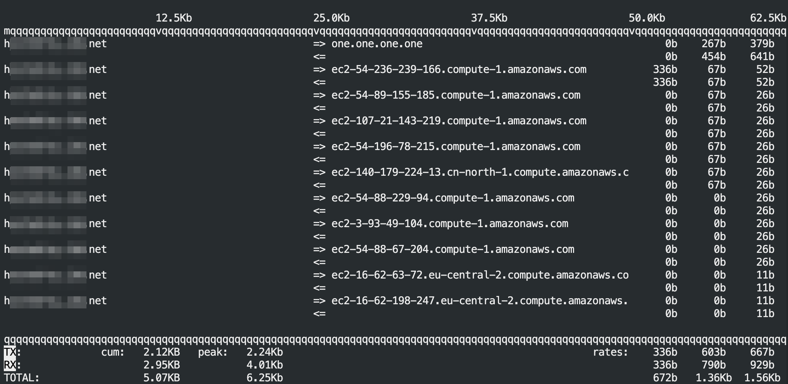

---

Display bandwidth usage on an interface by host.

## Installation

```plain
sudo apt install iftop
```

```plain
brew install iftop
```

## Usage

```plain
iftop -h | [-npblNBP] [-i interface] [-f filter code] [-F net/mask] [-G net6/mask6]
```

## Flags

```plain
   -h                  display this message
   -n                  don't do hostname lookups
   -N                  don't convert port numbers to services
   -p                  run in promiscuous mode (show traffic between other
                       hosts on the same network segment)
   -b                  don't display a bar graph of traffic
   -B                  Display bandwidth in bytes
   -i interface        listen on named interface
   -f filter code      use filter code to select packets to count
                       (default: none, but only IP packets are counted)
   -F net/mask         show traffic flows in/out of IPv4 network
   -G net6/mask6       show traffic flows in/out of IPv6 network
   -l                  display and count link-local IPv6 traffic (default: off)
   -P                  show ports as well as hosts
   -m limit            sets the upper limit for the bandwidth scale
   -c config file      specifies an alternative configuration file
   -t                  use text interface without ncurses

   Sorting orders:
   -o 2s                Sort by first column (2s traffic average)
   -o 10s               Sort by second column (10s traffic average) [default]
   -o 40s               Sort by third column (40s traffic average)
   -o source            Sort by source address
   -o destination       Sort by destination address

   The following options are only available in combination with -t
   -s num              print one single text output afer num seconds, then quit
   -L num              number of lines to print

iftop, version 1.0pre4
copyright (c) 2002 Paul Warren <pdw@ex-parrot.com> and contributors
```

## Examples



## URL list

- [Linux.die.net - iftop](https://linux.die.net/man/8/iftop)
