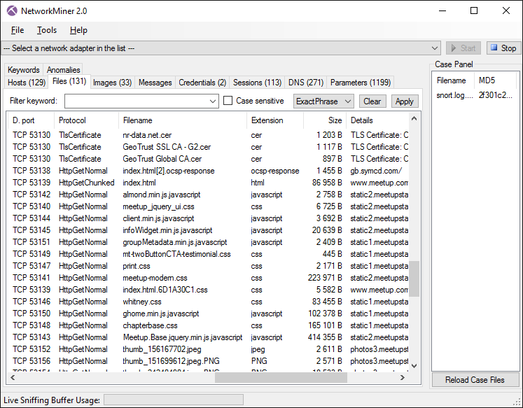
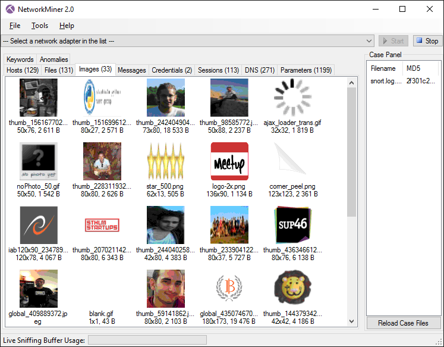

## NetworkMiner

NetworkMiner is an [open source](https://www.netresec.com/?page=NetworkMinerSourceCode) Network Forensic Analysis Tool (NFAT) for Windows (but also works in [Linux](https://www.netresec.com/?page=Blog&month=2014-02&post=HowTo-install-NetworkMiner-in-Ubuntu-Fedora-and-Arch-Linux) / [Mac OS X](https://netresec.com/?b=146F525) / [FreeBSD](https://netresec.com/?b=11C135E)). NetworkMiner can be used as a passive network sniffer/packet capturing tool in order to detect operating systems, sessions, hostnames, open ports etc. without putting any traffic on the network. NetworkMiner can also parse PCAP files for off-line analysis and to regenerate/reassemble transmitted files and certificates from PCAP files.

NetworkMiner makes it easy to perform advanced Network Traffic Analysis (NTA) by providing extracted artifacts in an intuitive user interface. The way data is presented not only makes the analysis simpler, it also saves valuable time for the analyst or forensic investigator.

NetworkMiner has, since the first release in 2007, become a popular tool among incident response teams as well as law enforcement. NetworkMiner is today used by companies and organizations all over the world.

### Installation

Download newest release (Windows) from [Netrecsec.com](https://www.netresec.com/?download=NetworkMiner)

## Examples

### Convert pcapng to pcap

```plain
tshark -F pcap -r {pcapng file} -w {pcap file}
```




### URL list

* [Netresec.com - NetworkMiner](https://www.netresec.com/?page=NetworkMiner)
