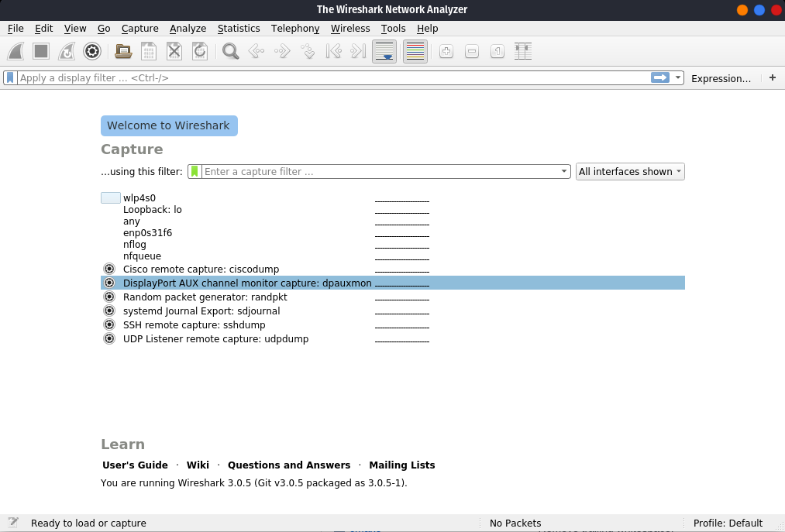

## Wireshark

Is the world's foremost and widely-used network protocol analyzer.

### Installation

```plain
sudo apt install wireshark
```

### Usage

```plain
wireshark [options] ... [ <infile> ]
```

### Flags

```plain
Wireshark 3.0.5 (Git v3.0.5 packaged as 3.0.5-1)
Interactively dump and analyze network traffic.
See https://www.wireshark.org for more information.

Usage: wireshark [options] ... [ <infile> ]

Capture interface:
  -i <interface>           name or idx of interface (def: first non-loopback)
  -f <capture filter>      packet filter in libpcap filter syntax
  -s <snaplen>             packet snapshot length (def: appropriate maximum)
  -p                       don't capture in promiscuous mode
  -k                       start capturing immediately (def: do nothing)
  -S                       update packet display when new packets are captured
  -l                       turn on automatic scrolling while -S is in use
  -I                       capture in monitor mode, if available
  -B <buffer size>         size of kernel buffer (def: 2MB)
  -y <link type>           link layer type (def: first appropriate)
  --time-stamp-type <type> timestamp method for interface
  -D                       print list of interfaces and exit
  -L                       print list of link-layer types of iface and exit
  --list-time-stamp-types  print list of timestamp types for iface and exit

Capture stop conditions:
  -c <packet count>        stop after n packets (def: infinite)
  -a <autostop cond.> ...  duration:NUM - stop after NUM seconds
                           filesize:NUM - stop this file after NUM KB
                              files:NUM - stop after NUM files
Capture output:
  -b <ringbuffer opt.> ... duration:NUM - switch to next file after NUM secs
                           filesize:NUM - switch to next file after NUM KB
                              files:NUM - ringbuffer: replace after NUM files
Input file:
  -r <infile>              set the filename to read from (no pipes or stdin!)

Processing:
  -R <read filter>         packet filter in Wireshark display filter syntax
  -n                       disable all name resolutions (def: all enabled)
  -N <name resolve flags>  enable specific name resolution(s): "mnNtdv"
  -d <layer_type>==<selector>,<decode_as_protocol> ...
                           "Decode As", see the man page for details
                           Example: tcp.port==8888,http
  --enable-protocol <proto_name>
                           enable dissection of proto_name
  --disable-protocol <proto_name>
                           disable dissection of proto_name
  --enable-heuristic <short_name>
                           enable dissection of heuristic protocol
  --disable-heuristic <short_name>
                           disable dissection of heuristic protocol

User interface:
  -C <config profile>      start with specified configuration profile
  -Y <display filter>      start with the given display filter
  -g <packet number>       go to specified packet number after "-r"
  -J <jump filter>         jump to the first packet matching the (display)
                           filter
  -j                       search backwards for a matching packet after "-J"
  -m <font>                set the font name used for most text
  -t a|ad|d|dd|e|r|u|ud    output format of time stamps (def: r: rel. to first)
  -u s|hms                 output format of seconds (def: s: seconds)
  -X <key>:<value>         eXtension options, see man page for details
  -z <statistics>          show various statistics, see man page for details

Output:
  -w <outfile|->           set the output filename (or '-' for stdout)

Miscellaneous:
  -h                       display this help and exit
  -v                       display version info and exit
  -P <key>:<path>          persconf:path - personal configuration files
                           persdata:path - personal data files
  -o <name>:<value> ...    override preference or recent setting
  -K <keytab>              keytab file to use for kerberos decryption
  --display=DISPLAY        X display to use
  --fullscreen             start Wireshark in full screen
```

### Examples

#### Start GUI

```plain
sudo wireshark
```



#### Filter IPs from PCAP

Command to extract IPs from captured PCAP-file.

```plain
$ tcpdump -r capture.pcapng 'ip' -n | grep -oE "\b([0-9]{1,3}\.){3}[0-9]{1,3}\b" | sort -u

reading from file capture.pcapng, link-type EN10MB (Ethernet)
0.0.0.0
10.30.100.204
104.26.10.153
13.107.18.11
140.82.112.26
140.82.121.4
```

### URL list

* [Wireshark.org](https://www.wireshark.org/)
* [Github.com - wireshark](https://github.com/wireshark/wireshark)
