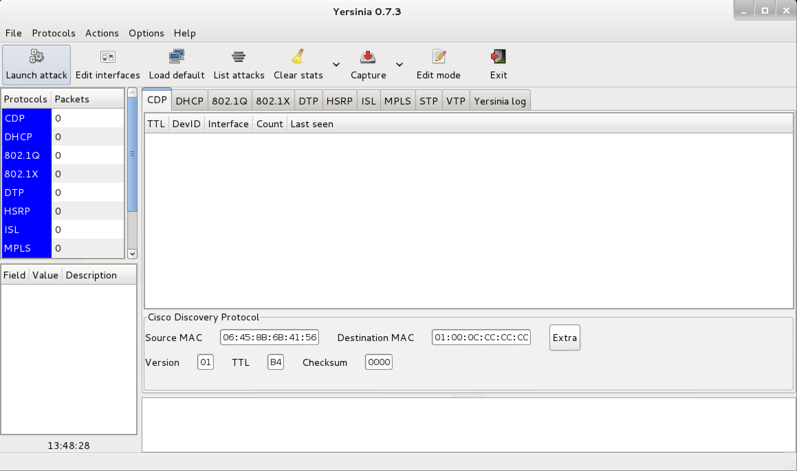

## Yersinia

Is a framework for performing layer 2 attacks. It is designed to take advantage of some weaknesses in different network protocols.

### Installation (Kali)

```plain
sudo apt install yersinia
```

### Usage

```plain
yersinia [-hVGIDd] [-l logfile] [-c conffile] protocol
```

### Flags

```plain
Usage: yersinia [-hVGIDd] [-l logfile] [-c conffile] protocol [protocol_options]
       -V   Program version.
       -h   This help screen.
       -G   Graphical mode (GTK).
       -I   Interactive mode (ncurses).
       -D   Daemon mode.
       -d   Debug.
       -l logfile   Select logfile.
       -c conffile  Select config file.
  protocol   One of the following: cdp, dhcp, dot1q, dot1x, dtp, hsrp, isl, mpls, stp, vtp.
```

### Examples



### URL list

* [Kali.org - yersinia](https://tools.kali.org/vulnerability-analysis/yersinia)
