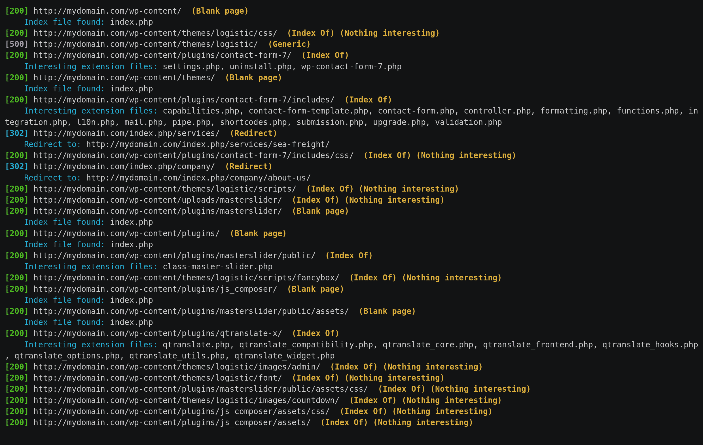

---

Find web directories without bruteforce.

Dirhunt is a web crawler optimize for search and analyze directories. This tool can find interesting things if the server has the "index of" mode enabled. Dirhunt is also useful if the directory listing is not enabled. It detects directories with false 404 errors, directories where an empty index file has been created to hide things and much more.

Dirhunt does not use brute force. But neither is it just a crawler. This tool is faster than others because it minimizes requests to the server. Generally, this tool takes between 5-30 seconds, depending on the website and the server.

Read more about how to use Dirhunt [in the documentation](http://docs.nekmo.org/dirhunt/usage.html).

### Features

- Process one or multiple sites at a time.
- Process 'Index Of' pages and report interesting files.
- Detect redirectors.
- Detect blank index file created on directory to hide things.
- Process some html files in search of new directories.
- 404 error pages and detect fake 404 errors.
- Filter results by flags.
- Analyze results at end. It also processes date & size of the Index Pages.
- Get new directories using robots.txt, VirusTotal & Google.
- Delay between requests.
- One or multiple proxies option. It can also search for free proxies.
- Save the results to a JSON file (NEW!)
- Resume the aborted scans (NEW!)

## Installation

```plain
python3 -m pip install dirhunt
```

There are other [installation methods](http://docs.nekmo.org/dirhunt/installation.html) available.

## Usage

```plain
dirhunt [OPTIONS] [URLS]...
    One or more domain or urls. Load urls from files using the /full/path or
    ./relative/path.
```

## Flags

```plain
Options:
  -t, --threads INTEGER           Number of threads to use.
  -x, --exclude-flags TEXT        Exclude results with these flags. See
                                  documentation.

  -i, --include-flags TEXT        Only include results with these flags. See
                                  documentation.

  -e, --interesting-extensions TEXT
                                  The files found with these extensions are
                                  interesting

  -f, --interesting-files TEXT    The files with these names are interesting
  --stdout-flags TEXT             Return only in stdout the urls of these
                                  flags

  --progress-enabled / --progress-disabled
  --timeout INTEGER
  --max-depth INTEGER             Maximum links to follow without increasing
                                  directories depth

  --not-follow-subdomains         The subdomains will be ignored
  --exclude-sources TEXT          Exclude source engines. Possible options:
                                  robots, virustotal, google

  -p, --proxies TEXT              Set one or more proxies to alternate between
                                  them

  -d, --delay FLOAT               Delay between requests to avoid bans by the
                                  server

  --not-allow-redirects           Redirectors will not be followed
  --limit INTEGER                 Max number of pages processed to search for
                                  directories.

  --to-file PATH                  Create a report file in JSON.
  -u, --user-agent TEXT           User agent to use. By default a random
                                  browser.

  -c, --cookie TEXT               Add a cookie to requests in the
                                  cookie_name:value format.

  -h, --header TEXT               Add a header to requests in the header:value
                                  format.

  --version
  --help                          Show this message and exit.
```

## Examples

```plain
$ dirhunt https://offsec.nl       
Welcome to Dirhunt v0.8.1 using Python 3.9.5
[301] https://offsec.nl  (Redirect)
    Redirect to: https://offsec.nl/
[302] http://offsec.nl/  (Redirect)
    Redirect to: https://offsec.nl/
[200] https://offsec.nl/  (Generic)
    Index file found: index.php
[200] https://offsec.nl/  (Generic)
    Index file found: index.php

No interesting files detected ¯\_(ツ)_/¯
```



## URL List

- [Github.com - Dirhunt](https://github.com/Nekmo/dirhunt)
