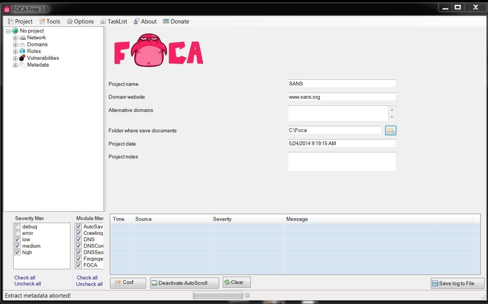

---

Fingerprinting Organizations with Collected Archives.

## Installation

Download newest release from [github.com](https://github.com/ElevenPaths/FOCA/releases)

## Examples

## URL List

- [Github.com - FOCA](https://github.com/ElevenPaths/FOCA)
- [Elevenpaths.com - FOCA](https://www.elevenpaths.com/labstools/foca/index.html)
