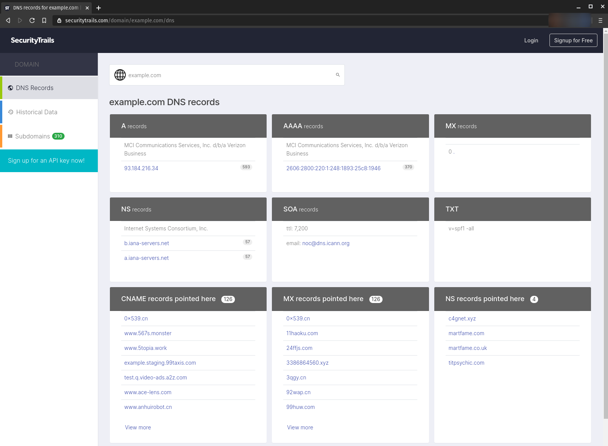
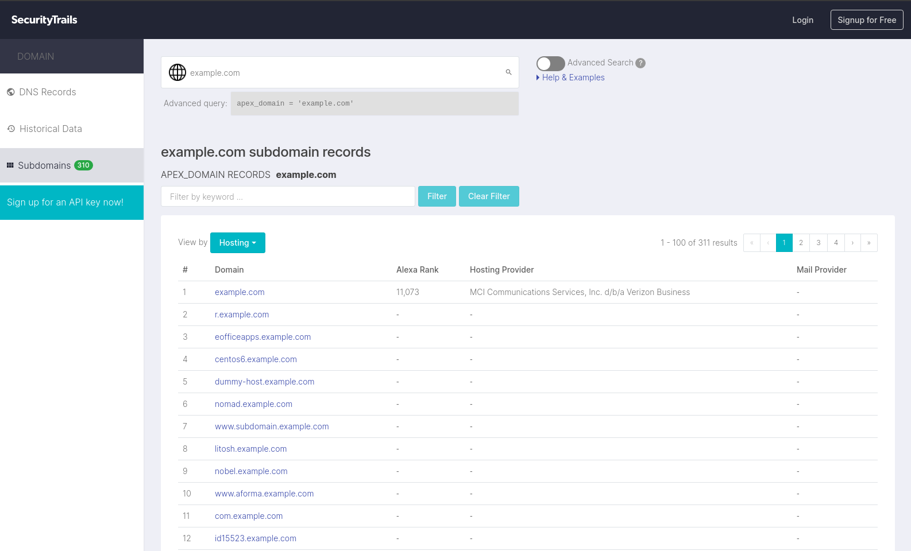

## Securitytrails

Search Internet Assets Accurately & Instantly.

[Securitytrails.com](https://securitytrails.com/)

### Examples




### API

Read the docs <https://docs.securitytrails.com/>

#### Gather subdomains

```plain
curl --request GET \
  --url 'https://api.securitytrails.com/v1/domain/<DOMAIN-HERE>/subdomains?children_only=false' \
  --header 'APIKEY: <KEY-HERE>' \
  --header 'Accept: application/json'
```

### URL list

* [Securitytrails.com](https://securitytrails.com/)
