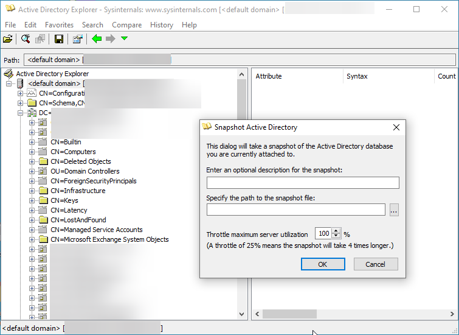

## ADExplorerSnapshot.py

ADExplorerSnapshot.py is an AD Explorer snapshot ingestor for [BloodHound](https://bloodhound.readthedocs.io/).

AD Explorer allows you to connect to a DC and browse LDAP data. It can also create snapshots of the server you are currently attached to. This tool allows you to convert those snapshots to BloodHound-compatible JSON files.

You can use the `.exe` below or try to run it directly from Command Prompt.

```plain
\\live.sysinternals.com\tools\ADExplorer.exe -accepteula -snapshot "" out.snapshot
```

{}

### Limitations

The ingestor only supports offline information collection from the snapshot file and won't interact with systems on the network. That means features like session and localadmin collection are not available. GPO/OU collection is missing. The ingestor processes all data it possibly can from the snapshot (including ACLs). You will only have the data available of the LDAP/DC that you ran the snapshot against.

## Installation

```plain
git clone https://github.com/c3c/ADExplorerSnapshot.py.git
cd ADExplorerSnapshot.py
python3 -m pip install --user .
```

## Usage

```plain
ADExplorerSnapshot.py [-h] [-o OUTPUT] [-m {BloodHound,Objects}] snapshot
```

## Flags

```plain
positional arguments:
  snapshot              Path to the snapshot .dat file.

options:
  -h, --help            show this help message and exit
  -o OUTPUT, --output OUTPUT
                        Path to the *.json output folder. Folder will be created if it doesn't
                        exist. Defaults to the current directory.
  -m {BloodHound,Objects}, --mode {BloodHound,Objects}
                        The output mode to use. Besides BloodHound JSON output files, it is
                        possible to dump all objects with all attributes to NDJSON. Defaults to
                        BloodHound output mode.
```

### Notes

This library is now supporting the BloodHound v4.1+ output format (JSON format v4). For the old v3 output format, you can use the code in the [v3-format branch](https://github.com/c3c/ADExplorerSnapshot.py/tree/v3-format).

Making snapshots in AD Explorer is more network-intensive than the traditional BloodHound ingestors as it attempts to retrieve all objects it can from the LDAP.

ADExplorerSnapshot.py will create caches of information for quicker lookups while processing the data. Especially when processing larger snapshots (e.g. 4GB+) you will also need to have sufficient RAM available. In my tests, about half of the snapshot file size was required in RAM.

The library was tested with a number of data sets, please create an issue report if you run into problems.

The AD Explorer snapshot parser is implemented as its own module, which could also be used individually.

The format in which snapshots are stored by AD Explorer is proprietary and led to a fun reverse engineering journey. A 010 editor template is included in this repository, which I used for iteratively mapping out the contents of the snapshot into structs.

## Examples



```plain
$ python3 ADExplorerSnapshot.py snapshot.dat 
[*] Server: DC01.offsec.nl
[*] Time of snapshot: 2021-12-31T09:35:35
[*] Mapping offset: 0x114c005
[*] Object count: 9068
[+] Parsing properties: 3943
[+] Parsing classes: 583
[+] Parsing object offsets: 9068
[+] Preprocessing objects: 170 sids, 10 computers, 1 domains with 2 DCs
[+] Collecting data: 41 users, 84 groups, 10 computers, 0 trusts
[+] Output written to DC01.offsec.nl_1640939735_*.json files
```

## URL List

- [Github.com - ADExplorerSnapshot.py](https://github.com/c3c/ADExplorerSnapshot.py)
