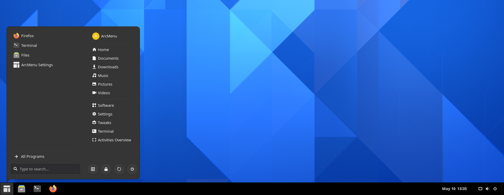
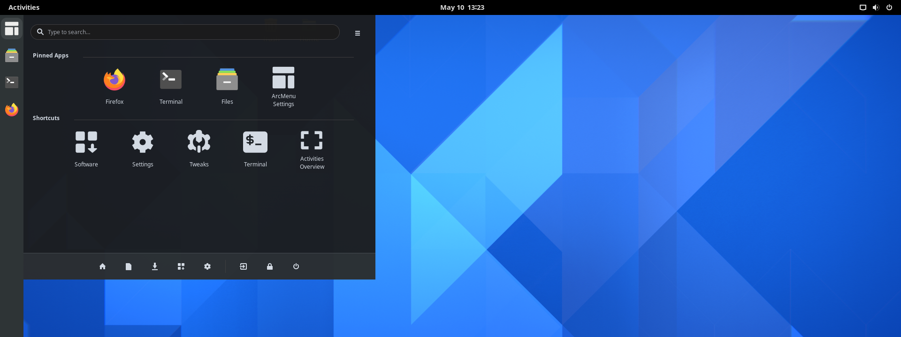

## Arcmenu

Is an application menu for GNOME Shell, designed to provide a more traditional user experience and workflow. This extension has many features, including multiple menu layout styles, GNOME search, quick access to system shortcuts, and more! If you are a new user to GNOME and are looking for a Windows style start menu, this extension will be perfect for you.

## Installation

Make sure you've installed `gir1.2-gmenu-3.0`.

Install via [extensions.gnome.org](https://extensions.gnome.org/extension/3628/arcmenu/)

## Examples

### ArcMenu integrated with Dash-to-Panel

[Dash-to-panel]()

### ArcMenu integrated with Dash-to-Dock

## URL List

- [Gitlab.com - ArcMenu](https://gitlab.com/arcmenu/ArcMenu)
