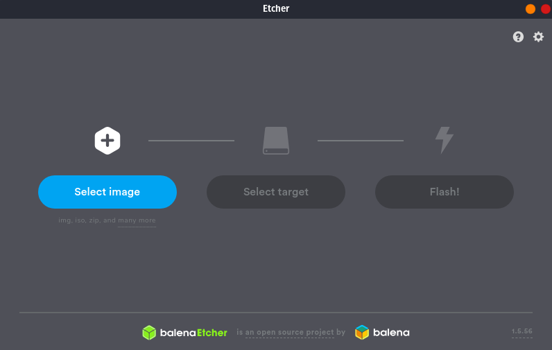

## BalenaEtcher

Flash OS images to SD cards & USB drives, safely and easily.

## Installation

Download newest release from [Github.com](https://github.com/balena-io/etcher/releases)

OR:

```plain
echo "deb https://deb.etcher.io stable etcher" | sudo tee /etc/apt/sources.list.d/balena-etcher.list
sudo apt-key adv --keyserver hkps://keyserver.ubuntu.com:443 --recv-keys 379CE192D401AB61
sudo apt-get update
sudo apt-get install balena-etcher-electron
```

## Examples



## URL List

- [Balena.io - Etcher](https://www.balena.io/etcher/)
- [GitHub.com - Etcher](https://github.com/balena-io/etcher)
