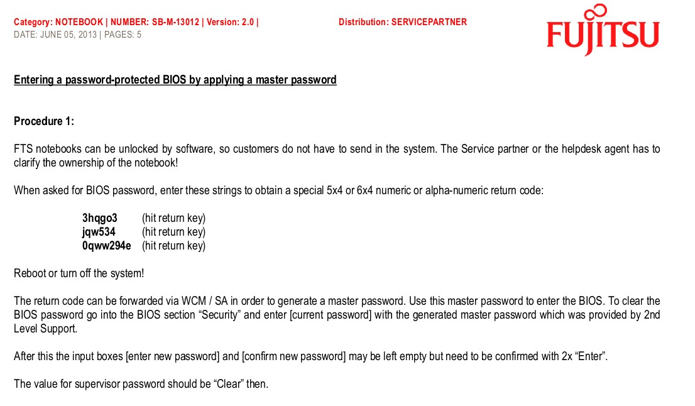

## BIOS Master Password Generators for Laptops

Requirement:- You need Python 2.x to run these generators. More information available here: <http://dogber1.blogspot.com/2009/05/table-of-reverse-engineered-bios.html>

| Vendor                          | Hash Encoding          | Example of Hash Code/Serial            | Scripts                                                                                                                                    |
| ------------------------------- | ---------------------- | -------------------------------------- | ------------------------------------------------------------------------------------------------------------------------------------------ |
| Asus                            | Machine Date           | 01-01-2011                             | [pwgen-asus.py](https://github.com/dogbert/bios-pwgen)                                                                                     |
| Compaq                          | 5 decimal digits       | 12345                                  | [pwgen-5dec.py](https://github.com/dogbert/bios-pwgen) / [Windows binary](http://sites.google.com/site/dogber1/blag/pwgen-5dec.zip)        |
| Dell                            | serial number          | 1234567-595B 1234567-D35B 1234567-2A7B | [bios-pw.org](http://bios-pw.org/)                                                                                                         |
| Fujitsu-Siemens                 | 5 decimal digits       | 12345                                  | [pwgen-5dec.py](https://github.com/dogbert/bios-pwgen) / [Windows binary](http://sites.google.com/site/dogber1/blag/pwgen-5dec.zip)        |
| Fujitsu-Siemens                 | 8 hexadecimal digits   | DEADBEEF                               | [pwgen-fsi-hex.py](https://github.com/dogbert/bios-pwgen) / [Windows binary](http://sites.google.com/site/dogber1/blag/pwgen-5dec.zip)     |
| Fujitsu-Siemens                 | 5x4 hexadecimal digits | AAAA-BBBB-CCCC-DEAD-BEEF               | [pwgen-fsi-hex.py](https://github.com/dogbert/bios-pwgen) /[Windows binary](http://sites.google.com/site/dogber1/blag/pwgen-5dec.zip)      |
| Fujitsu-Siemens                 | 5x4 decimal digits     | 1234-4321-1234-4321-1234               | [pwgen-fsi-5x4dec.py](https://github.com/dogbert/bios-pwgen) / [Windows binary](http://sites.google.com/site/dogber1/blag/pwgen-5dec.zip)  |
| Fujitsu-Siemens                 | 6x4 decimal digits     | 8F16-1234-4321-1234-4321-1234          | [pwgen-fsi-6x4dec.py](https://github.com/dogbert/bios-pwgen)                                                                               |
| Hewlett-Packard                 | 5 decimal digits       | 12345                                  | [pwgen-5dec.py](https://github.com/dogbert/bios-pwgen) / [Windows binary](http://sites.google.com/site/dogber1/blag/pwgen-5dec.zip)        |
| Hewlett-Packard/Compaq Netbooks | 10 characters          | CNU1234ABC                             | [pwgen-fsi-hex.py](https://github.com/dogbert/bios-pwgen) / [Windows binary](http://sites.google.com/site/dogber1/blag/pwgen-5dec.zip)     |
| Insyde H20 (generic)            | 8 decimal digits       | 03133610                               | [pwgen-insyde.py](https://github.com/dogbert/bios-pwgen) / [Windows binary](http://sites.google.com/site/dogber1/blag/pwgen-5dec.zip)      |
| Phoenix (generic)               | 5 decimal digits       | 12345                                  | [pwgen-5dec.py](https://github.com/dogbert/bios-pwgen) / [Windows binary](http://sites.google.com/site/dogber1/blag/pwgen-5dec.zip)        |
| Sony                            | 4x4 hexadecimal digits | 1234-1234-1234-1234                    | [pwgen-sony-4x4.py](https://github.com/dogbert/bios-pwgen)                                                                                 |
| Sony                            | 7 digit serial number  | 1234567                                | [pwgen-sony-serial.py](https://github.com/dogbert/bios-pwgen) / [Windows binary](http://sites.google.com/site/dogber1/blag/pwgen-5dec.zip) |
| Samsung                         | 12 hexadecimal digits  | 07088120410C0000                       | [pwgen-samsung.py](https://github.com/dogbert/bios-pwgen) / [Windows binary](http://sites.google.com/site/dogber1/blag/pwgen-5dec.zip)     |

## Installation

```plain
git clone https://github.com/dogbert/bios-pwgen
```

## Examples



```plain
$ python2 pwgen-fsi-6x4dec.py 0270-4075-0139-2561-3565-3043
Master Password Generator for FSI laptops (6x4 digits version)
Copyright (C) 2013 dogbert <dogber1@gmail.com>

When asked for a password, enter these:
First password:  3hqgo3
Second password: jqw534
Third password:  0qww294e

You will receive a hash code with five blocks, each with four numbers,
e.g. 1234-4321-1234-4321-1234

Please enter the hash:
0270-4075-0139-2561-3565-3043

The master password is: 483tv06q

Please note that the password is encoded for US QWERTY keyboard layouts.
```

## URL List

- [BIOS Master Password Generators for Laptops](https://github.com/dogbert/bios-pwgen)
- [Dogber1-blogspot.com - BIOS Password Backdoors in Laptops](https://dogber1.blogspot.com/2009/05/table-of-reverse-engineered-bios.html)
- [Sites.google.com - My quick article about brands laptops bios passwords](https://sites.google.com/site/hpglserv/Home/article)
- [Github.com - Password generator for BIOS](https://github.com/bacher09/pwgen-for-bios)
- [beta.bios-pw.org - BIOS Password Recovery for Laptops](https://beta.bios-pw.org/)
