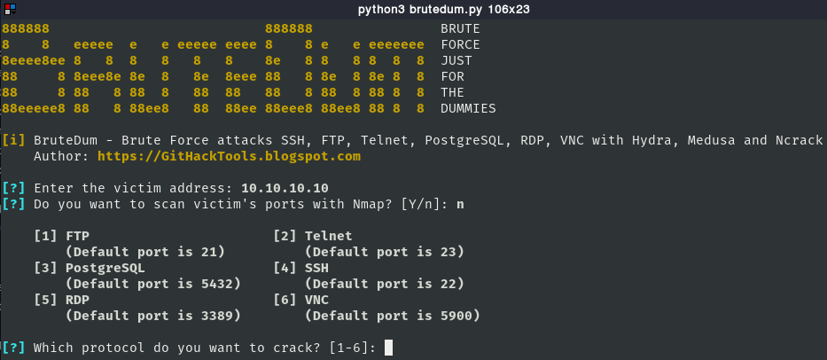

## Brutedum

Is a SSH, FTP, Telnet, PostgreSQL, RDP, VNC brute forcing tool with Hydra, Medusa and Ncrack.

### Installation

```plain
git clone https://github.com/GitHackTools/BruteDum.git
```

### Usage

```plain
python3 brutedum.py
```

### Examples



### URL list

- [GitHub.com - BruteDum](https://github.com/GitHackTools/BruteDum)
