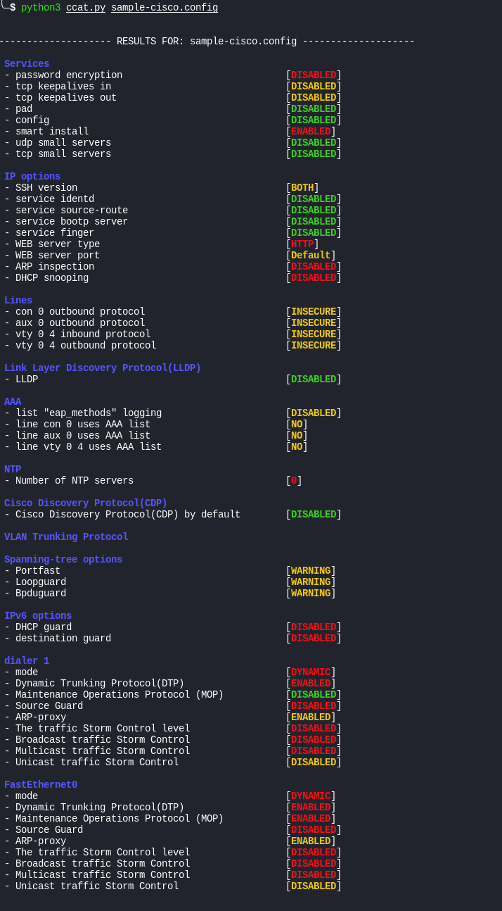

## CCAT - Cisco Config Analysis Tool

[](http://www.toolswatch.org/2018/09/black-hat-arsenal-europe-2018-lineup-announced/)  
This tool is designed to analyze the configuration files of Cisco devices. The [list of checks](https://github.com/cisco-config-analysis-tool/ccat/wiki/List-of-the-checks) is based on the [Cisco Guide to Harden Cisco IOS Devices](https://www.cisco.com/c/en/us/support/docs/ip/access-lists/13608-21.html).

## Installation

```plain
git clone https://github.com/frostbits-security/ccat.git
python3 -m pip install -r requirements.txt
```

## Usage

```plain
ccat.py [-h] [-vlanmap VLANMAP] [-output OUTPUT] [--no-console-display] [--no-ipv6] [--disabled-interfaces] [--storm_level STORM_LEVEL]
               [--max_number_mac MAX_NUMBER_MAC] [--dump-creds] [--debug] [--graph [GRAPH]]
               [configs]
```

## Flags

```plain
Cisco Configuration Analysis Tool

positional arguments:
  configs               full path to the configuration file or folder with config(s)

optional arguments:
  -h, --help            show this help message and exit
  -vlanmap VLANMAP      path to vlanmap (file that determine how critical is certain vlan, you can find example in 'example' folder)
  -output OUTPUT        path to output html files directory
  --no-console-display  to output analysis results in html files directory or into network graph
  --no-ipv6             if you're not using IPv6
  --disabled-interfaces
                        check interfaces even if they are turned off
  --storm_level STORM_LEVEL
                        to set up appropriate level for storm-control (by default value=80)
  --max_number_mac MAX_NUMBER_MAC
                        to set up maximum number of mac-addresses for port-security (by default value=10)
  --dump-creds          enable credentials harvesting
  --debug               enable debug output

Network graph:
  --graph [GRAPH]       left the argument empty to get into interactive mode or define a file name for graph output in png extension

Usage example:
  ccat  smth/config_folder -vlanmap smth/vlanmap_file
```

## Examples

```plain
$ python3 ccat.py sample-cisco.config


-------------------- RESULTS FOR: sample-cisco.config --------------------

 Services
 - password encryption                             [DISABLED]
 - tcp keepalives in                               [DISABLED]
 - tcp keepalives out                              [DISABLED]
 - pad                                             [DISABLED]
 - config                                          [DISABLED]
 - smart install                                   [ENABLED]
 - udp small servers                               [DISABLED]
 - tcp small servers                               [DISABLED]

 IP options
 - SSH version                                     [BOTH]
 - service identd                                  [DISABLED]
 - service source-route                            [DISABLED]
 - service bootp server                            [DISABLED]
 - service finger                                  [DISABLED]
 - WEB server type                                 [HTTP]
 - WEB server port                                 [Default]
 - ARP inspection                                  [DISABLED]
 - DHCP snooping                                   [DISABLED]

 Lines
 - con 0 outbound protocol                         [INSECURE]
 - aux 0 outbound protocol                         [INSECURE]
 - vty 0 4 inbound protocol                        [INSECURE]
 - vty 0 4 outbound protocol                       [INSECURE]

 Link Layer Discovery Protocol(LLDP)
 - LLDP                                            [DISABLED]

 AAA
 - list "eap_methods" logging                      [DISABLED]
 - line con 0 uses AAA list                        [NO]
 - line aux 0 uses AAA list                        [NO]
 - line vty 0 4 uses AAA list                      [NO]

 NTP
 - Number of NTP servers                           [0]

 Cisco Discovery Protocol(CDP)
 - Cisco Discovery Protocol(CDP) by default        [DISABLED]

 VLAN Trunking Protocol

 Spanning-tree options
 - Portfast                                        [WARNING]
 - Loopguard                                       [WARNING]
 - Bpduguard                                       [WARNING]

 IPv6 options
 - DHCP guard                                      [DISABLED]
 - destination guard                               [DISABLED]

 dialer 1
 - mode                                            [DYNAMIC]
 - Dynamic Trunking Protocol(DTP)                  [ENABLED]
 - Maintenance Operations Protocol (MOP)           [DISABLED]
 - Source Guard                                    [DISABLED]
 - ARP-proxy                                       [ENABLED]
 - The traffic Storm Control level                 [DISABLED]
 - Broadcast traffic Storm Control                 [DISABLED]
 - Multicast traffic Storm Control                 [DISABLED]
 - Unicast traffic Storm Control                   [DISABLED]

 FastEthernet0
 - mode                                            [DYNAMIC]
 - Dynamic Trunking Protocol(DTP)                  [ENABLED]
 - Maintenance Operations Protocol (MOP)           [ENABLED]
 - Source Guard                                    [DISABLED]
 - ARP-proxy                                       [ENABLED]
 - The traffic Storm Control level                 [DISABLED]
 - Broadcast traffic Storm Control                 [DISABLED]
 - Multicast traffic Storm Control                 [DISABLED]
 - Unicast traffic Storm Control                   [DISABLED]

 FastEthernet1
 - mode                                            [DYNAMIC]
 - Dynamic Trunking Protocol(DTP)                  [ENABLED]
 - Maintenance Operations Protocol (MOP)           [ENABLED]
 - Source Guard                                    [DISABLED]
 - ARP-proxy                                       [ENABLED]
 - The traffic Storm Control level                 [DISABLED]
 - Broadcast traffic Storm Control                 [DISABLED]
 - Multicast traffic Storm Control                 [DISABLED]
 - Unicast traffic Storm Control                   [DISABLED]

 FastEthernet2
 - mode                                            [DYNAMIC]
 - Dynamic Trunking Protocol(DTP)                  [ENABLED]
 - Maintenance Operations Protocol (MOP)           [ENABLED]
 - Source Guard                                    [DISABLED]
 - ARP-proxy                                       [ENABLED]
 - The traffic Storm Control level                 [DISABLED]
 - Broadcast traffic Storm Control                 [DISABLED]
 - Multicast traffic Storm Control                 [DISABLED]
 - Unicast traffic Storm Control                   [DISABLED]

 FastEthernet3
 - type                                            [TRUNK]
 - Dynamic Trunking Protocol(DTP)                  [ENABLED]
 - Maintenance Operations Protocol (MOP)           [ENABLED]
 - Source Guard                                    [DISABLED]
 - ARP-proxy                                       [ENABLED]
 - The traffic Storm Control level                 [DISABLED]
 - Broadcast traffic Storm Control                 [DISABLED]
 - Multicast traffic Storm Control                 [DISABLED]
 - Unicast traffic Storm Control                   [DISABLED]

 FastEthernet4
 - mode                                            [DYNAMIC]
 - Dynamic Trunking Protocol(DTP)                  [ENABLED]
 - Maintenance Operations Protocol (MOP)           [ENABLED]
 - Source Guard                                    [DISABLED]
 - ARP-proxy                                       [ENABLED]
 - The traffic Storm Control level                 [DISABLED]
 - Broadcast traffic Storm Control                 [DISABLED]
 - Multicast traffic Storm Control                 [DISABLED]
 - Unicast traffic Storm Control                   [DISABLED]

 Dot11Radio0
 - mode                                            [DYNAMIC]
 - Dynamic Trunking Protocol(DTP)                  [ENABLED]
 - Maintenance Operations Protocol (MOP)           [DISABLED]
 - Source Guard                                    [DISABLED]
 - ARP-proxy                                       [ENABLED]
 - The traffic Storm Control level                 [DISABLED]
 - Broadcast traffic Storm Control                 [DISABLED]
 - Multicast traffic Storm Control                 [DISABLED]
 - Unicast traffic Storm Control                   [DISABLED]

 Dot11Radio0.1
 - mode                                            [DYNAMIC]
 - Dynamic Trunking Protocol(DTP)                  [ENABLED]
 - Maintenance Operations Protocol (MOP)           [DISABLED]
 - Source Guard                                    [DISABLED]
 - ARP-proxy                                       [ENABLED]
 - The traffic Storm Control level                 [DISABLED]
 - Broadcast traffic Storm Control                 [DISABLED]
 - Multicast traffic Storm Control                 [DISABLED]
 - Unicast traffic Storm Control                   [DISABLED]

 Dot11Radio0.2
 - mode                                            [DYNAMIC]
 - Dynamic Trunking Protocol(DTP)                  [ENABLED]
 - Maintenance Operations Protocol (MOP)           [DISABLED]
 - Source Guard                                    [DISABLED]
 - ARP-proxy                                       [ENABLED]
 - The traffic Storm Control level                 [DISABLED]
 - Broadcast traffic Storm Control                 [DISABLED]
 - Multicast traffic Storm Control                 [DISABLED]
 - Unicast traffic Storm Control                   [DISABLED]

 Dot11Radio0.3
 - mode                                            [DYNAMIC]
 - Dynamic Trunking Protocol(DTP)                  [ENABLED]
 - Maintenance Operations Protocol (MOP)           [DISABLED]
 - Source Guard                                    [DISABLED]
 - ARP-proxy                                       [ENABLED]
 - The traffic Storm Control level                 [DISABLED]
 - Broadcast traffic Storm Control                 [DISABLED]
 - Multicast traffic Storm Control                 [DISABLED]
 - Unicast traffic Storm Control                   [DISABLED]

 BVI1
 - mode                                            [DYNAMIC]
 - Dynamic Trunking Protocol(DTP)                  [ENABLED]
 - Maintenance Operations Protocol (MOP)           [DISABLED]
 - Source Guard                                    [DISABLED]
 - ARP-proxy                                       [ENABLED]
 - The traffic Storm Control level                 [DISABLED]
 - Broadcast traffic Storm Control                 [DISABLED]
 - Multicast traffic Storm Control                 [DISABLED]
 - Unicast traffic Storm Control                   [DISABLED]

 BVI2
 - mode                                            [DYNAMIC]
 - Dynamic Trunking Protocol(DTP)                  [ENABLED]
 - Maintenance Operations Protocol (MOP)           [DISABLED]
 - Source Guard                                    [DISABLED]
 - ARP-proxy                                       [ENABLED]
 - The traffic Storm Control level                 [DISABLED]
 - Broadcast traffic Storm Control                 [DISABLED]
 - Multicast traffic Storm Control                 [DISABLED]
 - Unicast traffic Storm Control                   [DISABLED]

 BVI3
 - mode                                            [DYNAMIC]
 - Dynamic Trunking Protocol(DTP)                  [ENABLED]
 - Maintenance Operations Protocol (MOP)           [DISABLED]
 - Source Guard                                    [DISABLED]
 - ARP-proxy                                       [ENABLED]
 - The traffic Storm Control level                 [DISABLED]
 - Broadcast traffic Storm Control                 [DISABLED]
 - Multicast traffic Storm Control                 [DISABLED]
 - Unicast traffic Storm Control                   [DISABLED]
```



### Sample configuration file

{}

## URL List

* [Github.com - ccat](https://github.com/frostbits-security/ccat)
