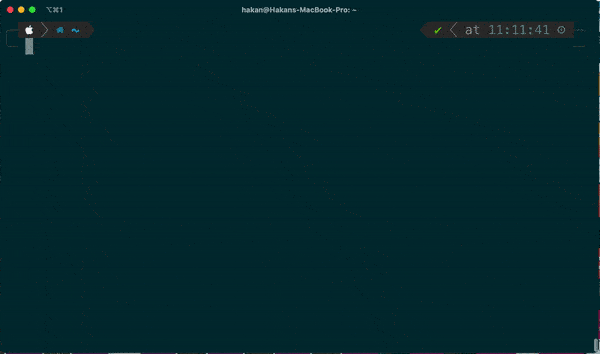

---

A CLI tool to extract server certificates.



## Installation

### Mac OS X - Homebrew 🍺

```plain
brew tap hakky54/crip
brew install crip
crip print --url=https://stackoverflow.com/
```

### Windows

1. Download the latest binary here: [Releases](https://github.com/Hakky54/certificate-ripper/releases)
2. Extract the compressed file
3. Start cmd and `cd` to the extracted file
4. Run `start /b "" "crip.exe" print --url=https://stackoverflow.com/`

### Linux

1. Download the latest binary here: [Releases](https://github.com/Hakky54/certificate-ripper/releases)
2. Extract the compressed file
3. Add the reference to your environment variables: `export CRIP_HOME=/path/to/crip/binary`
4. Run `crip print --url=https://stackoverflow.com/`

## Usage

```plain
crip [COMMAND]
```

## Flags

### Print - Prints the extracted certificates to the console

```plain
crip print [--proxy-password] [--resolve-ca] [-f=<format>]
           [--proxy-host=<proxyHost>] [--proxy-port=<proxyPort>]
           [--proxy-user=<proxyUser>] [-t=<timeoutInMilliseconds>]
            -u=<urls> [-u=<urls>]...
```

```plain
  -f, --format=<format>   To be printed certificate format
      --proxy-host=<proxyHost>
                          Proxy host
      --proxy-password    Password for authenticating the user for the given
                            proxy
      --proxy-port=<proxyPort>
                          Proxy port
      --proxy-user=<proxyUser>
                          User for authenticating the user for the given proxy
      --resolve-ca        Indicator to automatically resolve the root ca
  -t, --timeout=<timeoutInMilliseconds>
                          Amount of milliseconds till the ripping should timeout
  -u, --url=<urls>        Url of the target server to extract the certificates
```

### Export - Export the extracted certificate to the provided output type

```plain
crip export [COMMAND]
```

```plain
  pkcs12, p12  Export the extracted certificate to a PKCS12/p12 type truststore
  jks          Export the extracted certificate to a JKS (Java KeyStore) type
                 truststore
  der          Export the extracted certificate to a binary form also known as
                 DER
  pem          Export the extracted certificate to a base64 encoded string also
```

## Examples

### Print Example

```plain
$ crip print --url=https://kb.offsec.nl      

Certificate ripper statistics:
- Certificate count

  * 3: https://kb.offsec.nl
         [cn=kboffsecnl_o=cloudflare_-inc_l=san-francisco_st=california_c=us]
         [cn=cloudflare-inc-ecc-ca-3_o=cloudflare_-inc_c=us]
         [cn=baltimore-cybertrust-root_ou=cybertrust_o=baltimore_c=ie]

Certificates for url = https://kb.offsec.nl

[
[
  Version: V3
  Subject: CN=kb.offsec.nl, O="Cloudflare, Inc.", L=San Francisco, ST=California, C=US
  Signature Algorithm: SHA256withECDSA, OID = 1.2.840.10045.4.3.2

  Key:  Sun EC public key, 256 bits
  public x coord: 51447716222942191986863130644917392280984886932116491313131558442773617279940
  public y coord: 18634292853548021299731521567562215714142132921369115845727336396284476490676
  parameters: secp256r1 [NIST P-256,X9.62 prime256v1] (1.2.840.10045.3.1.7)
  Validity: [From: Fri Oct 06 02:00:00 CEST 2023,
               To: Sun Oct 06 01:59:59 CEST 2024]
  Issuer: CN=Cloudflare Inc ECC CA-3, O="Cloudflare, Inc.", C=US
  SerialNumber: [    0b4fb1bf 506b309a 9a91cba2 859aea83]

Certificate Extensions: 10
[1]: ObjectId: 1.3.6.1.4.1.11129.2.4.2 Criticality=false
Extension unknown: DER encoded OCTET string =
0000: 04 82 01 6E 04 82 01 6A   01 68 00 75 00 EE CD D0  ...n...j.h.u....
0010: 64 D5 DB 1A CE C5 5C B7   9D B4 CD 13 A2 32 87 46  d.....\......2.F
0020: 7C BC EC DE C3 51 48 59   46 71 1F B5 9B 00 00 01  .....QHYFq......
0030: 8B 03 5D 08 72 00 00 04   03 00 46 30 44 02 20 15  ..].r.....F0D. .
0040: EB 8C 89 6A 78 D2 57 C7   77 E6 34 E5 E4 B7 F1 12  ...jx.W.w.4.....
0050: 60 AB 48 9A BC 5B D2 31   7F 43 71 74 F1 FA 0E 02  `.H..[.1.Cqt....
0060: 20 0B 02 66 03 AD 3F 62   57 AE E2 B9 80 B0 CA EE   ..f..?bW.......
0070: 05 37 98 DD CB C4 0E 89   36 B2 6F 09 85 86 9E 1F  .7......6.o.....
0080: BB 00 76 00 48 B0 E3 6B   DA A6 47 34 0F E5 6A 02  ..v.H..k..G4..j.
0090: FA 9D 30 EB 1C 52 01 CB   56 DD 2C 81 D9 BB BF AB  ..0..R..V.,.....
00A0: 39 D8 84 73 00 00 01 8B   03 5D 07 E3 00 00 04 03  9..s.....]......
00B0: 00 47 30 45 02 20 34 97   01 3D DF 63 55 99 56 2A  .G0E. 4..=.cU.V*
00C0: 76 FA 58 32 28 7A EA FA   15 29 97 CF 29 C6 CA 1C  v.X2(z...)..)...
00D0: 8A 2F 7D 33 4B EB 02 21   00 B4 CA 0A 52 38 1A 2A  ./.3K..!....R8.*
00E0: CC DC 2F 2D 7E 18 0C 29   61 23 68 69 5F AC 63 2A  ../-...)a#hi_.c*
00F0: C2 B7 08 60 DE 78 91 8C   11 00 77 00 DA B6 BF 6B  ...`.x....w....k
0100: 3F B5 B6 22 9F 9B C2 BB   5C 6B E8 70 91 71 6C BB  ?.."....\k.p.ql.
0110: 51 84 85 34 BD A4 3D 30   48 D7 FB AB 00 00 01 8B  Q..4..=0H.......
0120: 03 5D 07 DE 00 00 04 03   00 48 30 46 02 21 00 9D  .].......H0F.!..
0130: 0A 61 A0 F6 7B 28 D4 B7   60 14 00 52 C8 62 67 93  .a...(..`..R.bg.
0140: E5 ED 67 00 E3 66 C1 79   B8 7F 6E E4 51 E7 29 02  ..g..f.y..n.Q.).
0150: 21 00 E7 EA 31 F2 D7 14   B7 3E 4C 2B 56 55 A0 DF  !...1....>L+VU..
0160: A0 05 ED 15 16 9A 64 23   42 A8 E1 2A FD 62 82 0F  ......d#B..*.b..
0170: 47 BD                                              G.


[2]: ObjectId: 1.3.6.1.5.5.7.1.1 Criticality=false
AuthorityInfoAccess [
  [
   accessMethod: ocsp
   accessLocation: URIName: http://ocsp.digicert.com
, 
   accessMethod: caIssuers
   accessLocation: URIName: http://cacerts.digicert.com/CloudflareIncECCCA-3.crt
]
[...]
```

### Export Example

```plain
$ crip export der --url=https://kb.offsec.nl

Certificate ripper statistics:
- Certificate count

  * 3: https://kb.offsec.nl
         [cn=kboffsecnl_o=cloudflare_-inc_l=san-francisco_st=california_c=us]
         [cn=cloudflare-inc-ecc-ca-3_o=cloudflare_-inc_c=us]
         [cn=baltimore-cybertrust-root_ou=cybertrust_o=baltimore_c=ie]

Extracted 3 certificates.
It has been exported to /Users/crypt0rr
```

## URL List

- [Github.com - Certificate Ripper](https://github.com/Hakky54/certificate-ripper)
