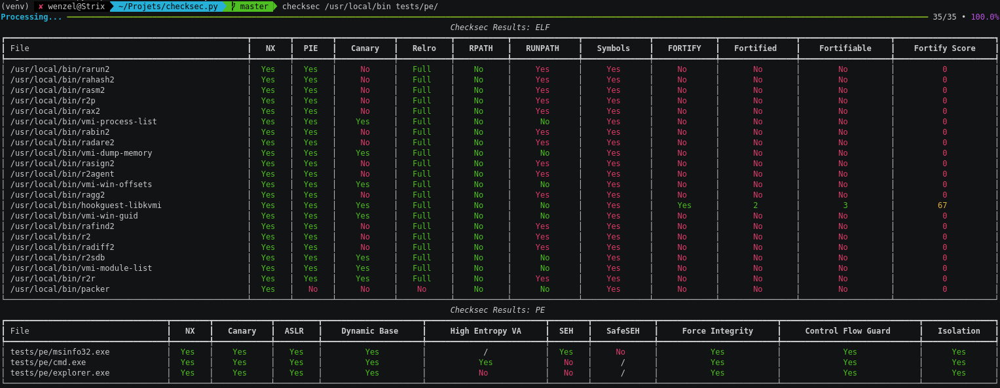

## Checksec

A simple tool to verify the security properties of your binaries.

## Installation

```plain
virtualenv -p python3 venv
source venv/bin/activate
(venv) pip install checksec.py
```

## Usage

```plain
checksec.py [options] <file/directory>...
```

## Flags

```plain
Options:
    -r --recursive                  Walk directories recursively
    -w WORKERS --workers=WORKERS    Specify the number of process pool workers [default: 4]
    -j --json                       Display results as JSON
    -d --debug                      Enable debug output
    -h --help                       Display this message
```

## Examples



## URL List

- [GitHub.com - Checksec](https://github.com/Wenzel/checksec.py)
