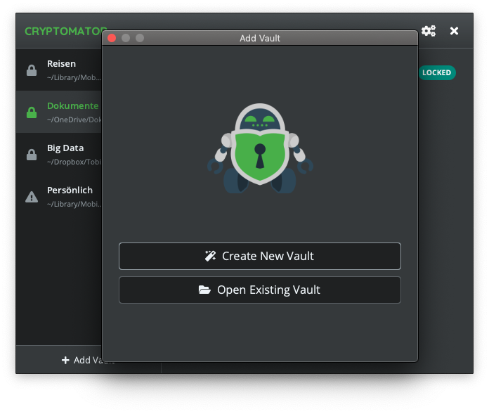

## Cryptomator

Free client-side encryption for your cloud files. Open source software: No backdoors, no registration.

### Installation

Download newest release from [Github.com](https://github.com/cryptomator/cryptomator/releases)

Or add PPA

```plain
sudo add-apt-repository ppa:sebastian-stenzel/cryptomator
sudo apt-get update
```

### Examples



### URL list

* [Cryptomator.org](https://cryptomator.org/)
* [GitHub.com - Cryptomator](https://github.com/cryptomator/cryptomator)
* [Launchpad.net PPA - Cryptomator](https://launchpad.net/~sebastian-stenzel/+archive/ubuntu/cryptomator)
