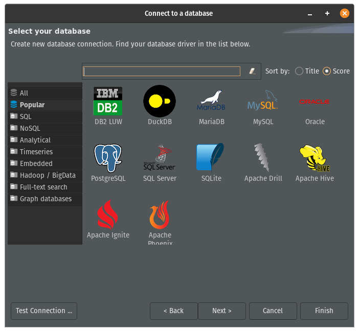
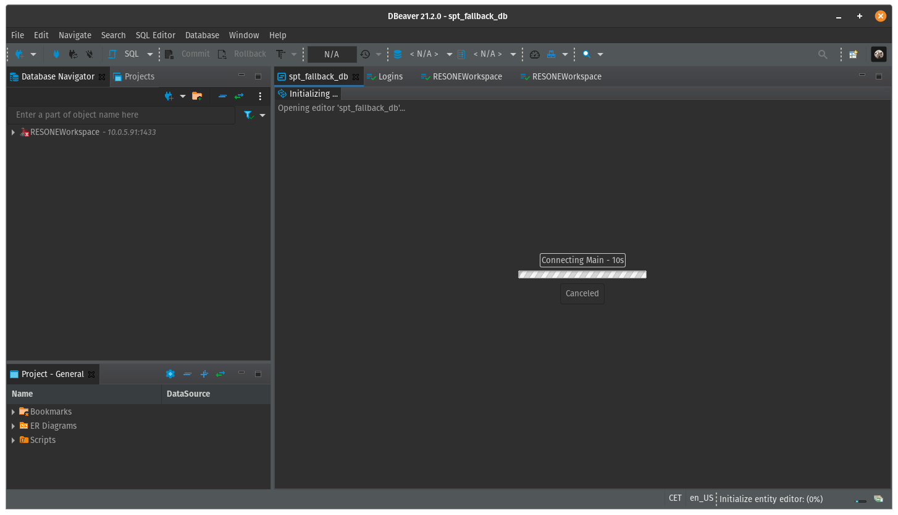

---

Universal Database Tool

Free multi-platform database tool for developers, database administrators, analysts and all people who need to work with databases. Supports all popular databases: MySQL, PostgreSQL, SQLite, Oracle, DB2, SQL Server, Sybase, MS Access, Teradata, Firebird, Apache Hive, Phoenix, Presto, etc.

## Installation

Download newest binary from [dbeaver.io](https://dbeaver.io/download/)

## Examples

## URL List

- [Dbeaver.io](https://dbeaver.io/)
- [Github.com - Dbeaver](https://github.com/dbeaver/dbeaver)
