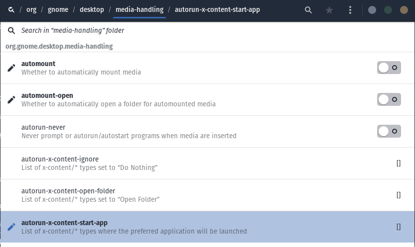

---

Graphical interface for editing other applications settings.

## Installation

```plain
sudo apt install dconf-editor
```

## Usage

```plain
dconf-editor [OPTION…] [ PATH | [FIXED_SCHEMA|RELOC_SCHEMA:DIR] [KEY] ]
```

## Flags

```plain
Uses the gsettings API of the glib library, among others.

Help Options:
  -h, --help                                                      Show help options
  --help-all                                                      Show all help options
  --help-gapplication                                             Show GApplication options
  --help-gtk                                                      Show GTK+ Options

Application Options:
  -v, --version                                                   Print release version and exit
  --list-relocatable-schemas                                      Print relocatable schemas and exit
  --I-understand-that-changing-options-can-break-applications     Do not show initial warning
  --display=DISPLAY                                               X display to use

Arguments description:
  PATH
    a folder path or a key path
    example: “/org/gnome/” or “/ca/desrt/dconf-editor/Demo/boolean”
  FIXED_SCHEMA
    the name of a schema with fixed path
    example: “ca.desrt.dconf-editor.Settings”
  RELOC_SCHEMA
    the name of a “relocatable” schema, without fixed path
    see list with the “--list-relocatable-schemas” option
  DIR
    the path where to map the relocatable schema
    example: “ca.desrt.dconf-editor.Bookmarks:/ca/desrt/dconf-editor/”
  KEY
    the name of a key from the schema
    example: “bookmarks”
```

## Examples



## URL List

- [Wiki.gnome.org - DconfEditor](https://wiki.gnome.org/Apps/DconfEditor)
