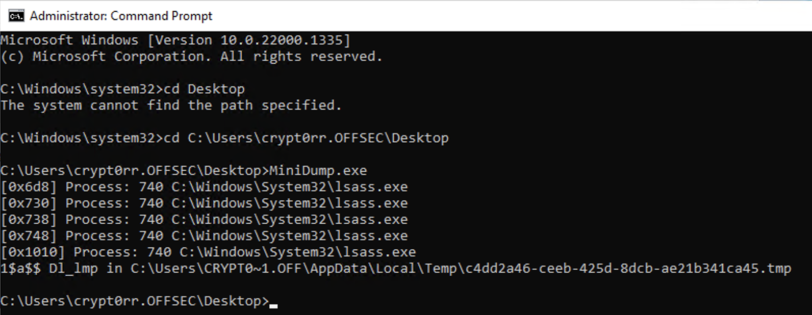

---

Dumping LSASS by Unhooking MiniDumpWriteDump by getting a fresh DbgHelp.dll copy from the disk , plus functions and strings obfuscation , it contains Anti-sandbox , if you run it under unperformant Virtual Machine you need to uncomment the code related to it and recompile.

It's Fully Undetectable and bypass almost all the vendors AV/EDRs, it doesn't bypass RunAsPPL. Dumping LSASS by Unhooking MiniDumpWriteDump by getting a fresh DbgHelp.dll copy from the disk , plus functions and strings obfuscation, duplicate lsass handle from existed processes. The execution may take time, bcz of sandboxing check.

## Compilation

Download source and compile with for example [Visual Studio](https://visualstudio.microsoft.com/).

## Usage

Start CMD or PowerShell as (local) administrator.

```plain
.\MiniDump_(x64/x86).exe
```

## Examples



## URL list

- [Github.com - DumpThatLSASS](https://github.com/D1rkMtr/DumpThatLSASS)
