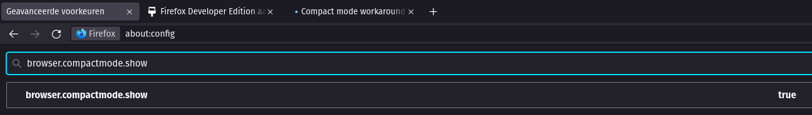
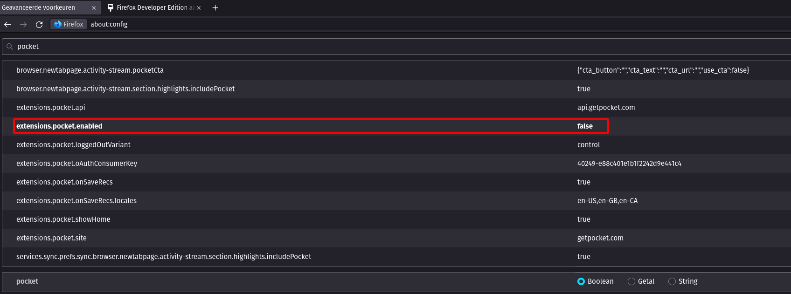

## Firefox Developer Edition

## Installation

Download newest release from [Mozilla.org](https://www.mozilla.org/nl/firefox/developer/)

```plain
tar xjf firefox-x.x.tar.bz2
sudo mv firefox /opt/firefox-dev
sudo chown -R $USER /opt/firefox-dev
```

Next we will create the shortcut of FireFox in menu's.

```plain
touch ~/.local/share/applications/firefox-dev.desktop
```

Fill the created file with you're desired editor with the following content:

```plain
[Desktop Entry]
Name=Firefox Developer
GenericName=Firefox Developer Edition
Exec=/opt/firefox-dev/firefox %u
Terminal=false
Icon=/opt/firefox-dev/browser/chrome/icons/default/default128.png
Type=Application
Categories=Application;Network;X-Developer;
Comment=Firefox Developer Edition Web Browser.
```

### Tweaks




## URL List

* [Mozilla.org - FireFox Developer Edition](https://www.mozilla.org/nl/firefox/developer)
