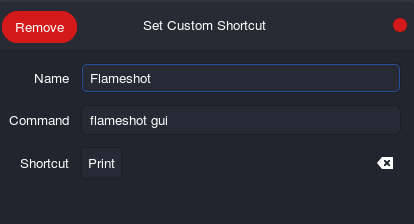

## Flameshot

Powerful yet simple-to-use screenshot software.

## Installation

```plain
sudo apt install flameshot
```

## Usage

```plain
flameshot [flameshot-options] [arguments]
```

## Flags

```plain
Usage: flameshot [flameshot-options] [arguments]

Options:
  -h, --help     Displays this help
  -v, --version  Displays version information

Arguments:
  gui            Start a manual capture in GUI mode.
  screen         Capture a single screen.
  full           Capture the entire desktop.
  launcher       Open the capture launcher.
  config         Configure flameshot.
```

## Examples

#### Bind flameshot under 'prtcs' button



## URL List

* [Github.com - Flameshot](https://github.com/flameshot-org/flameshot)
