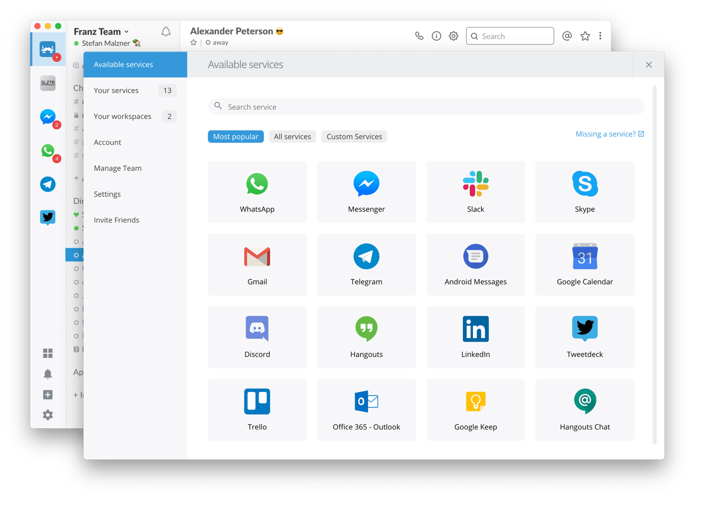

## Franz

Messaging app for WhatsApp, Slack, Telegram, HipChat, Hangouts and many many more.

### Installation

Download newest release from [Github.com](https://github.com/meetfranz/franz/releases)

### Examples

### URL list

* [Meetfranz.com](https://meetfranz.com/)
* [GitHub.com - franz](https://github.com/meetfranz/franz)
