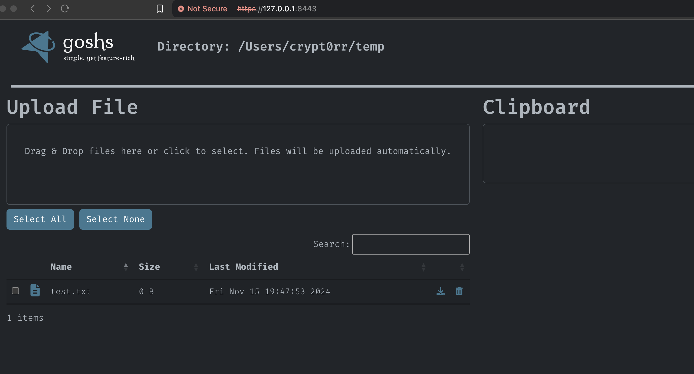

---

goshs is a replacement for Python's `SimpleHTTPServer`. It allows uploading and downloading via HTTP/S with either self-signed certificate or user provided certificate and you can use HTTP basic auth.

## Features

- Download or view files
  - Bulk download as .zip file
- Upload files (Drag & Drop)
- Delete files
  - Individually
  - Bulk delete
- Authentication
  - Basic Authentication
  - Certificate Based Authentication via Client Certificate
- Transport Layer Security (HTTPS)
  - self-signed
  - let's encrypt
  - provide own certificate
- Non persistent clipboard
  - Download clipboard entries as .json file
- WebDAV support
- Read-Only and Upload-Only mode
- Silent mode (no webserver output)
- Retrieve json on cli
- Drop user privileges before execution (Unix only)
  - Example: Run on port 80, but process is "www-data"
- Themes
  - Dark Mode
  - Light Mode
- Command Line
  - Run Commands on the system hosting `goshs`
- File Based ACLs
  - You can place a `.goshs` in any folder to apply custom ACLs
  - You can apply custom basic auth per folder
  - You can restrict access to specific files completely
- Embed files on compile time
- Self updating binary

## Installation

```plain
go install github.com/patrickhener/goshs@latest
```

## Usage

```plain
goshs [options]
```

## Flags

```plain
Web server options:
  -i,  --ip           The ip/if-name to listen on             (default: 0.0.0.0)
  -p,  --port         The port to listen on                   (default: 8000)
  -d,  --dir          The web root directory                  (default: current working path)
  -w,  --webdav       Also serve using webdav protocol        (default: false)
  -wp, --webdav-port  The port to listen on for webdav        (default: 8001)
  -ro, --read-only    Read only mode, no upload possible      (default: false)
  -uo, --upload-only  Upload only mode, no download possible  (default: false)
  -si, --silent       Running without dir listing             (default: false)
  -c,  --cli          Enable cli (only with auth and tls)     (default: false)
  -e,  --embedded     Show embedded files in UI               (default: false)

TLS options:
  -s,   --ssl          Use TLS
  -ss,  --self-signed  Use a self-signed certificate
  -sk,  --server-key   Path to server key
  -sc,  --server-cert  Path to server certificate
  -p12, --pkcs12       Path to server p12
  -sl,  --lets-encrypt Use Let's Encrypt as certification service
  -sld, --le-domains   Domain(s) to request from Let's Encrypt          (comma separated list)
  -sle, --le-email     Email to use with Let's Encrypt
  -slh, --le-http      Port to use for Let's Encrypt HTTP Challenge     (default: 80)
  -slt, --le-tls       Port to use for Let's Encrypt TLS ALPN Challenge (default: 443)

Authentication options:
  -b,  --basic-auth    Use basic authentication (user:pass - user can be empty)
  -ca, --cert-auth     Use certificate based authentication - provide ca certificate
  -H,  --hash          Hash a password for file based ACLs

Misc options:
  -u  --user          Drop privs to user (unix only)          (default: current user)
      --update        Update goshs to most recent version
  -V  --verbose       Activate verbose log output             (default: false)
  -v                  Print the current goshs version

Usage examples:
  Start with default values:            ./goshs
  Start with wevdav support:            ./goshs -w
  Start with different port:            ./goshs -p 8080
  Start with self-signed cert:          ./goshs -s -ss
  Start with let's encrypt:             ./goshs -s -sl -sle your@mail.com -sld your.domain.com,your.seconddomain.com
  Start with custom cert:               ./goshs -s -sk <path to key> -sc <path to cert>
  Start with basic auth:                ./goshs -b secret-user:$up3r$3cur3
  Start with basic auth empty user:     ./goshs -b :$up3r$3cur3
  Start with cli enabled:               ./goshs -b secret-user:$up3r$3cur3 -s -ss -c
```

## Examples

### Default Configuration (no flags)

```plain
$ goshs       
INFO   [2024-11-15 19:50:21] You are running the newest version (v1.0.0) of goshs 
INFO   [2024-11-15 19:50:21] Download embedded file at: /example.txt?embedded 
INFO   [2024-11-15 19:50:21] Serving on interface lo0 bound to 127.0.0.1:8000 
INFO   [2024-11-15 19:50:21] Serving on interface en0 bound to 10.10.20.241:8000 
INFO   [2024-11-15 19:50:21] Serving on interface utun4 bound to 100.96.138.141:8000 
INFO   [2024-11-15 19:50:21] Serving HTTP from /Users/crypt0rr/temp       
INFO   [2024-11-15 19:50:32] 127.0.0.1:57057 - [200] - "GET / HTTP/1.1"
```

### Self-Signed SSL and Basic Auth Enabled

```plain
$ goshs -i 127.0.0.1 -p 8443 -s -ss -b crypt0rr:Welkom1234
INFO   [2024-11-15 19:54:13] You are running the newest version (v1.0.0) of goshs 
INFO   [2024-11-15 19:54:13] Using basic auth with user 'crypt0rr' and password 'Welkom1234' 
INFO   [2024-11-15 19:54:13] Download embedded file at: /example.txt?embedded 
INFO   [2024-11-15 19:54:14] Serving on 127.0.0.1:8443                    
INFO   [2024-11-15 19:54:14] Serving HTTPS from /Users/crypt0rr/temp with ssl enabled and self-signed certificate 
WARNING[2024-11-15 19:54:14] Be sure to check the fingerprint of certificate 
INFO   [2024-11-15 19:54:14] SHA-256 Fingerprint: 2C 58 E8 8B 26 A4 9E 3E 89 D1 D9 A3 B1 1D 6F A9 8D 6F 84 4B D9 30 D3 DE A1 DF 81 43 50 90 D7 1A  
INFO   [2024-11-15 19:54:14] SHA-1   Fingerprint: 3B 03 7E 3B AF 5D 81 34 89 BA FD C2 25 57 8C 35 F5 89 AE C3  
INFO   [2024-11-15 19:54:35] 127.0.0.1:57116 - [200] - "GET / HTTP/2.0"
```



## URL list

- [Github.com - goshs](https://github.com/patrickhener/goshs)
