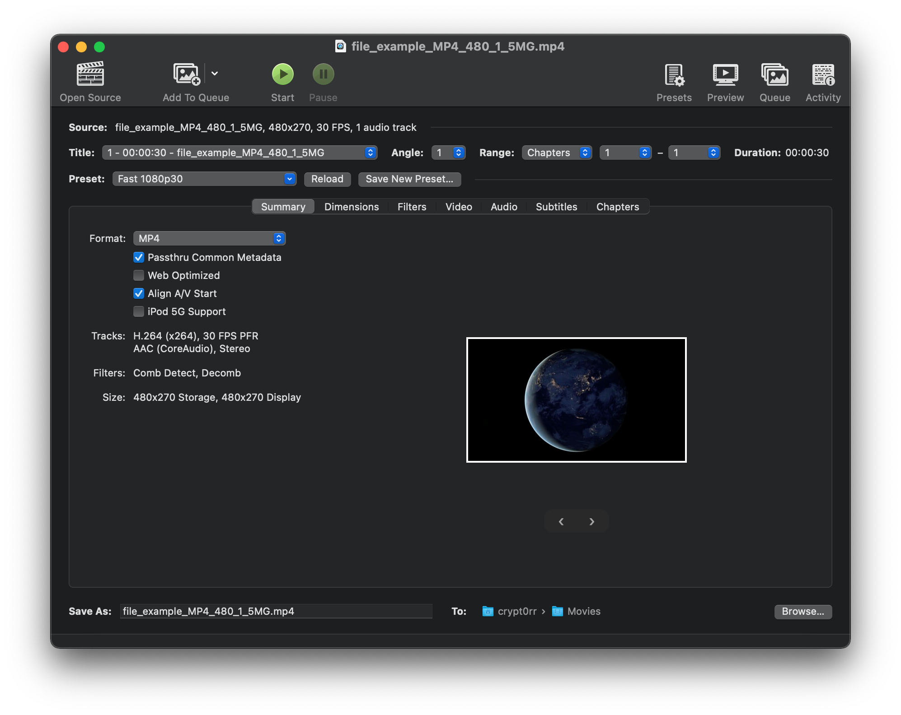
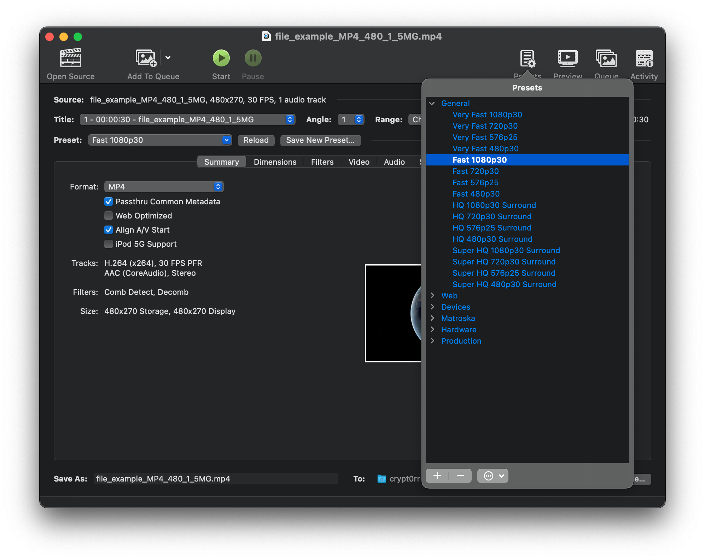

## HandBrake

HandBrake is an open-source video transcoder available for Linux, Mac, and Windows, licensed under the [GNU General Public License (GPL) Version 2](https://github.com/HandBrake/HandBrake/blob/master/LICENSE).

HandBrake takes videos you already have and makes new ones that work on your mobile phone, tablet, TV media player, game console, computer, or web browser—nearly anything that supports modern video formats.

HandBrake works with most common video files and formats, including ones created by consumer and professional video cameras, mobile devices such as phones and tablets, game and computer screen recordings, and DVD and Blu-ray discs. HandBrake leverages tools such as FFmpeg, x264, and x265 to create new MP4 or MKV video files from these Sources.

For information on downloading, building/installing, and using HandBrake, see the official [HandBrake Documentation](https://handbrake.fr/docs).

Reasons you’ll love HandBrake:

* Convert video from nearly any format
* Free and Open Source
* Multi-Platform (Windows, Mac and Linux)

### Features

### Built-in Device Presets

Get started with HandBrake in seconds by choosing a profile optimised for your device, or choose a universal profile for standard or high quality conversions. Simple, easy, fast. For those that want more choice, tweak many basic and advanced options to improve your encodes.

### Supported Input Sources

Handbrake can process most common multimedia files and any DVD or BluRay sources that do not contain any kind of copy protection.

**Outputs**:

* File Containers: .MP4(.M4V), .MKV and WebM
* Video Encoders: H.264 and H.265 (Including hardware acceleration support), MPEG-4 and MPEG-2, VP8, VP9 and Theora
* Audio Encoders: AAC / HE-AAC, MP3, FLAC, AC3, E-AC3, Opus and Vorbis
* Audio Pass-thru: AC-3, E-AC3, FLAC, DTS, DTS-HD, TrueHD, AAC, MP3 and MP2 tracks

### Even more features

* Title / chapter and range selection
* Batch Scan and Queueing of encodes
* Chapter Markers
* Subtitles (VobSub, Closed Captions CEA-608, SSA, SRT)
* Constant Quality or Average Bitrate Video Encoding
* Support for VFR and CFR
* Video Filters: Deinterlacing, Decomb, Denoise, Detelecine, Deblock, Grayscale, Colourspace, Cropping and scaling
* Live Static and Video Preview

## Installation

Download newest release from [Github.com](https://github.com/HandBrake/HandBrake/releases)

## Examples

## URL List

- [Handbrake.fr](https://handbrake.fr/)
- [Handbrake.fr - Forum](https://forum.handbrake.fr/)
- [Github.com - HandBrake](https://github.com/HandBrake/HandBrake)
