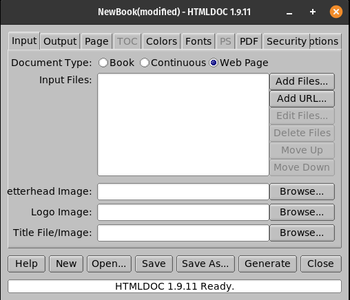

---

A program that reads HTML and Markdown source files or web pages and generates corresponding EPUB, HTML, PostScript, or PDF files with an optional table of contents.

## Installation

```plain
sudo snap install htmldoc
```

## Usage

```plain
htmldoc [options] filename1.html [ ... filenameN.html ]
htmldoc filename.book
```

## Flags

```plain
Options:
  --batch filename.book
  --bodycolor color
  --bodyfont {courier,helvetica,monospace,sans,serif,times}
  --bodyimage filename.{bmp,gif,jpg,png}
  --book
  --bottom margin{in,cm,mm}
  --browserwidth pixels
  --charset {cp-874...1258,iso-8859-1...-15,koi8-r,utf-8}
  --color
  --compression[=level]
  --continuous
  --cookies 'name="value with space"; name=value'
  --datadir directory
  --duplex
  --effectduration {0.1..10.0}
  --embedfonts
  --encryption
  --firstpage {p1,toc,c1}
  --fontsize {4.0..24.0}
  --fontspacing {1.0..3.0}
  --footer fff
  {--format, -t} {epub,html,htmlsep,pdf11,pdf12,pdf13,pdf14,ps1,ps2,ps3}
  --gray
  --header fff
  --header1 fff
  --headfootfont {courier{-bold,-oblique,-boldoblique},
                  helvetica{-bold,-oblique,-boldoblique},
                  monospace{-bold,-oblique,-boldoblique},
                  sans{-bold,-oblique,-boldoblique},
                  serif{-bold,-italic,-bolditalic},
                  times{-roman,-bold,-italic,-bolditalic}}

  --headfootsize {6.0..24.0}
  --headingfont {courier,helvetica,monospace,sans,serif,times}
  --help
  --helpdir directory
  --hfimage0 filename.{bmp,gif,jpg,png}
  --hfimage1 filename.{bmp,gif,jpg,png}
  --hfimage2 filename.{bmp,gif,jpg,png}
  --hfimage3 filename.{bmp,gif,jpg,png}
  --hfimage4 filename.{bmp,gif,jpg,png}
  --hfimage5 filename.{bmp,gif,jpg,png}
  --hfimage6 filename.{bmp,gif,jpg,png}
  --hfimage7 filename.{bmp,gif,jpg,png}
  --hfimage8 filename.{bmp,gif,jpg,png}
  --hfimage9 filename.{bmp,gif,jpg,png}
  --jpeg[=quality]
  --landscape
  --left margin{in,cm,mm}
  --letterhead filename.{bmp,gif,jpg,png}
  --linkcolor color
  --links
  --linkstyle {plain,underline}
  --logoimage filename.{bmp,gif,jpg,png}
  --no-compression
  --no-duplex
  --no-embedfonts
  --no-encryption
  --no-links
  --no-localfiles
  --no-numbered
  --no-overflow
  --no-pscommands
  --no-strict
  --no-title
  --no-toc
  --numbered
  --nup {1,2,4,6,9,16}
  {--outdir, -d} dirname
  {--outfile, -f} filename.{epub,html,pdf,ps}
  --overflow
  --owner-password password
  --pageduration {1.0..60.0}
  --pageeffect {none,bi,bo,d,gd,gdr,gr,hb,hsi,hso,vb,vsi,vso,wd,wl,wr,wu}
  --pagelayout {single,one,twoleft,tworight}
  --pagemode {document,outline,fullscreen}
  --path "dir1;dir2;dir3;...;dirN"
  --permissions {all,annotate,copy,modify,print,no-annotate,no-copy,no-modify,no-print,none}
  --portrait
  --proxy http://host:port
  --pscommands
  --quiet
  --referer url
  --right margin{in,cm,mm}
  --size {letter,a4,WxH{in,cm,mm},etc}
  --strict
  --textcolor color
  --textfont {courier,times,helvetica}
  --title
  --titlefile filename.{htm,html,shtml}
  --titleimage filename.{bmp,gif,jpg,png}
  --tocfooter fff
  --tocheader fff
  --toclevels levels
  --toctitle string
  --top margin{in,cm,mm}
  --user-password password
  {--verbose, -v}
  --version
  --webpage

  fff = heading format string; each 'f' can be one of:

        . = blank
        / = n/N arabic page numbers (1/3, 2/3, 3/3)
        : = c/C arabic chapter page numbers (1/2, 2/2, 1/4, 2/4, ...)
        1 = arabic numbers (1, 2, 3, ...)
        a = lowercase letters
        A = uppercase letters
        c = current chapter heading
        C = current chapter page number (arabic)
        d = current date
        D = current date and time
        h = current heading
        i = lowercase roman numerals
        I = uppercase roman numerals
        l = logo image
        L = letterhead image
        t = title text
        T = current time
        u = current file/URL
```

## Examples



## URL List

- [Snapcraft.io - htmldoc](https://snapcraft.io/htmldoc)
- [Msweet.org - htmldoc](https://www.msweet.org/htmldoc/)
- [Github.com - htmldoc](https://github.com/michaelrsweet/htmldoc)
