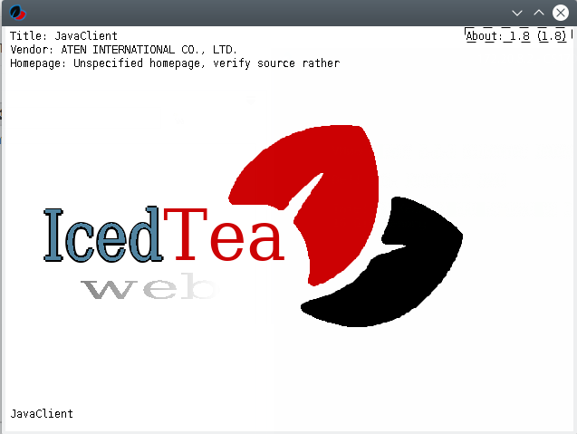

## Icedtea-NetX

NetX provides a drop-in replacement for javaws (Java Web Start). Since upstream NetX is dead, the IcedTea Web project is hosting a fork of the original code. However, as icedtea-web has evolved to complex set of tools, extensions and tests, it has now only a few lines of code shared with the original implementation.

Tool to open and view **.jnlp** files.

## Installation

```plain
sudo apt-get install icedtea-netx
```

## Usage

```plain
javaws viewer.jnlp
```

## Examples



## URL List

- [Packages.debian.org - icedtea-netx](https://packages.debian.org/nl/sid/icedtea-netx)
