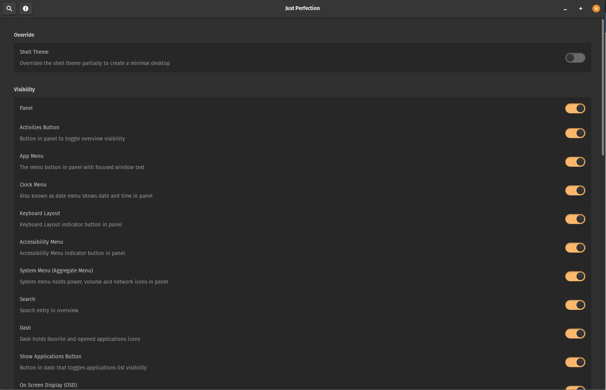
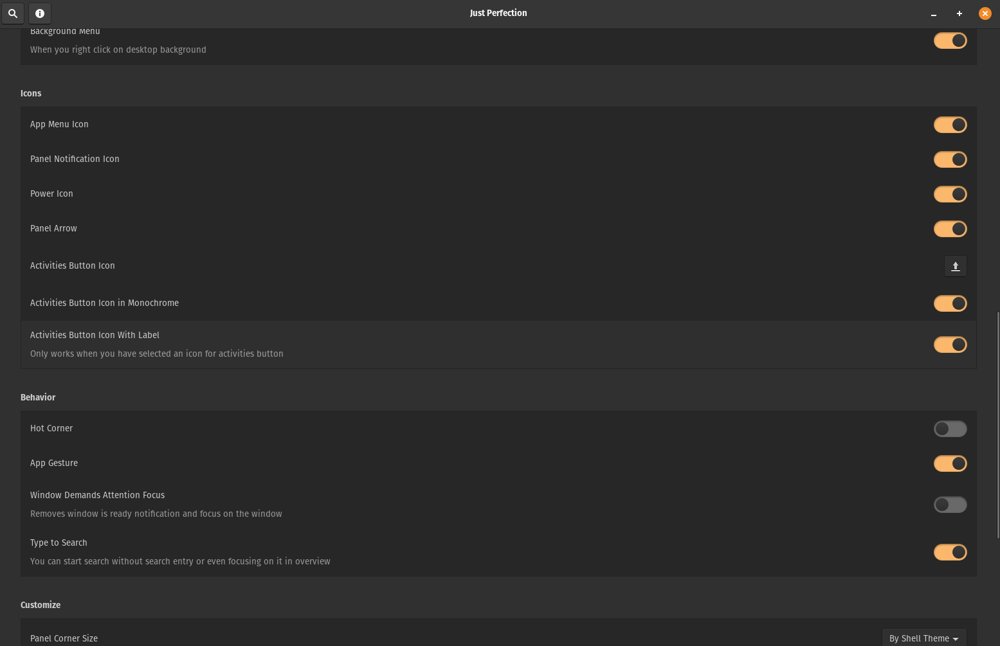
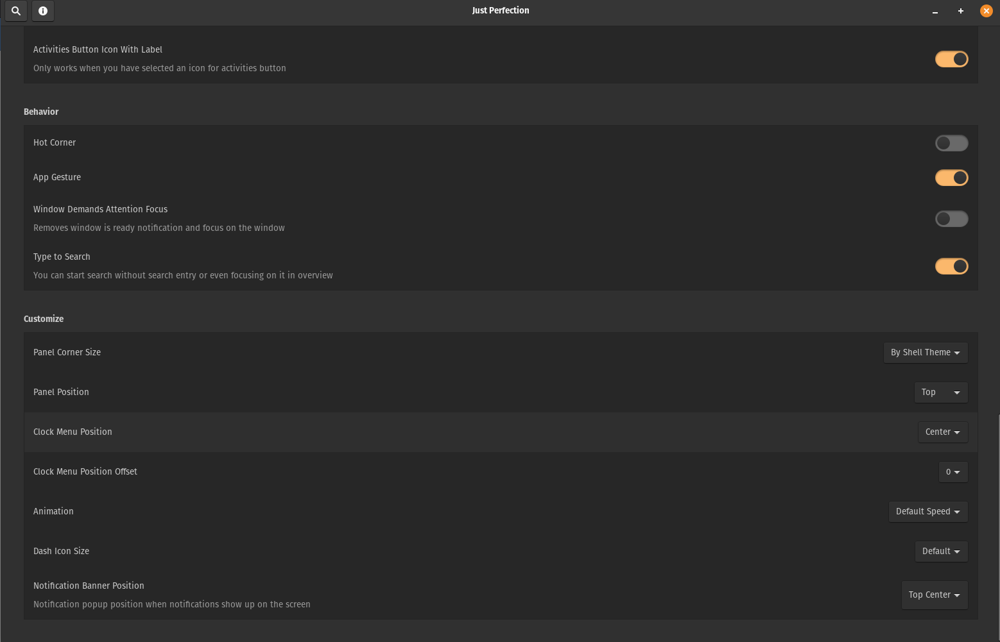

## Just Perfection

Disable and Customize GNOME shell UI Elements.

This extension allows you to do the following:

#### Visibility

* OSD
* Search
* Dash
* Workspace Switcher
* Workspace Popup
* Panel
* Background Menu
* Activities button
* App Menu
* Clock Menu
* Keyboard Layout
* Accessibility Menu
* System Menu (Aggregate Menu)
* Applications Button
* Workspaces in app grid (Only GNOME Shell 40)

#### Icons Visibility

* App Menu Icon
* Power Icon
* Panel Notification icon
* Window Picker Icon (Only GNOME Shell 40)
* Panel Arrow (Only GNOME Shell 3.36 and 3.38)
* Activities Button Icon

#### Behavior

* Disable Type to Search
* Hot Corner
* App Gesture (Only GNOME Shell 3.36 and 3.38)
* Window Demands Attention Focus
* Always Show Workspace Switcher on Dynamic Workspaces (Only GNOME Shell 40)
* Startup status (Only GNOME Shell 40)

#### Customize

* Panel Position
* Panel Round Corner Size
* Clock Menu Position
* Workspace Switcher Size (Only GNOME Shell 40)
* Animation Speed or Disable it
* Dash Icon Size
* Notification Banner Position

#### Override

* GNOME shell theme (You don't need to have user-theme-extension)

### Installation

Installation via [extensions.gnome.org](https://extensions.gnome.org/extension/3843/just-perfection/)

### Examples

### URL list

* [Gitlab.gnome.org - Just Perfection](https://gitlab.gnome.org/jrahmatzadeh/just-perfection)
* [Extensions.gnome.org - Just Perfection](https://extensions.gnome.org/extension/3843/just-perfection/)
