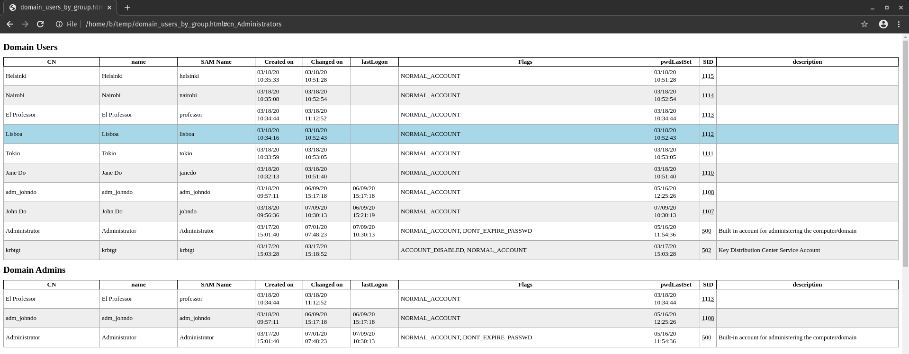

## LDAPDomainDump

Active Directory information dumper via LDAP.

### Installation

Dependencies

```plain
python3 -m pip install ldap3 dnspython
```

```plain
git clone https://github.com/dirkjanm/ldapdomaindump.git
cd ldapdomaindump
sudo python3 setup.py install
```

### Usage

```plain
usage: ldapdomaindump [-h] [-u USERNAME] [-p PASSWORD] [-at {NTLM,SIMPLE}]
                      [-o DIRECTORY] [--no-html] [--no-json] [--no-grep]
                      [--grouped-json] [-d DELIMITER] [-r] [-n DNS_SERVER]
                      [-m]
                      HOSTNAME
```

### Flags

```plain
Domain information dumper via LDAP. Dumps users/computers/groups and
OS/membership information to HTML/JSON/greppable output.

Required options:
  HOSTNAME              Hostname/ip or ldap://host:port connection string to
                        connect to (use ldaps:// to use SSL)

Main options:
  -h, --help            show this help message and exit
  -u USERNAME, --user USERNAME
                        DOMAIN\username for authentication, leave empty for
                        anonymous authentication
  -p PASSWORD, --password PASSWORD
                        Password or LM:NTLM hash, will prompt if not specified
  -at {NTLM,SIMPLE}, --authtype {NTLM,SIMPLE}
                        Authentication type (NTLM or SIMPLE, default: NTLM)

Output options:
  -o DIRECTORY, --outdir DIRECTORY
                        Directory in which the dump will be saved (default:
                        current)
  --no-html             Disable HTML output
  --no-json             Disable JSON output
  --no-grep             Disable Greppable output
  --grouped-json        Also write json files for grouped files (default:
                        disabled)
  -d DELIMITER, --delimiter DELIMITER
                        Field delimiter for greppable output (default: tab)

Misc options:
  -r, --resolve         Resolve computer hostnames (might take a while and
                        cause high traffic on large networks)
  -n DNS_SERVER, --dns-server DNS_SERVER
                        Use custom DNS resolver instead of system DNS (try a
                        domain controller IP)
  -m, --minimal         Only query minimal set of attributes to limit memmory
                        usage
```

### Examples

#### Dump domain information (normal user)

```plain
$ ldapdomaindump -u '<domain>\<user>' -p '<password>' -d ';' <dc-ip>
[*] Connecting to host...
[*] Binding to host
[+] Bind OK
[*] Starting domain dump
[+] Domain dump finished
```

#### Filter all usernames

For example to use with [Kerbrute]() or [CrackMapExec]()

```plain
cat domain_users.grep | grep -v ACCOUNT_DISABLED | awk -F ';' '{print $3}'
```

#### Script to filter (enabled) high privilege users

Requires 'domain_users.grep' file



#### Filter Description field

```plain
cat domain_users.grep | grep -v ACCOUNT_DISABLED | awk -F ';' '{print $3,$12}' OFS=" | "  
```

#### Filter group memberships of specific SIDs

For example 'Domain Users'.

```plain
grep -w 'S-1-5-21*.*513' domain_groups.grep | awk -F ';' '{print $3}'
```

#### Oneliners to filter high privilege users

```plain
grep -w 'Domain Admins' domain_users.grep | grep -v ACCOUNT_DISABLED | awk -F ';' '{print $3}'
```

```plain
grep -w 'Enterprise Admins' domain_users.grep | grep -v ACCOUNT_DISABLED | awk -F ';' '{print $3}'
```

```plain
grep -w 'Administrators' domain_users.grep | grep -v ACCOUNT_DISABLED | awk -F ';' '{print $3}'
```

```plain
grep -w 'Schema Admins' domain_users.grep | grep -v ACCOUNT_DISABLED | awk -F ';' '{print $3}'
```

```plain
grep -w 'Account Operators' domain_users.grep | grep -v ACCOUNT_DISABLED | awk -F ';' '{print $3}'
```

```plain
grep -w 'Backup Operators' domain_users.grep | grep -v ACCOUNT_DISABLED | awk -F ';' '{print $3}'
```

```plain
grep -w 'DNS Admins' domain_users.grep | grep -v ACCOUNT_DISABLED | awk -F ';' '{print $3}'
```

```plain
grep PASSWD_NOTREQD domain_users.grep | grep -v ACCOUNT_DISABLED | awk -F ';' '{print $3}'
```

#### Filter accounts that have 'Password Never Expire' set

From all users enabled and disabled.

```plain
grep -w 'DONT_EXPIRE_PASSWD' domain_users.grep | awk -F ';' '{print $3}'
```

From all users only enabled accounts.

```plain
grep -w 'DONT_EXPIRE_PASSWD' domain_users.grep | grep -v ACCOUNT_DISABLED | awk -F ';' '{print $3}'
```

From specific group.

```plain
grep -w 'Domain Admins' domain_users.grep | grep DONT_EXPIRE_PASSWD | awk -F ';' '{print $3}'
```

From specific group only enabled accounts.

```plain
grep -w 'Domain Admins' domain_users.grep | grep DONT_EXPIRE_PASSWD | grep -v ACCOUNT_DISABLED | awk -F ';' '{print $3}'
```

#### Filter accounts that have not loggedin for a while

```plain
$ sort -t ';' -k 8 domain_users.grep | grep -v ACCOUNT_DISABLED | awk -F ';' '{print $3, $8}'
lisboa 01/01/01 00:00:00
adm_johndo 06/09/20 15:17:18
johndo 06/09/20 15:21:19
Administrator 07/09/20 12:31:41
```



### URL list

* [Github.com - LDAPdomaindump](https://github.com/dirkjanm/ldapdomaindump)
