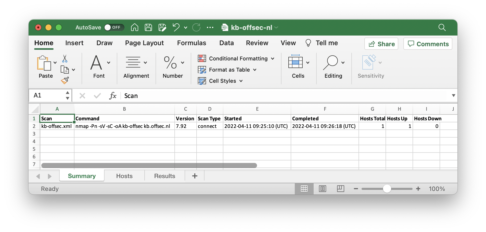
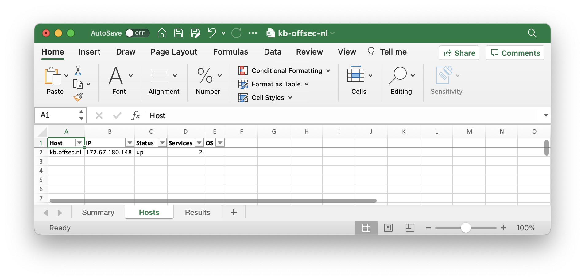
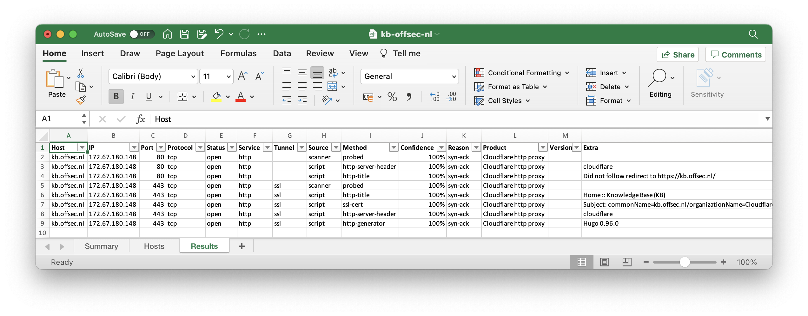

## nmap-converter

Python script for converting nmap reports into XLS.

## Installation

```plain
git clone https://github.com/mrschyte/nmap-converter.git
python3 -m pip install -r requirements.txt
```

## Usage

```plain
nmap-converter.py [-h] [-o XLS] XML [XML ...]
```

## Flags

```plain
positional arguments:
  XML                   path to nmap xml report

optional arguments:
  -h, --help            show this help message and exit
  -o XLS, --output XLS  path to xlsx output
```

## Examples

Perform a [nmap]() to the target system(s) and for example use `-oA` to save in all formats.

```plain
$ nmap -Pn -sV -sC -oA kb-offsec kb.offsec.nl     
Starting Nmap 7.92 ( https://nmap.org ) at 2022-04-11 11:25 CEST
Nmap scan report for kb.offsec.nl (172.67.180.148)
Host is up (0.028s latency).
Other addresses for kb.offsec.nl (not scanned): 104.21.67.203
Not shown: 998 filtered tcp ports (no-response)
PORT    STATE SERVICE  VERSION
80/tcp  open  http     Cloudflare http proxy
|_http-server-header: cloudflare
|_http-title: Did not follow redirect to https://kb.offsec.nl/
443/tcp open  ssl/http Cloudflare http proxy
|_http-title: Home :: Knowledge Base (KB)
| ssl-cert: Subject: commonName=kb.offsec.nl/organizationName=Cloudflare, Inc./stateOrProvinceName=California/countryName=US
| Subject Alternative Name: DNS:kb.offsec.nl
| Not valid before: 2021-12-06T00:00:00
|_Not valid after:  2022-12-05T23:59:59
|_http-server-header: cloudflare
|_http-generator: Hugo 0.96.0

Service detection performed. Please report any incorrect results at https://nmap.org/submit/ .
Nmap done: 1 IP address (1 host up) scanned in 68.61 seconds
```

Convert the nmap output to Excel.

```plain
$ python3 nmap-converter.py kb-offsec.xml -o kb-offsec-nl.xls
[+] Processing Nmap done at Mon Apr 11 11:26:18 2022; 1 IP address (1 host up) scanned in 68.61 seconds
[+] Processing NmapHost: [172.67.180.148 (kb.offsec.nl) - up]
```





{}

## URL List

- [Github.com - nmap-converter](https://github.com/mrschyte/nmap-converter)
