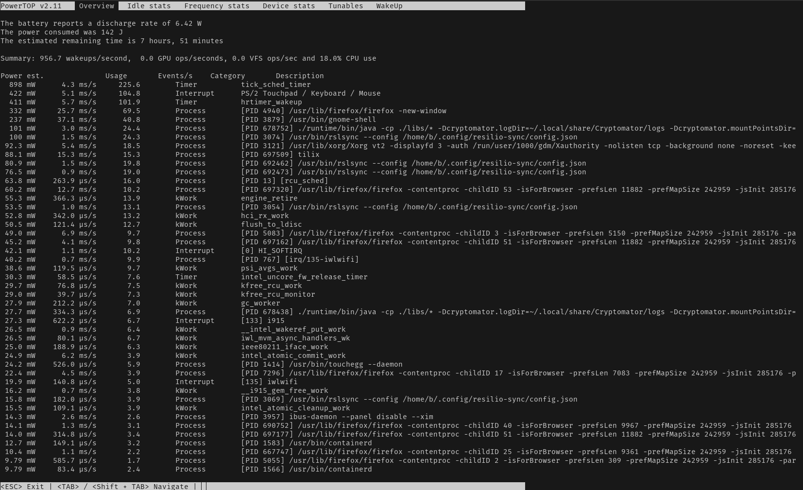

---

Apower consumption and power management diagnosis tool.

## Installation

```plain
sudo apt install powertop
```

## Usage

```plain
sudo powertop [OPTIONS]
```

## Flags

```plain
     --auto-tune                sets all tunable options to their GOOD setting
 -c, --calibrate                runs powertop in calibration mode
 -C, --csv[=filename]           generate a csv report
     --debug                    run in "debug" mode
     --extech[=devnode]         uses an Extech Power Analyzer for measurements
 -r, --html[=filename]          generate a html report
 -i, --iteration[=iterations]   number of times to run each test
 -q, --quiet                    suppress stderr output
 -s, --sample[=seconds]         interval for power consumption measurement
 -t, --time[=seconds]           generate a report for 'x' seconds
 -w, --workload[=workload]      file to execute for workload
 -V, --version                  print version information
 -h, --help                     print this help menu

For more help please refer to the 'man 8 powertop'
```

## Examples



## URL List

- [Github.com - PowerTOP](https://github.com/fenrus75/powertop)
