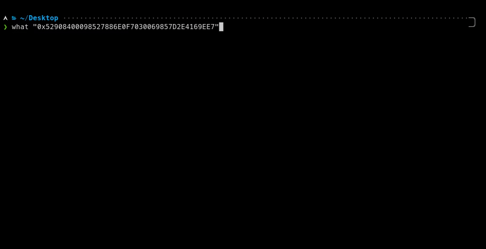

---

Imagine this: You come across some mysterious text "0x52908400098527886E0F7030069857D2E4169EE7" or "dQw4w9WgXcQ" and you wonder what it is. What do you do?

Well, with `what` all you have to do is ask what "0x52908400098527886E0F7030069857D2E4169EE7" and `what` will tell you!

`what`'s job is to identify what something is. Whether it be a file or text! Or even the hex of a file! What about text within files? We have that too! `what` is recursive, it will identify everything in text and more!

## Installation

```plain
python3 -m pip install pywhat
```

For macOS you can also install using HomeBrew.

```plain
brew install pywhat
```

## Usage

```plain
what [OPTIONS] [TEXT_INPUT]
```

## Flags

```plain
  Filtration:

      --rarity min:max

          Rarity is how unlikely something is to be a false-positive. The
          higher the number, the more unlikely.

          Only print entries with rarity in range [min,max]. min and max can
          be omitted.

          Note: PyWhat by default has a rarity of 0.1. To see all matches,
          with many potential false positives use `0:`.

      --include list

          Only include entries containing at least one tag in a list. List
          is a comma separated list.

      --exclude list

          Exclude specified tags. List is a comma separated list.

  Sorting:

      --key key_name

          Sort by the given key.

      --reverse

          Sort in reverse order.

      Available keys:

          name - Sort by the name of regex pattern

          rarity - Sort by rarity

          matched - Sort by a matched string

          none - No sorting is done (the default)

  Exporting:

      --json

          Return results in json format.

  Boundaryless mode:

      CLI tool matches strings like 'abcdTHM{hello}plze' by default because
      the boundaryless mode is enabled for regexes with a rarity of 0.1 and
      higher.

      Since boundaryless mode may produce a lot of false-positive matches,
      it is possible to disable it, either fully or partially.

      '--disable-boundaryless' flag can be used to fully disable this mode.

      In addition, '-br', '-bi', and '-be' options can be used to tweak
      which regexes should be in boundaryless mode.

      Refer to the Filtration section for more information.

  Formatting the output:

      --format format_str

          format_str can be equal to:

              pretty - Output data in the table

              json - Output data in json format

              CUSTOM_STRING - Print data in the way you want. For every
              match CUSTOM_STRING will be printed and '%x' (See below for
              possible x values) will be substituted with a match value.

              For example:

                  pywhat --format '%m - %n' 'google.com htb{flag}'

                  will print:

                  htb{flag} - HackTheBox Flag Format
                  google.com - Uniform Resource Locator (URL)

              Possible '%x' values:

                  %m - matched text

                  %n - name of regex

                  %d - description (will not output if absent)

                  %e - exploit (will not output if absent)

                  %r - rarity

                  %l - link (will not output if absent)

                  %t - tags (in 'tag1, tag2 ...' format)

              If you want to print '%' or '\' character - escape it: '\%',
              '\\'.

  Examples:

      * what 'HTB{this is a flag}'

      * what '0x52908400098527886E0F7030069857D2E4169EE7'

      * what -- '52.6169586, -1.9779857'

      * what --rarity 0.6: 'myEmail@host.org'

      * what --rarity 0: --include "credentials, username, password"
      --exclude "aws, credentials" 'James:SecretPassword'

      * what -br 0.6: -be URL '123myEmail@host.org456'

  Your text must either be in quotation marks, or use the POSIX standard of
  "--" to mean "anything after -- is textual input".

  pyWhat can also search files or even a whole directory with recursion:

      * what 'secret.txt'

      * what 'this/is/a/path'

Options:
  -t, --tags                      Show available tags and exit.
  -r, --rarity TEXT               Filter by rarity. Rarity is how unlikely
                                  something is to be a false-positive. The
                                  higher the number, the more unlikely. This
                                  is in the range of 0:1. To filter only items
                                  past 0.5, use 0.5: with the colon on the
                                  end. Default 0.1:1

  -i, --include TEXT              Only show matches with these tags.
  -e, --exclude TEXT              Exclude matches with these tags.
  -o, --only-text                 Do not scan files or folders.
  -k, --key TEXT                  Sort by the specified key.
  --reverse                       Sort in reverse order.
  -br, --boundaryless-rarity TEXT
                                  Same as --rarity but for boundaryless mode
                                  (toggles what regexes will not have
                                  boundaries).

  -bi, --boundaryless-include TEXT
                                  Same as --include but for boundaryless mode.
  -be, --boundaryless-exclude TEXT
                                  Same as --exclude but for boundaryless mode.
  -db, --disable-boundaryless     Disable boundaryless mode.
  --json                          Return results in json format.
  -v, --version                   Display the version of pywhat.
  -if, --include-filenames        Search filenames for possible matches.
  --format TEXT                   Format output according to specified rules.
  -pt, --print-tags               Add flags to output
  --help                          Show this message and exit.
```

## Examples



## URL List

- [Github.com - pyWhat](https://github.com/bee-san/pyWhat)
- [Twitter.com - bee_sec_san](https://twitter.com/bee_sec_san)
