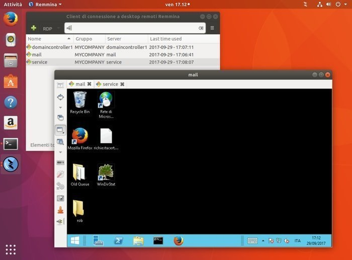

## Remmina

The GTK Remote Desktop Client.

## Installation

```plain
sudo apt install remmina
```

## Usage

Use Remmina GUI

```plain
remmina [OPTION…] FILE
```

## Flags

```plain
Usage:
  org.remmina.Remmina [OPTION…] FILE

Help Options:
  -h, --help                  Show help options
  --help-all                  Show all help options
  --help-gapplication         Show GApplication options
  --help-gtk                  Show GTK+ Options

Application Options:
  -a, --about                 Show about dialog
  -c, --connect=FILE          Connect to desktop described by file (.remmina or type supported by plugin)
  -e, --edit=FILE             Edit desktop connection described by file (.remmina or type supported by plugin)
  -k, --kiosk                 Start Remmina in Kiosk mode
  -n, --new                   Create a new connection profile
  -p, --pref=PAGENR           Show preferences dialog page
  -x, --plugin=PLUGIN         Execute the plugin
  -q, --quit                  Quit the application
  -s, --server=SERVER         Use default server name (for --new)
  -t, --protocol=PROTOCOL     Use default protocol (for --new)
  -i, --icon                  Start as tray icon
  -v, --version               Show the application's version
  -V, --full-version          Show the application's version, including the plugin versions
  --display=DISPLAY           X display to use
```

## Examples



## URL List

- [GitHub.com - Remmina](https://github.com/FreeRDP/Remmina)
- [Remmina.org](https://remmina.org/)
