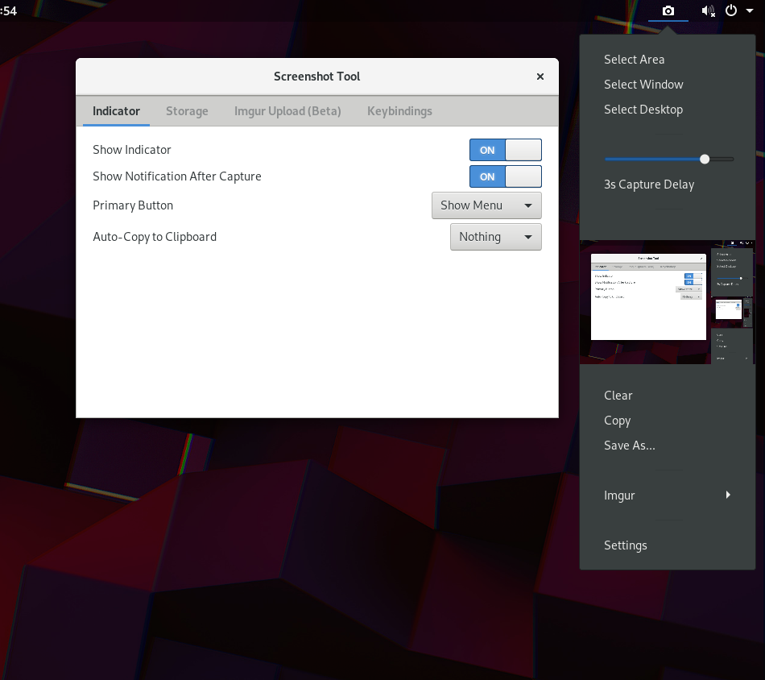

## Screenshot Tool

Conveniently create, copy, store and upload screenshots.

## Installation

Installation via [extensions.gnome.org](https://extensions.gnome.org/extension/1112/screenshot-tool/)

## Examples

## URL List

- [Extensions.gnome.org - Screenshot Tool](https://extensions.gnome.org/extension/1112/screenshot-tool/)
- [Github.com - Screenshot Tool](https://github.com/OttoAllmendinger/gnome-shell-screenshot/)
