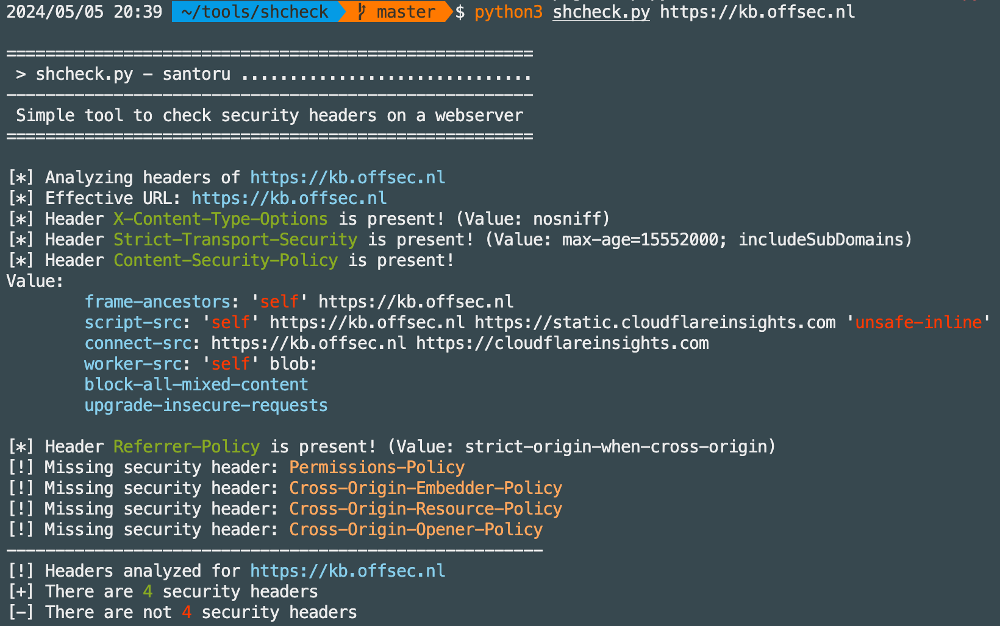

---

## Installation

### Python Pip

```plain
python3 -m pip install shcheck
```

### Source

```plain
git clone https://github.com/santoru/shcheck && cd shcheck
./shcheck.py https://insecurity.blog
```

## Usage

```plain
shcheck.py [options] <target>
```

## Flags

```plain
  -h, --help            show this help message and exit
  -p PORT, --port=PORT  Set a custom port to connect to
  -c COOKIE_STRING, --cookie=COOKIE_STRING
                        Set cookies for the request
  -a HEADER_STRING, --add-header=HEADER_STRING
                        Add headers for the request e.g. 'Header: value'
  -d, --disable-ssl-check
                        Disable SSL/TLS certificate validation
  -g, --use-get-method  Use GET method instead HEAD method
  -j, --json-output     Print the output in JSON format
  -i, --information     Display information headers
  -x, --caching         Display caching headers
  -k, --deprecated      Display deprecated headers
  --proxy=PROXY_URL     Set a proxy (Ex: http://127.0.0.1:8080)
  --hfile=PATH_TO_FILE  Load a list of hosts from a flat file
  --colours=COLOURS     Set up a colour profile [dark/light/none]
  --colors=COLOURS      Alias for colours for US English
```

## Examples



## URL list

- [Github.com - shcheck](https://github.com/santoru/shcheck)
