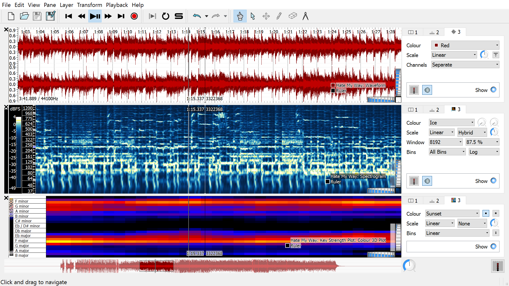
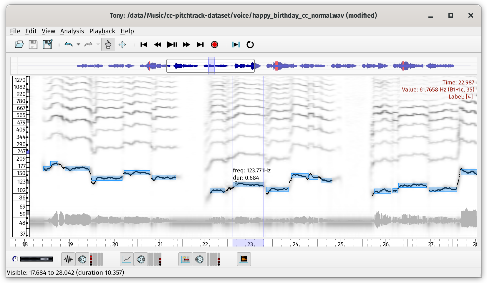

---

A program for viewing and analysing the contents of music audio files.

## Installation

Download newest version of [Sonic Visualiser](https://sonicvisualiser.org/download.html). Sonic Visualiser itself is the most general, a program for highly configurable detailed visualisation, analysis, and annotation of audio recordings.
Download newest version of [Tony](https://code.soundsoftware.ac.uk/projects/sonic-lineup/files). Tony is for high quality pitch and note transcription for scientific applications, designed primarily for solo vocal recordings.

## Examples

### Visualiser

### Tony

## URL List

- [Sonicvisualiser.org](https://sonicvisualiser.org/)
- [Github.com - Sonic Visualiser](https://github.com/sonic-visualiser/sonic-visualiser)
