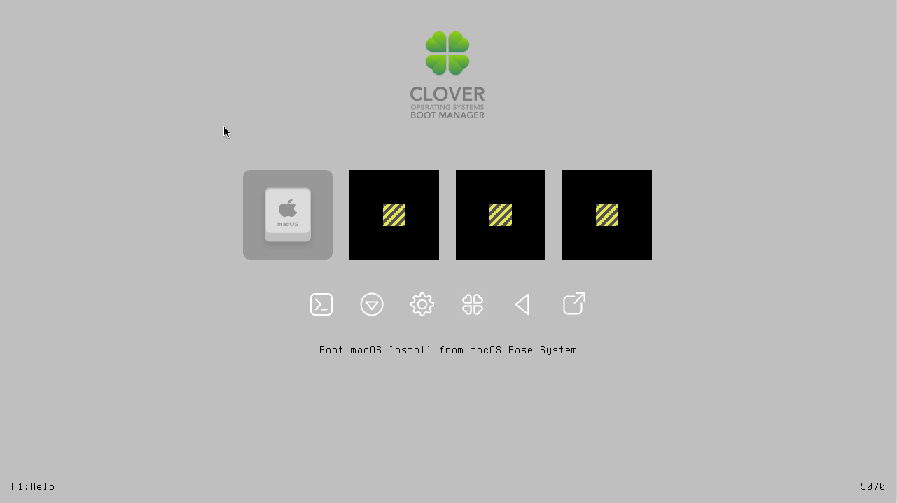
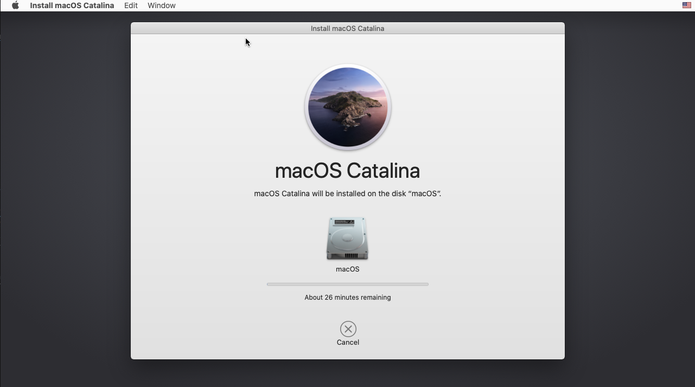
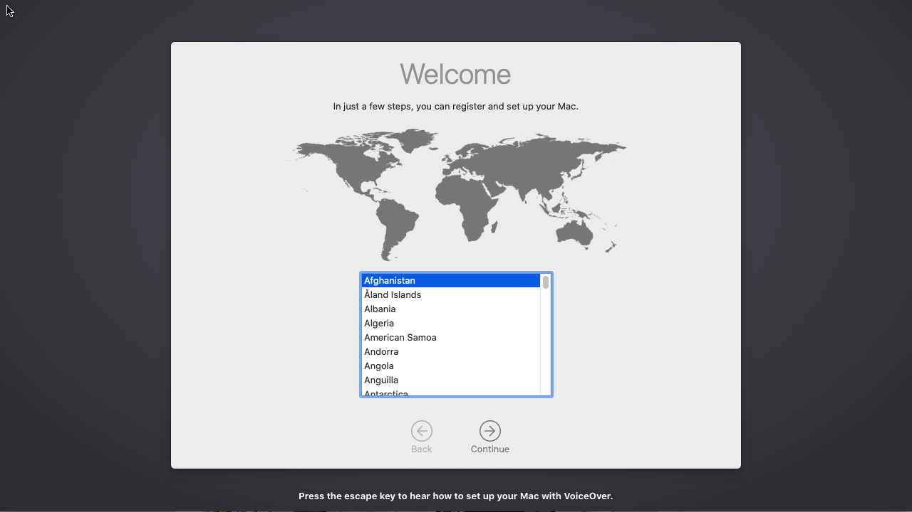
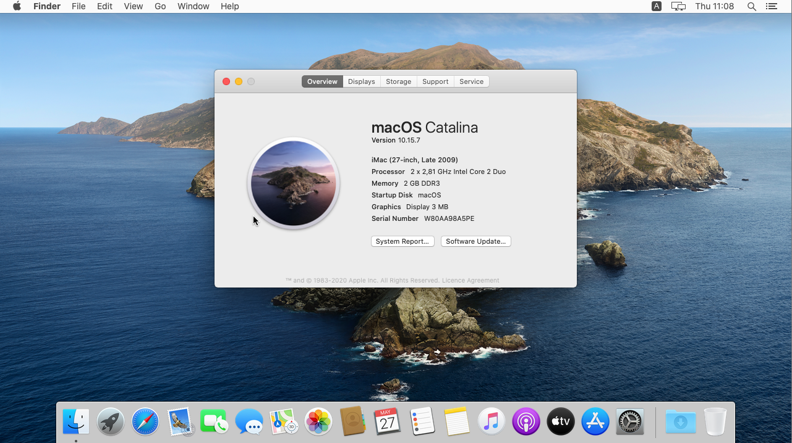
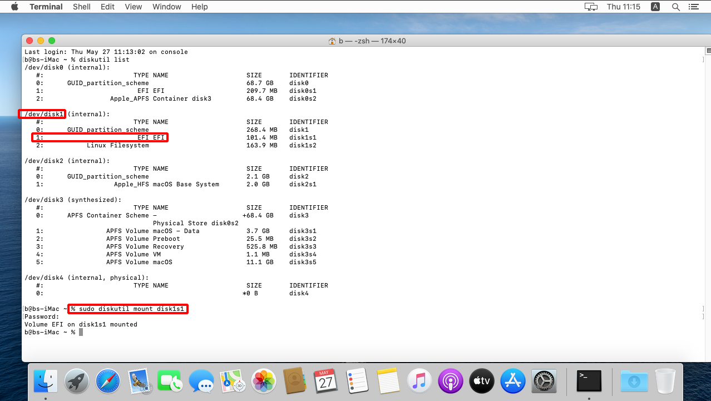
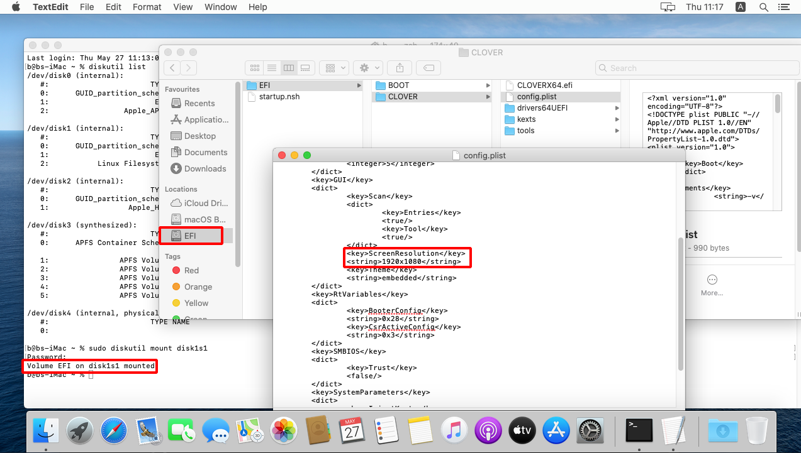

---

Download and install macOS in a VM / macOS on Linux in one command.

## Installation

Clean install of macOS will take **30.6 GiB** of disk space.

```plain
sudo snap install sosumi
```

Run initial setup and install macOS.

```plain
sosumi
```

## Usage

After installation you can just run the command of the snap module to start the macOS environment.

```plain
sosumi
```

### Initial installation








### Edit resolution

From Apple Terminal inside macOS.

```plain
diskutil list
```



```plain
sudo diskutil mount <EFI-PARTITION>
```



### Edit RAM CPU

```plain
nano ~/snap/sosumi/common/launch
```

Example configuration.

```plain
#!/bin/bash

OSK="ourhardworkbythesewordsguardedpleasedontsteal(c)AppleComputerInc"

"$SNAP"/usr/bin/qemu-system-x86_64 \
    -enable-kvm \
    -m 8G \
    -machine q35,accel=kvm \
    -smp 4,cores=4 \
    -cpu Penryn,vendor=GenuineIntel,kvm=on,+sse3,+sse4.2,+aes,+xsave,+avx,+xsaveopt,+xsavec,+xgetbv1,+avx2,+bmi2,+smep,+bmi1,+fma,+movbe,+invtsc \
    -device isa-applesmc,osk="$OSK" \
    -smbios type=2 \
    -object rng-random,id=rng0,filename=/dev/urandom -device virtio-rng-pci,rng=rng0 \
    -serial mon:stdio \
    -drive if=pflash,format=raw,readonly,file="$SNAP"/firmware/OVMF_CODE.fd \
    -drive if=pflash,format=raw,file="$SNAP_USER_COMMON"/firmware/OVMF_VARS-1024x768.fd \
    -device virtio-vga,virgl=on \
    -display sdl,gl=on \
    -L "$SNAP"/usr/share/seabios/ \
    -L "$SNAP"/usr/lib/ipxe/qemu/ \
    -audiodev pa,id=pa,server="/run/user/$(id -u)/pulse/native" \
    -device ich9-intel-hda -device hda-output,audiodev=pa \
    -usb -device usb-kbd -device usb-mouse \
    -netdev user,id=net0 \
    -device vmxnet3,netdev=net0,id=net0 \
    -drive id=ESP,if=virtio,format=qcow2,file="$SNAP_USER_COMMON"/ESP.qcow2 \
    -drive id=InstallMedia,format=raw,if=virtio,file="$SNAP_USER_COMMON"/BaseSystem/BaseSystem.img \
    -drive id=SystemDisk,if=virtio,file="$SNAP_USER_COMMON"/macos.qcow2 \
```

### USB passthrough

### Check if permissions are present for raw-usb

```plain
$ snap interfaces sosumi
Slot                     Plug
:audio-playback          sosumi
:desktop                 sosumi
:home                    sosumi
:kvm                     sosumi
:network                 sosumi
:network-bind            sosumi
:opengl                  sosumi
:screen-inhibit-control  sosumi
:unity7                  sosumi
:wayland                 sosumi
:x11                     sosumi
-                        sosumi:audio-record
-                        sosumi:network-control
-                        sosumi:raw-usb
```

### Give permissions for raw-usb

```plain
sudo snap connect sosumi:raw-usb
```

```plain
$ snap interfaces sosumi          
Slot                     Plug
:audio-playback          sosumi
:desktop                 sosumi
:home                    sosumi
:kvm                     sosumi
:network                 sosumi
:network-bind            sosumi
:opengl                  sosumi
:raw-usb                 sosumi
:screen-inhibit-control  sosumi
:unity7                  sosumi
:wayland                 sosumi
:x11                     sosumi
-                        sosumi:audio-record
-                        sosumi:network-control
```



## URL List

- [Snapcraft.io - Sosumi Ubuntu](https://snapcraft.io/install/sosumi/ubuntu)
- [Github.com - Popey - sosumi-snap](https://github.com/popey/sosumi-snap)
- [Github.com - Foxlet - macOS Simple KVM](https://github.com/foxlet/macOS-Simple-KVM)
- [Youtube.com - Run macOS on Linux with 1 COMMAND](https://www.youtube.com/watch?v=6WgjQpm9VWE)
- [Youtube.com - Sosumi: Run Mac OS on Linux with 1 Click](https://www.youtube.com/watch?v=QWZ_LjzT39k)
