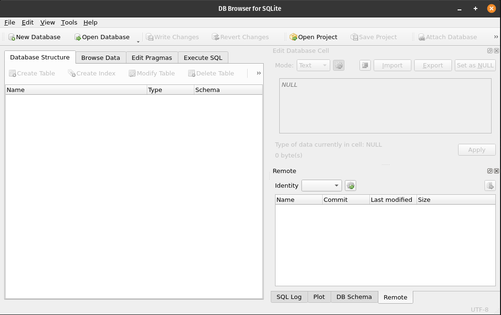

## SQlitebrowser

DB Browser for SQLite (DB4S) is a high quality, visual, open source tool to create, design, and edit database files compatible with SQLite.

## Installation

#### APT

```plain
sudo apt install sqlitebrowser
```

#### Snap

```plain
sudo snap install sqlitebrowser
```

## Usage

```plain
sqlitebrowser [options] [db]
```

## Flags

```plain
Possible command line arguments:
  -h, --help        Show command line options
  -q, --quit        Exit application after running scripts
  -s, --sql [file]  Execute this SQL file after opening the DB
  -t, --table [table]   Browse this table after opening the DB
  -R, --read-only   Open database in read-only mode
  -o, --option [group/setting=value]    Run application with this setting temporarily set to value
  -v, --version Display the current version
  [file]        Open this SQLite database
```

## Examples



## URL List

* [Sqlitebrowser.org](https://sqlitebrowser.org/)
* [Github.com - sqlitebrowser](https://github.com/sqlitebrowser/sqlitebrowser)
* [Snapcraft.io - sqlitebrowser](https://snapcraft.io/sqlitebrowser)
