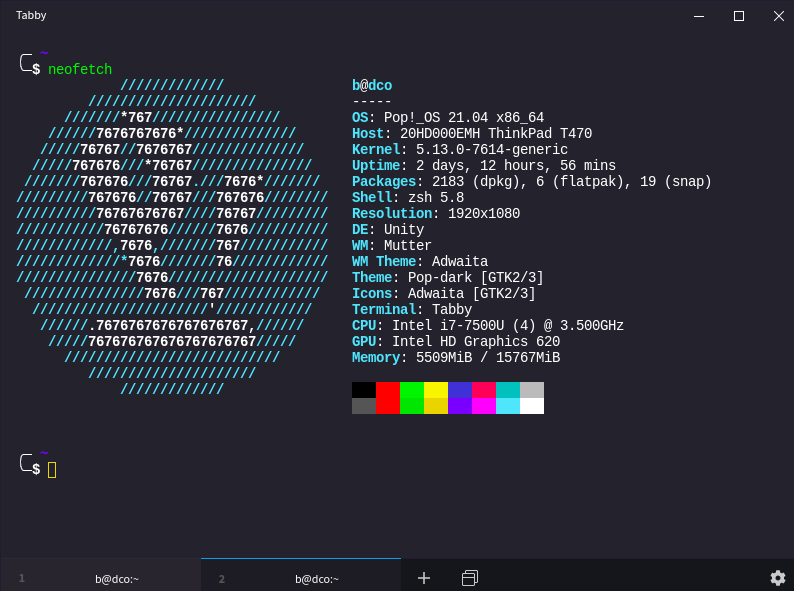

## Tabby

Tabby (formerly Terminus) is a highly configurable terminal emulator, SSH and serial client for Windows, macOS and Linux

* Integrated SSH and Telnet client and connection manager
* Integrated serial terminal
* Theming and color schemes
* Fully configurable shortcuts and multi-chord shortcuts
* Split panes
* Remembers your tabs
* PowerShell (and PS Core), WSL, Git-Bash, Cygwin, MSYS2, Cmder and CMD support
* Direct file transfer from/to SSH sessions via Zmodem
* Full Unicode support including double-width characters
* Doesn't choke on fast-flowing outputs
* Proper shell experience on Windows including tab completion (via Clink)
* Integrated encrypted container for SSH secrets and configuration

### Features

* A V220 terminal + various extensions
* Multiple nested split panes
* Tabs on any side of the window
* Optional dockable window with a global spawn hotkey ("Quake console")
* Progress detection
* Notification on process completion
* Bracketed paste, multiline paste warnings
* Font ligatures
* Custom shell profiles
* Optional RMB paste and copy-on select (PuTTY style)

## Installation

Download newest release from [Github.com](https://github.com/Eugeny/tabby/releases)

### Recommended plugins

* altair
* clickable-links
* save-output

## Examples

## URL List

- [Tabby.sh](https://tabby.sh/)
- [Github.com - tabby](https://github.com/Eugeny/tabby)
