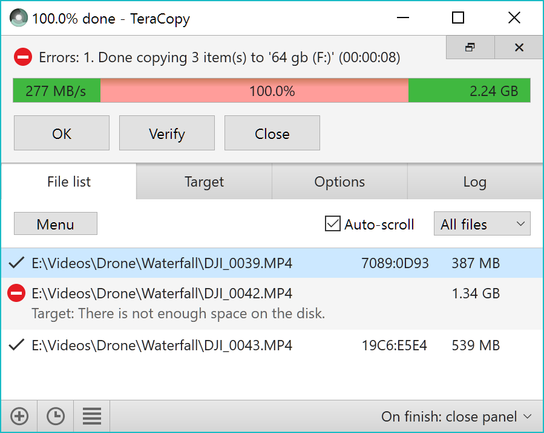

## TeraCopy

A free utility designed to copy files faster and more secure. It can verify copied files to ensure they are identical. It skips bad files during copy, not terminating the entire transfer. Seamless integration with Windows Explorer.

| Feature                                   | TeraCopy | TeraCopy Pro |
| ----------------------------------------- | -------- | ------------ |
| Verify files after copy                   | check    | check        |
| Preserve date timestamps                  | check    | check        |
| Copy locked files                         | check    | check        |
| Integrate with Windows Explorer           | check    | check        |
| Run a shell script on transfer completion | check    | check        |
| Generate and verify checksum files        | check    | check        |
| Delete files securely                     | check    | check        |
| Use in a commercial environment           |          | check        |
| Edit file lists                           |          | check        |
| Manage favorite folders                   |          | check        |
| Export reports in HTML and CSV formats    |          | check        |

## Installation

### Windows

Download newest version from [codesector.com](https://www.codesector.com/teracopy)

### macOS

Download newest version from [codesector.com](https://www.codesector.com/teracopy-for-mac)

## Examples

### Be in control

In case of a copy error TeraCopy will try to recover. If unable to recover in the worst case scenario it will simply skip the problematic file, not terminating the entire transfer. It can also wait for network or device reconnection.

Unnecessary files can be skipped to reduce the transfer time. During the process, TeraCopy shows detected errors, and allows you to fix the problem by recopying only the problematic files.

### File verification

TeraCopy can verify files after they have been copied to ensure that they are identical. This is done by comparing hashes of source and target files.

Supported algorithms: CRC32, MD5, SHA-1, SHA-256, SHA-512, Panama, Tiger, RipeMD, Whirlpool and xxHash.

### Confirm drag'n'drop

TeraCopy can optionally show a confirmation dialog on every drag and drop operation. It can prevent you from moving folders accidentally from one location to another.

### Faster workflow

TeraCopy can keep history of recently used directories, as well as show folders which are open in Explorer and other file managers.

## URL List

- [Codesector.com - TeraCopy](https://www.codesector.com/teracopy)
