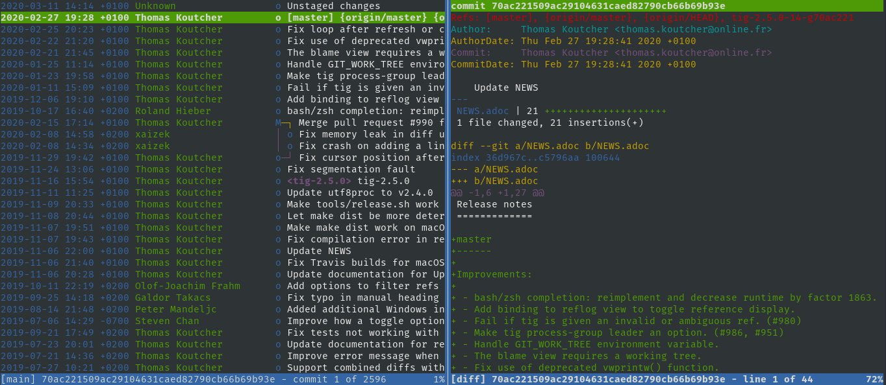

## Tig

Text-mode interface for Git.

### Installation

```plain
sudo apt install tig
```

### Usage

```plain
tig [options] [revs] [--] [paths]
```

### Flags

```plain
tig 2.4.1

Usage: tig        [options] [revs] [--] [paths]
   or: tig log    [options] [revs] [--] [paths]
   or: tig show   [options] [revs] [--] [paths]
   or: tig blame  [options] [rev] [--] path
   or: tig grep   [options] [pattern]
   or: tig refs
   or: tig stash
   or: tig status
   or: tig <      [git command output]

Options:
  +<number>       Select line <number> in the first view
  -v, --version   Show version and exit
  -h, --help      Show help message and exit
```

### Examples



### URL list

* [GitHub.com - tig](https://github.com/jonas/tig)
