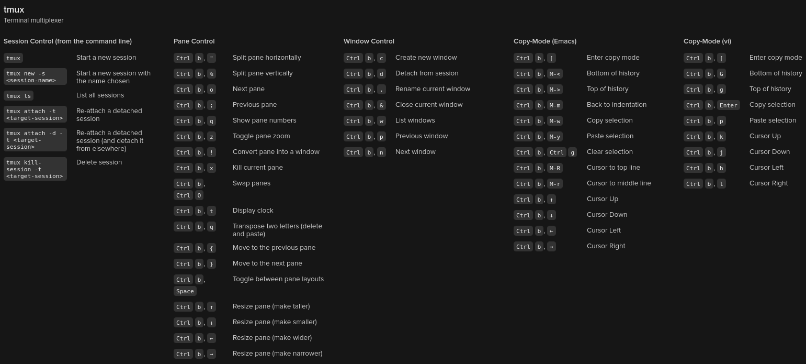

## Tmux

Lets you switch easily between several programs in one terminal.

## Installation

```plain
sudo apt install tmux
```

## Usage

```plain
tmux
```

## Flags

```plain
usage: tmux [-2CluvV] [-c shell-command] [-f file] [-L socket-name]
            [-S socket-path] [command [flags]]
```

## Examples

#### Start tmux

```plain
tmux
```

#### Detach tmux session

```plain
ctrl + b; d
```

#### Attach tmux session

```plain
tmux attach -t <name-or-id>
```

#### List running tmux

```plain
tmux ls
```

#### Run command without entering tmux session

```plain
tmux new-session -d -s "<session-name>" "command-to-run"
```



## URL List

* [GitHub.com - TMUX](https://github.com/tmux/tmux)
* [Openbsd.org - TMUX](http://man.openbsd.org/OpenBSD-current/man1/tmux.1)
