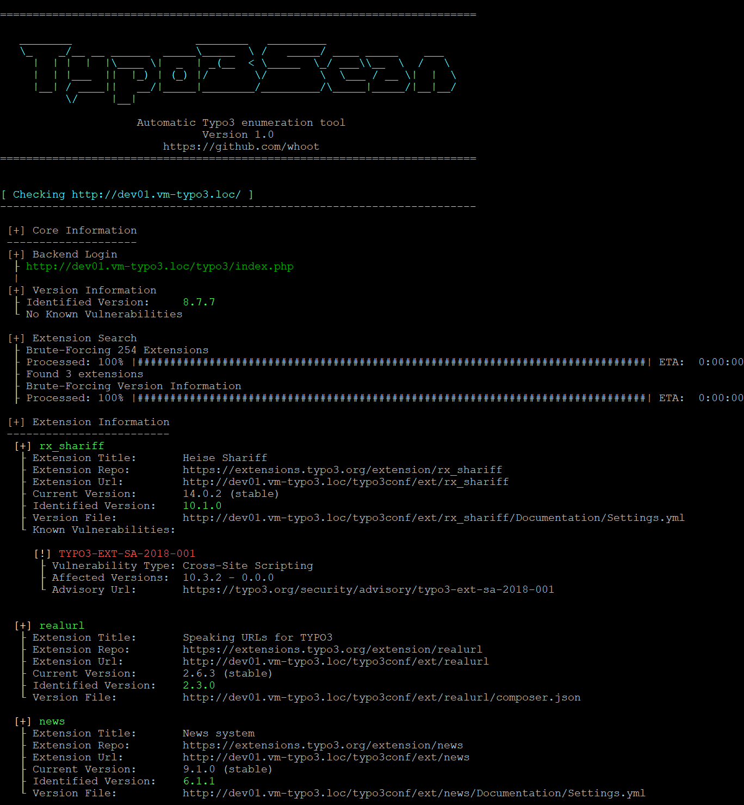

## Typo3Scan

Enumerate Typo3 version and extensions.

Typo3Scan is an open source penetration testing tool that I wrote to automate the process of detecting the [Typo3 CMS](https://typo3.org) version and its installed [extensions](https://extensions.typo3.org/).
Useful parts of the official [security advisories](https://typo3.org/help/security-advisories) are stored in a database and compared with the identified versions. If vulnerabilities are known for the version in use, the corresponding advisory is displayed.

Typo3Scan does not exploit vulnerabilities! Its solely purpose was to enumerate version info and installed extensions in penetration tests ever since.

**Disclaimer**
Typo3Scan is intended to be used for legal security purposes only, and you should only use it to test websites you own or have permission to test. Any other use is not the responsibility of the developer(s). Be sure that you understand and are complying with the laws in your area. In other words, don't be stupid, don't be an asshole, and use this tool responsibly and legally.

## Installation

```plain
git clone https://github.com/whoot/Typo3Scan
python3 -m pip install -r requirements.txt
```

## Usage

```plain
python3 typo3scan.py [options]
```

## Flags

```plain
Usage: 

Options:
  -h, --help         Show this help message and exit.

  Target:
   At least one of these options has to be provided to define the target(s):

    --domain | -d <target url>  The Typo3 URL(s)/domain(s) to scan.
    --file   | -f <file>        Parse targets from file (one domain per line).


  Optional:
   You dont need to specify this arguments, but you may want to

    --vuln              Check for extensions with known vulnerabilities only.
              
    --timeout TIMEOUT   Request Timeout.
                        Default: 10 seconds
              
    --auth USER:PASS    Username and Password for HTTP Basic Authorization.
    
    --cookie NAME=VALUE Can be used for authenticiation based on cookies.

    --agent USER-AGENT  Set custom User-Agent for requests.
         
    --threads THREADS   The number of threads to use for enumerating extensions.
                        Default: 5

    --json PATH         Path for json output file.
                        Default: current working directory

    --force             Force enumeration.

    --no-interaction    Do not ask any interactive question.

  General:
    -u | --update       Update extensions and vulnerability database.
    --core VERSION      Show all known vulnerabilities for given Typo3 version.
    --ext EXT:VERSION   Show all known vulnerabilities for given extension and version.
```

## Examples



## URL list

- [Github.com - Typo3Scan]](https://github.com/whoot/Typo3Scan)
