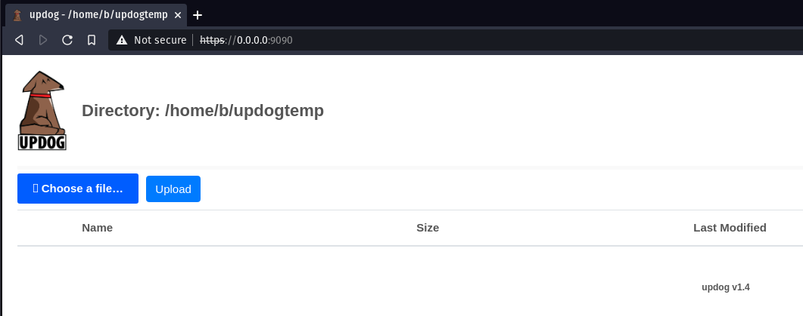

## Updog

Is a replacement for Python's SimpleHTTPServer. It allows uploading and downloading via HTTP/S, can set ad hoc SSL certificates and use HTTP basic auth.

Local file sharing made easy.

## Installation

```plain
python3 -m pip install updog
```

## Usage

```plain
updog [-h] [-d DIRECTORY] [-p PORT] [--password PASSWORD] [--ssl] [--version]
```

## Flags

```plain
optional arguments:
  -h, --help            show this help message and exit
  -d DIRECTORY, --directory DIRECTORY
                        Root directory [Default=.]
  -p PORT, --port PORT  Port to serve [Default=9090]
  --password PASSWORD   Use a password to access the page. (No username)
  --ssl                 Use an encrypted connection
  --version             show program's version number and exit
```

## Examples

#### Run with password and share folder temp over HTTP

```plain
$ updog -d temp --password 'JoeJoe'
[+] Serving /temp...
 * Running on http://0.0.0.0:9090/ (Press CTRL+C to quit)
```

#### Run with password and share folder temp over HTTPS

```plain
$ updog -d temp --ssl --password 'JoeJoe'
[+] Serving /temp...
 * Running on https://0.0.0.0:9090/ (Press CTRL+C to quit)
```



## URL List

* [GitHub.com - updog](https://github.com/sc0tfree/updog)
