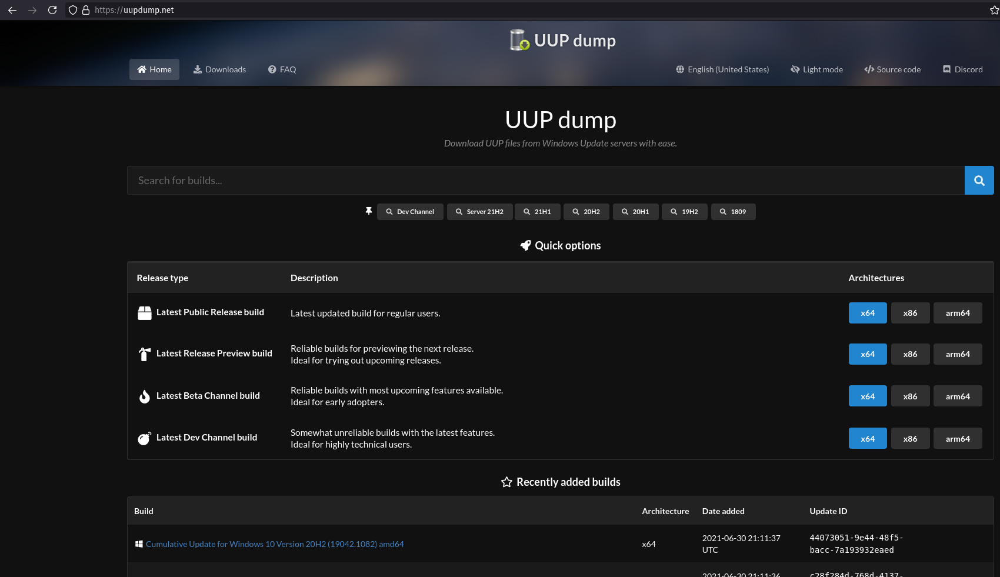
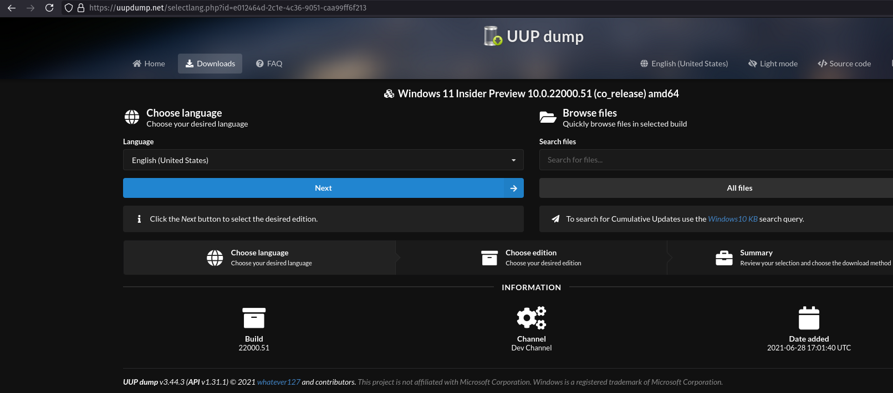
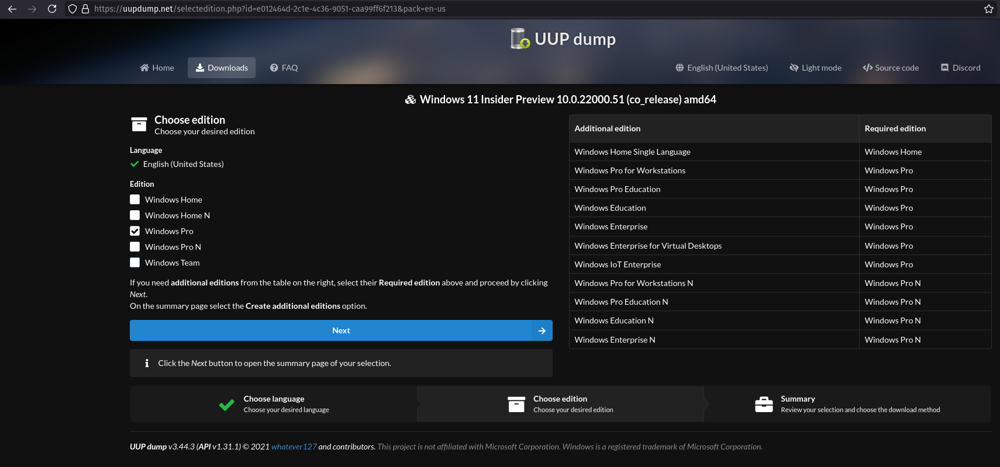
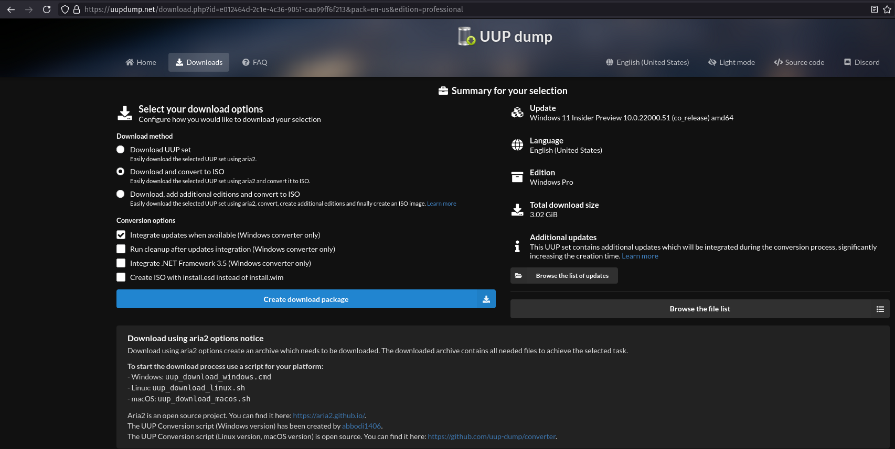
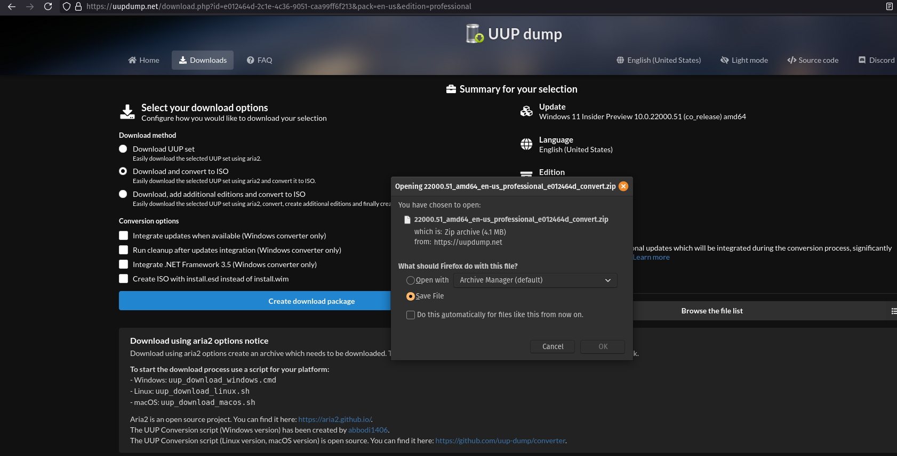

## UUP dump

Download UUP files from Windows Update servers with ease - Create Windows ISO as you like.

[UUPdump.net](https://uupdump.net/)

### Installation

Please install [Aria2]().

```plain
sudo apt-get install cabextract wimtools chntpw genisoimage
```

### Usage

Select the right package you want to download on [UUPdump.net](https://uupdump.net/known.php)







### Examples

Extract the package just downloaded with the options you want.

```plain
$ unzip 22000.51_amd64_en-us_professional_e012464d_convert.zip 
Archive:  22000.51_amd64_en-us_professional_e012464d_convert.zip
  inflating: uup_download_windows.cmd  
  inflating: uup_download_linux.sh   
  inflating: uup_download_macos.sh   
  inflating: ConvertConfig.ini       
 extracting: files/convert_config_linux  
 extracting: files/convert_config_macos  
  inflating: files/aria2c.exe        
  inflating: files/convert.sh        
  inflating: files/convert_ve_plugin  
  inflating: files/7zr.exe           
  inflating: files/uup-converter-wimlib.7z  

$ chmod +x uup_download_linux.sh
```

```plain
$ ./uup_download_linux.sh 
Retrieving aria2 script...

07/02 10:01:57 [NOTICE] Downloading 1 item(s)
[#878acc 0B/0B CN:1 DL:0B]                                                                                                                                                                                          
07/02 10:02:00 [NOTICE] Download complete: /root/aria2_script.13704.txt

Download Results:
gid   |stat|avg speed  |path/URI
======+====+===========+=======================================================
878acc|OK  |    26KiB/s|/root/aria2_script.13704.txt

Status Legend:
(OK):download completed.

Attempting to download files...

07/02 10:02:00 [NOTICE] Downloading 74 item(s)

07/02 10:02:00 [NOTICE] Verification finished successfully. file=UUPs/microsoft-windows-foundation-package.esd

07/02 10:02:00 [NOTICE] Download complete: UUPs/microsoft-windows-foundation-package.esd

07/02 10:02:00 [NOTICE] Verification finished successfully. file=UUPs/windows10.0-kb5004567-x64.cab

07/02 10:02:00 [NOTICE] Download complete: UUPs/windows10.0-kb5004567-x64.cab

07/02 10:02:00 [NOTICE] Verification finished successfully. file=UUPs/microsoft-windows-not-supported-on-ltsb-package.esd

07/02 10:02:00 [NOTICE] Download complete: UUPs/microsoft-windows-not-supported-on-ltsb-package.esd

07/02 10:02:00 [NOTICE] Verification finished successfully. file=UUPs/microsoft-windows-ethernet-client-realtek-rtcx21x64-fod-package-amd64.cab

07/02 10:02:00 [NOTICE] Download complete: UUPs/microsoft-windows-ethernet-client-realtek-rtcx21x64-fod-package-amd64.cab

07/02 10:02:00 [NOTICE] Verification finished successfully. file=UUPs/microsoft-windows-languagefeatures-ocr-en-us-package-amd64.cab

07/02 10:02:00 [NOTICE] Download complete: UUPs/microsoft-windows-languagefeatures-ocr-en-us-package-amd64.cab

07/02 10:02:00 [NOTICE] Verification finished successfully. file=UUPs/microsoft-windows-notepad-system-fod-package-amd64.cab

07/02 10:02:00 [NOTICE] Download complete: UUPs/microsoft-windows-notepad-system-fod-package-amd64.cab

07/02 10:02:00 [NOTICE] Verification finished successfully. file=UUPs/microsoft-windows-ethernet-client-intel-e2f68-fod-package-amd64.cab

07/02 10:02:00 [NOTICE] Download complete: UUPs/microsoft-windows-ethernet-client-intel-e2f68-fod-package-amd64.cab

07/02 10:02:00 [NOTICE] Verification finished successfully. file=UUPs/microsoft-windows-wifi-client-realtek-rtl8187se-fod-package-amd64.cab

07/02 10:02:00 [NOTICE] Download complete: UUPs/microsoft-windows-wifi-client-realtek-rtl8187se-fod-package-amd64.cab

07/02 10:02:00 [NOTICE] Verification finished successfully. file=UUPs/microsoft-windows-editionspecific-professional-wow64-package.esd

07/02 10:02:00 [NOTICE] Download complete: UUPs/microsoft-windows-editionspecific-professional-wow64-package.esd

07/02 10:02:00 [NOTICE] Verification finished successfully. file=UUPs/microsoft-windows-stepsrecorder-package-amd64.cab

07/02 10:02:00 [NOTICE] Download complete: UUPs/microsoft-windows-stepsrecorder-package-amd64.cab

07/02 10:02:00 [NOTICE] Verification finished successfully. file=UUPs/microsoft-windows-ethernet-client-intel-e1i68x64-fod-package-amd64.cab

07/02 10:02:00 [NOTICE] Download complete: UUPs/microsoft-windows-ethernet-client-intel-e1i68x64-fod-package-amd64.cab

07/02 10:02:00 [NOTICE] Verification finished successfully. file=UUPs/microsoft-windows-internetexplorer-optional-package-amd64.cab

07/02 10:02:00 [NOTICE] Download complete: UUPs/microsoft-windows-internetexplorer-optional-package-amd64.cab

07/02 10:02:00 [NOTICE] Verification finished successfully. file=UUPs/microsoft-windows-wifi-client-realtek-rtl819xp-fod-package-amd64.cab

07/02 10:02:00 [NOTICE] Download complete: UUPs/microsoft-windows-wifi-client-realtek-rtl819xp-fod-package-amd64.cab

07/02 10:02:00 [NOTICE] Verification finished successfully. file=UUPs/windows10.0-kb5004568-x64.cab

07/02 10:02:00 [NOTICE] Download complete: UUPs/windows10.0-kb5004568-x64.cab

07/02 10:02:01 [NOTICE] Verification finished successfully. file=UUPs/microsoft-windows-printing-pmcppc-fod-package-amd64.cab

07/02 10:02:01 [NOTICE] Download complete: UUPs/microsoft-windows-printing-pmcppc-fod-package-amd64.cab

07/02 10:02:01 [NOTICE] Verification finished successfully. file=UUPs/microsoft-windows-quickassist-package-amd64.cab

07/02 10:02:01 [NOTICE] Download complete: UUPs/microsoft-windows-quickassist-package-amd64.cab

07/02 10:02:01 [NOTICE] Verification finished successfully. file=UUPs/microsoft-onecore-directx-database-fod-package-amd64.cab

07/02 10:02:01 [NOTICE] Download complete: UUPs/microsoft-onecore-directx-database-fod-package-amd64.cab

07/02 10:02:01 [NOTICE] Verification finished successfully. file=UUPs/microsoft-windows-wifi-client-realtek-rtl8192se-fod-package-amd64.cab

07/02 10:02:01 [NOTICE] Download complete: UUPs/microsoft-windows-wifi-client-realtek-rtl8192se-fod-package-amd64.cab

07/02 10:02:01 [NOTICE] Verification finished successfully. file=UUPs/microsoft-windows-wifi-client-realtek-rtl85n64-fod-package-amd64.cab

07/02 10:02:01 [NOTICE] Download complete: UUPs/microsoft-windows-wifi-client-realtek-rtl85n64-fod-package-amd64.cab

07/02 10:02:01 [NOTICE] Verification finished successfully. file=UUPs/microsoft-windows-wifi-client-marvel-mrvlpcie8897-fod-package-amd64.cab

07/02 10:02:01 [NOTICE] Download complete: UUPs/microsoft-windows-wifi-client-marvel-mrvlpcie8897-fod-package-amd64.cab

07/02 10:02:01 [NOTICE] Verification finished successfully. file=UUPs/microsoft-windows-wordpad-fod-package-amd64.cab

07/02 10:02:01 [NOTICE] Download complete: UUPs/microsoft-windows-wordpad-fod-package-amd64.cab
[DL:10MiB][#3c3855 0.9MiB/0.9MiB(95%)][#04ae47 784KiB/0.9MiB(77%)][#475f69 816KiB/0.9MiB(80%)][#ed7fac 368KiB/1.0MiB(33%)][#6ab3a3 80KiB/1.0MiB(7%)]                                                                
07/02 10:02:01 [NOTICE] Verification finished successfully. file=UUPs/microsoft-windows-wifi-client-qualcomm-athw8x-fod-package-amd64.cab

07/02 10:02:01 [NOTICE] Download complete: UUPs/microsoft-windows-wifi-client-qualcomm-athw8x-fod-package-amd64.cab

07/02 10:02:01 [NOTICE] Verification finished successfully. file=UUPs/microsoft-windows-wifi-client-broadcom-bcmpciedhd63-fod-package-amd64.cab

07/02 10:02:01 [NOTICE] Download complete: UUPs/microsoft-windows-wifi-client-broadcom-bcmpciedhd63-fod-package-amd64.cab

07/02 10:02:01 [NOTICE] Verification finished successfully. file=UUPs/microsoft-windows-wifi-client-qualcomm-athwnx-fod-package-amd64.cab

07/02 10:02:01 [NOTICE] Download complete: UUPs/microsoft-windows-wifi-client-qualcomm-athwnx-fod-package-amd64.cab

07/02 10:02:01 [NOTICE] Verification finished successfully. file=UUPs/microsoft-windows-powershell-ise-fod-package-amd64.cab

07/02 10:02:01 [NOTICE] Download complete: UUPs/microsoft-windows-powershell-ise-fod-package-amd64.cab

07/02 10:02:01 [NOTICE] Verification finished successfully. file=UUPs/microsoft-windows-wifi-client-ralink-netr28x-fod-package-amd64.cab

07/02 10:02:01 [NOTICE] Download complete: UUPs/microsoft-windows-wifi-client-ralink-netr28x-fod-package-amd64.cab

07/02 10:02:01 [NOTICE] Verification finished successfully. file=UUPs/microsoft-windows-wifi-client-broadcom-bcmwl63al-fod-package-amd64.cab

07/02 10:02:01 [NOTICE] Download complete: UUPs/microsoft-windows-wifi-client-broadcom-bcmwl63al-fod-package-amd64.cab

07/02 10:02:01 [NOTICE] Verification finished successfully. file=UUPs/microsoft-windows-wifi-client-realtek-rtwlane13-fod-package-amd64.cab

07/02 10:02:01 [NOTICE] Download complete: UUPs/microsoft-windows-wifi-client-realtek-rtwlane13-fod-package-amd64.cab

07/02 10:02:02 [NOTICE] Verification finished successfully. file=UUPs/openssh-client-package-amd64.cab

07/02 10:02:02 [NOTICE] Download complete: UUPs/openssh-client-package-amd64.cab

07/02 10:02:02 [NOTICE] Verification finished successfully. file=UUPs/microsoft-windows-wifi-client-intel-netwbw02-fod-package-amd64.cab

07/02 10:02:02 [NOTICE] Download complete: UUPs/microsoft-windows-wifi-client-intel-netwbw02-fod-package-amd64.cab

07/02 10:02:02 [NOTICE] Verification finished successfully. file=UUPs/microsoft-windows-required-shellexperiences-desktop-wow64-package.esd

07/02 10:02:02 [NOTICE] Download complete: UUPs/microsoft-windows-required-shellexperiences-desktop-wow64-package.esd

07/02 10:02:02 [NOTICE] Verification finished successfully. file=UUPs/microsoft-windows-wifi-client-qualcomm-qcamain10x64-fod-package-amd64.cab

07/02 10:02:02 [NOTICE] Download complete: UUPs/microsoft-windows-wifi-client-qualcomm-qcamain10x64-fod-package-amd64.cab
[DL:12MiB][#6ccb7b 1.3MiB/1.7MiB(76%)][#d44e49 896KiB/1.9MiB(45%)][#2edb1f 320KiB/1.9MiB(15%)][#3ea232 176KiB/1.9MiB(8%)][#49c551 64KiB/2.1MiB(2%)]                                                                 
07/02 10:02:02 [NOTICE] Verification finished successfully. file=UUPs/microsoft-windows-wifi-client-intel-netwlv64-fod-package-amd64.cab

07/02 10:02:02 [NOTICE] Download complete: UUPs/microsoft-windows-wifi-client-intel-netwlv64-fod-package-amd64.cab

07/02 10:02:02 [NOTICE] Verification finished successfully. file=UUPs/microsoft-windows-wifi-client-intel-netwns64-fod-package-amd64.cab

07/02 10:02:02 [NOTICE] Download complete: UUPs/microsoft-windows-wifi-client-intel-netwns64-fod-package-amd64.cab

07/02 10:02:03 [NOTICE] Verification finished successfully. file=UUPs/microsoft-windows-wifi-client-broadcom-bcmwl63a-fod-package-amd64.cab

07/02 10:02:03 [NOTICE] Download complete: UUPs/microsoft-windows-wifi-client-broadcom-bcmwl63a-fod-package-amd64.cab

07/02 10:02:03 [NOTICE] Verification finished successfully. file=UUPs/microsoft-windows-wifi-client-intel-netwew00-fod-package-amd64.cab

07/02 10:02:03 [NOTICE] Download complete: UUPs/microsoft-windows-wifi-client-intel-netwew00-fod-package-amd64.cab

07/02 10:02:03 [NOTICE] Verification finished successfully. file=UUPs/microsoft-windows-wifi-client-realtek-rtwlane01-fod-package-amd64.cab

07/02 10:02:03 [NOTICE] Download complete: UUPs/microsoft-windows-wifi-client-realtek-rtwlane01-fod-package-amd64.cab

07/02 10:02:03 [NOTICE] Verification finished successfully. file=UUPs/microsoft-windows-wifi-client-intel-netwew01-fod-package-amd64.cab

07/02 10:02:03 [NOTICE] Download complete: UUPs/microsoft-windows-wifi-client-intel-netwew01-fod-package-amd64.cab
[DL:12MiB][#790203 1.7MiB/2.2MiB(76%)][#77025a 1.5MiB/2.4MiB(65%)][#7a3758 800KiB/2.5MiB(31%)][#ee4d3d 608KiB/2.5MiB(23%)][#3a4c70 0B/2.7MiB(0%)]                                                                   
07/02 10:02:03 [NOTICE] Verification finished successfully. file=UUPs/microsoft-windows-wifi-client-intel-netwsw00-fod-package-amd64.cab

07/02 10:02:03 [NOTICE] Download complete: UUPs/microsoft-windows-wifi-client-intel-netwsw00-fod-package-amd64.cab

07/02 10:02:03 [NOTICE] Verification finished successfully. file=UUPs/microsoft-windows-wifi-client-intel-netwtw04-fod-package-amd64.cab

07/02 10:02:03 [NOTICE] Download complete: UUPs/microsoft-windows-wifi-client-intel-netwtw04-fod-package-amd64.cab

07/02 10:02:04 [NOTICE] Verification finished successfully. file=UUPs/microsoft-windows-wifi-client-realtek-rtwlane-fod-package-amd64.cab

07/02 10:02:04 [NOTICE] Download complete: UUPs/microsoft-windows-wifi-client-realtek-rtwlane-fod-package-amd64.cab

07/02 10:02:04 [NOTICE] Verification finished successfully. file=UUPs/microsoft-windows-wifi-client-intel-netwtw06-fod-package-amd64.cab

07/02 10:02:04 [NOTICE] Download complete: UUPs/microsoft-windows-wifi-client-intel-netwtw06-fod-package-amd64.cab

07/02 10:02:04 [NOTICE] Verification finished successfully. file=UUPs/microsoft-windows-wifi-client-intel-netwtw08-fod-package-amd64.cab

07/02 10:02:04 [NOTICE] Download complete: UUPs/microsoft-windows-wifi-client-intel-netwtw08-fod-package-amd64.cab
[DL:13MiB][#0d8830 2.2MiB/3.0MiB(72%)][#b350e5 2.6MiB/3.1MiB(83%)][#b12532 1.6MiB/3.3MiB(49%)][#9f955d 848KiB/4.6MiB(17%)][#4b8a42 528KiB/4.7MiB(10%)]                                                              
07/02 10:02:04 [NOTICE] Verification finished successfully. file=UUPs/microsoft-windows-printing-wfs-fod-package-amd64.cab

07/02 10:02:04 [NOTICE] Download complete: UUPs/microsoft-windows-printing-wfs-fod-package-amd64.cab

07/02 10:02:04 [NOTICE] Verification finished successfully. file=UUPs/microsoft-windows-wifi-client-intel-netwtw02-fod-package-amd64.cab

07/02 10:02:04 [NOTICE] Download complete: UUPs/microsoft-windows-wifi-client-intel-netwtw02-fod-package-amd64.cab

07/02 10:02:04 [NOTICE] Verification finished successfully. file=UUPs/microsoft-onecore-applicationmodel-sync-desktop-fod-package-amd64.cab

07/02 10:02:04 [NOTICE] Download complete: UUPs/microsoft-onecore-applicationmodel-sync-desktop-fod-package-amd64.cab
[DL:14MiB][#9f955d 4.2MiB/4.6MiB(91%)][#4b8a42 4.7MiB/4.7MiB(99%)][#103353 2.8MiB/5.6MiB(50%)][#ec23fa 2.3MiB/7.8MiB(29%)][#da8798 2.3MiB/11MiB(21%)]                                                               
07/02 10:02:05 [NOTICE] Verification finished successfully. file=UUPs/microsoft-windows-kernel-la57-fod-package-amd64.cab

07/02 10:02:05 [NOTICE] Download complete: UUPs/microsoft-windows-kernel-la57-fod-package-amd64.cab

07/02 10:02:05 [NOTICE] Verification finished successfully. file=UUPs/microsoft-windows-languagefeatures-handwriting-en-us-package-amd64.cab

07/02 10:02:05 [NOTICE] Download complete: UUPs/microsoft-windows-languagefeatures-handwriting-en-us-package-amd64.cab

07/02 10:02:06 [NOTICE] Verification finished successfully. file=UUPs/microsoft-windows-tabletpcmath-package-amd64.cab

07/02 10:02:06 [NOTICE] Download complete: UUPs/microsoft-windows-tabletpcmath-package-amd64.cab
[DL:15MiB][#ec23fa 5.9MiB/7.8MiB(75%)][#da8798 6.7MiB/11MiB(60%)][#18b322 4.1MiB/12MiB(32%)][#5e7012 3.2MiB/14MiB(23%)][#54742c 768KiB/14MiB(5%)]                                                                   
07/02 10:02:06 [NOTICE] Verification finished successfully. file=UUPs/microsoft-windows-required-shellexperiences-desktop-package.esd

07/02 10:02:06 [NOTICE] Download complete: UUPs/microsoft-windows-required-shellexperiences-desktop-package.esd

07/02 10:02:07 [NOTICE] Verification finished successfully. file=UUPs/windows10.0-kb5004569-x64.cab

07/02 10:02:07 [NOTICE] Download complete: UUPs/windows10.0-kb5004569-x64.cab
[DL:16MiB][#18b322 9.3MiB/12MiB(73%)][#5e7012 7.6MiB/14MiB(54%)][#54742c 6.2MiB/14MiB(43%)][#fc176e 1.6MiB/14MiB(11%)][#f769c8 352KiB/17MiB(1%)]                                                                    
07/02 10:02:08 [NOTICE] Verification finished successfully. file=UUPs/microsoft-windows-editionspecific-professional-package.esd

07/02 10:02:08 [NOTICE] Download complete: UUPs/microsoft-windows-editionspecific-professional-package.esd
[DL:17MiB][#5e7012 12MiB/14MiB(85%)][#54742c 10MiB/14MiB(76%)][#fc176e 6.2MiB/14MiB(41%)][#f769c8 5.8MiB/17MiB(33%)][#19d8d5 1.4MiB/18MiB(7%)]                                                                      
07/02 10:02:08 [NOTICE] Verification finished successfully. file=UUPs/ssu-22000.51-x64.cab

07/02 10:02:08 [NOTICE] Download complete: UUPs/ssu-22000.51-x64.cab

07/02 10:02:09 [NOTICE] Verification finished successfully. file=UUPs/microsoft-windows-mediaplayer-package-amd64.cab

07/02 10:02:09 [NOTICE] Download complete: UUPs/microsoft-windows-mediaplayer-package-amd64.cab
[DL:18MiB][#fc176e 11MiB/14MiB(77%)][#f769c8 13MiB/17MiB(73%)][#19d8d5 8.3MiB/18MiB(44%)][#8252df 2.5MiB/20MiB(11%)][#2fcf43 1.9MiB/21MiB(9%)]                                                                      
07/02 10:02:10 [NOTICE] Verification finished successfully. file=UUPs/microsoft-windows-client-languagepack-package_en-us-amd64-en-us.esd

07/02 10:02:10 [NOTICE] Download complete: UUPs/microsoft-windows-client-languagepack-package_en-us-amd64-en-us.esd

07/02 10:02:10 [NOTICE] Verification finished successfully. file=UUPs/microsoft-windows-editionpack-professional-wow64-package.esd

07/02 10:02:10 [NOTICE] Download complete: UUPs/microsoft-windows-editionpack-professional-wow64-package.esd
[DL:19MiB][#19d8d5 15MiB/18MiB(84%)][#8252df 8.5MiB/20MiB(40%)][#2fcf43 6.9MiB/21MiB(33%)][#2198f6 1.3MiB/34MiB(3%)][#69daae 192KiB/37MiB(0%)]                                                                      
07/02 10:02:10 [NOTICE] Verification finished successfully. file=UUPs/microsoft-windows-regulatedpackages-wow64-package.esd

07/02 10:02:10 [NOTICE] Download complete: UUPs/microsoft-windows-regulatedpackages-wow64-package.esd
[DL:24MiB][#8252df 20MiB/20MiB(100%)][#2fcf43 18MiB/21MiB(87%)][#2198f6 17MiB/34MiB(50%)][#69daae 11MiB/37MiB(31%)][#375b86 13MiB/40MiB(32%)] [Checksum:#8252df 11MiB/20MiB(55%)]                                   
07/02 10:02:12 [NOTICE] Verification finished successfully. file=UUPs/microsoft-windows-userexperience-desktop-package-amd64.cab

07/02 10:02:12 [NOTICE] Download complete: UUPs/microsoft-windows-userexperience-desktop-package-amd64.cab

07/02 10:02:13 [NOTICE] Verification finished successfully. file=UUPs/microsoft-windows-languagefeatures-basic-en-us-package-amd64.cab

07/02 10:02:13 [NOTICE] Download complete: UUPs/microsoft-windows-languagefeatures-basic-en-us-package-amd64.cab
[DL:28MiB][#2198f6 34MiB/34MiB(100%)][#69daae 24MiB/37MiB(64%)][#375b86 27MiB/40MiB(67%)][#d0af41 15MiB/47MiB(32%)][#8ce048 9.3MiB/51MiB(18%)] [Checksum:#2198f6 3.9MiB/34MiB(11%)]                                 
07/02 10:02:14 [NOTICE] Verification finished successfully. file=UUPs/microsoft-windows-not-supported-on-ltsb-wow64-package.esd

07/02 10:02:14 [NOTICE] Download complete: UUPs/microsoft-windows-not-supported-on-ltsb-wow64-package.esd
[DL:32MiB][#69daae 37MiB/37MiB(100%)][#375b86 34MiB/40MiB(83%)][#d0af41 31MiB/47MiB(65%)][#8ce048 27MiB/51MiB(53%)][#e3888f 17MiB/61MiB(28%)] [Checksum:#69daae 28MiB/37MiB(74%)]                                   
07/02 10:02:16 [NOTICE] Verification finished successfully. file=UUPs/microsoft-windows-regulatedpackages-package.esd

07/02 10:02:16 [NOTICE] Download complete: UUPs/microsoft-windows-regulatedpackages-package.esd
[DL:33MiB][#375b86 38MiB/40MiB(93%)][#d0af41 34MiB/47MiB(71%)][#8ce048 34MiB/51MiB(66%)][#e3888f 33MiB/61MiB(54%)][#e387e3 6.3MiB/62MiB(10%)]                                                                       
07/02 10:02:18 [NOTICE] Verification finished successfully. file=UUPs/microsoft.modernapps.client.professional.esd

07/02 10:02:18 [NOTICE] Download complete: UUPs/microsoft.modernapps.client.professional.esd
[DL:34MiB][#d0af41 47MiB/47MiB(100%)][#8ce048 48MiB/51MiB(93%)][#e3888f 44MiB/61MiB(73%)][#e387e3 40MiB/62MiB(65%)][#ae5b0b 20MiB/81MiB(25%)] [Checksum:#d0af41 15MiB/47MiB(31%)]                                   
07/02 10:02:20 [NOTICE] Verification finished successfully. file=UUPs/microsoft-windows-languagefeatures-texttospeech-en-us-package-amd64.cab

07/02 10:02:20 [NOTICE] Download complete: UUPs/microsoft-windows-languagefeatures-texttospeech-en-us-package-amd64.cab
[DL:34MiB][#8ce048 51MiB/51MiB(100%)][#e3888f 50MiB/61MiB(82%)][#e387e3 44MiB/62MiB(72%)][#ae5b0b 37MiB/81MiB(45%)][#cdc7ce 5.7MiB/87MiB(6%)] [Checksum:#8ce048 43MiB/51MiB(83%)]                                   
07/02 10:02:21 [NOTICE] Verification finished successfully. file=UUPs/windows10.0-kb5004564-x64.cab

07/02 10:02:21 [NOTICE] Download complete: UUPs/windows10.0-kb5004564-x64.cab
[DL:35MiB][#e3888f 61MiB/61MiB(100%)][#e387e3 55MiB/62MiB(89%)][#ae5b0b 63MiB/81MiB(77%)][#cdc7ce 33MiB/87MiB(37%)][#6e559c 31MiB/158MiB(20%)] [Checksum:#e3888f 36MiB/61MiB(59%)]                                  
07/02 10:02:24 [NOTICE] Verification finished successfully. file=UUPs/microsoft-windows-languagefeatures-speech-en-us-package-amd64.cab

07/02 10:02:24 [NOTICE] Download complete: UUPs/microsoft-windows-languagefeatures-speech-en-us-package-amd64.cab
[DL:36MiB][#e387e3 60MiB/62MiB(97%)][#ae5b0b 81MiB/81MiB(100%)][#cdc7ce 57MiB/87MiB(65%)][#6e559c 68MiB/158MiB(43%)][#02ed81 167MiB/190MiB(87%)] [Checksum:#ae5b0b 50MiB/81MiB(62%)]                                
07/02 10:02:31 [NOTICE] Verification finished successfully. file=UUPs/microsoft-windows-client-features-wow64-package.esd

07/02 10:02:31 [NOTICE] Download complete: UUPs/microsoft-windows-client-features-wow64-package.esd
[DL:36MiB][#e387e3 61MiB/62MiB(99%)][#cdc7ce 87MiB/87MiB(100%)][#6e559c 120MiB/158MiB(76%)][#02ed81 173MiB/190MiB(91%)][#bfba8b 159MiB/275MiB(57%)] [Checksum:#cdc7ce 5.0MiB/87MiB(5%)]                             
07/02 10:02:38 [NOTICE] Verification finished successfully. file=UUPs/windows10.0-kb5004564-x64.psf

07/02 10:02:38 [NOTICE] Download complete: UUPs/windows10.0-kb5004564-x64.psf

07/02 10:02:38 [NOTICE] Verification finished successfully. file=UUPs/microsoft-windows-hello-face-package-amd64.cab

07/02 10:02:38 [NOTICE] Download complete: UUPs/microsoft-windows-hello-face-package-amd64.cab
[DL:35MiB][#6e559c 158MiB/158MiB(100%)][#02ed81 174MiB/190MiB(91%)][#bfba8b 232MiB/275MiB(84%)][#469f40 128MiB/395MiB(32%)][#b71e79 186MiB/615MiB(30%)] [Checksum:#6e559c 136MiB/158MiB(86%)]                       
07/02 10:02:50 [NOTICE] Verification finished successfully. file=UUPs/microsoft-windows-editionpack-professional-package.esd

07/02 10:02:50 [NOTICE] Download complete: UUPs/microsoft-windows-editionpack-professional-package.esd
 *** Download Progress Summary as of Fri Jul  2 10:03:00 2021 ***                                                                                                                                                   
====================================================================================================================================================================================================================
[#02ed81 181MiB/190MiB(95%) CN:1 DL:719KiB ETA:12s]
FILE: UUPs/microsoft-windows-client-desktop-required-wow64-package.esd
--------------------------------------------------------------------------------------------------------------------------------------------------------------------------------------------------------------------
[#bfba8b 255MiB/275MiB(92%) CN:1 DL:2.1MiB ETA:9s]
FILE: UUPs/microsoft-windows-client-features-package.esd
--------------------------------------------------------------------------------------------------------------------------------------------------------------------------------------------------------------------
[#469f40 214MiB/395MiB(54%) CN:10 DL:7.6MiB ETA:23s]
FILE: UUPs/microsoft.modernapps.client.all.esd
--------------------------------------------------------------------------------------------------------------------------------------------------------------------------------------------------------------------
[#b71e79 347MiB/615MiB(56%) CN:10 DL:14MiB ETA:19s]
FILE: UUPs/professional_en-us.esd
--------------------------------------------------------------------------------------------------------------------------------------------------------------------------------------------------------------------
[#e44d13 110MiB/730MiB(15%) CN:16 DL:11MiB ETA:55s]
FILE: UUPs/microsoft-windows-client-desktop-required-package.esd
--------------------------------------------------------------------------------------------------------------------------------------------------------------------------------------------------------------------

[DL:35MiB][#02ed81 190MiB/190MiB(100%)][#bfba8b 268MiB/275MiB(97%)][#469f40 377MiB/395MiB(95%)][#b71e79 551MiB/615MiB(89%)][#e44d13 434MiB/730MiB(59%)] [Checksum:#02ed81 85MiB/190MiB(45%)]                        
07/02 10:03:21 [NOTICE] Verification finished successfully. file=UUPs/microsoft-windows-client-desktop-required-wow64-package.esd

07/02 10:03:21 [NOTICE] Download complete: UUPs/microsoft-windows-client-desktop-required-wow64-package.esd
[DL:35MiB][#bfba8b 275MiB/275MiB(100%)][#469f40 386MiB/395MiB(97%)][#b71e79 559MiB/615MiB(90%)][#e44d13 482MiB/730MiB(66%)] [Checksum:#bfba8b 199MiB/275MiB(72%)]                                                   
07/02 10:03:22 [NOTICE] Verification finished successfully. file=UUPs/microsoft-windows-client-features-package.esd

07/02 10:03:22 [NOTICE] Download complete: UUPs/microsoft-windows-client-features-package.esd
[DL:35MiB][#469f40 395MiB/395MiB(100%)][#b71e79 615MiB/615MiB(100%)][#e44d13 729MiB/730MiB(99%)] [Checksum:#469f40 257MiB/395MiB(65%)](+1)                                                                          
07/02 10:03:32 [NOTICE] Verification finished successfully. file=UUPs/microsoft.modernapps.client.all.esd

07/02 10:03:32 [NOTICE] Download complete: UUPs/microsoft.modernapps.client.all.esd
[DL:28MiB][#b71e79 615MiB/615MiB(100%)][#e44d13 730MiB/730MiB(100%)] [Checksum:#b71e79 501MiB/615MiB(81%)](+1)                                                                                                      
07/02 10:03:34 [NOTICE] Verification finished successfully. file=UUPs/professional_en-us.esd

07/02 10:03:34 [NOTICE] Download complete: UUPs/professional_en-us.esd
[#e44d13 730MiB/730MiB(100%) CN:0] [Checksum:#e44d13 589MiB/730MiB(80%)]                                                                                                                                            
07/02 10:03:37 [NOTICE] Verification finished successfully. file=UUPs/microsoft-windows-client-desktop-required-package.esd

07/02 10:03:37 [NOTICE] Download complete: UUPs/microsoft-windows-client-desktop-required-package.esd

Download Results:
gid   |stat|avg speed  |path/URI
======+====+===========+=======================================================
a779e8|OK  |   0.9MiB/s|UUPs/microsoft-windows-foundation-package.esd
62cc36|OK  |   1.2MiB/s|UUPs/windows10.0-kb5004567-x64.cab
957c3e|OK  |   1.0MiB/s|UUPs/microsoft-windows-not-supported-on-ltsb-package.esd
7f47a2|OK  |   2.4MiB/s|UUPs/microsoft-windows-ethernet-client-realtek-rtcx21x64-fod-package-amd64.cab
cf6570|OK  |   2.0MiB/s|UUPs/microsoft-windows-languagefeatures-ocr-en-us-package-amd64.cab
142d8c|OK  |   2.2MiB/s|UUPs/microsoft-windows-notepad-system-fod-package-amd64.cab
76520d|OK  |   2.2MiB/s|UUPs/microsoft-windows-ethernet-client-intel-e2f68-fod-package-amd64.cab
874455|OK  |   2.1MiB/s|UUPs/microsoft-windows-wifi-client-realtek-rtl8187se-fod-package-amd64.cab
f0c33d|OK  |   2.3MiB/s|UUPs/microsoft-windows-editionspecific-professional-wow64-package.esd
5f73de|OK  |   2.0MiB/s|UUPs/microsoft-windows-stepsrecorder-package-amd64.cab
3780c1|OK  |   2.4MiB/s|UUPs/microsoft-windows-ethernet-client-intel-e1i68x64-fod-package-amd64.cab
368f3f|OK  |   2.5MiB/s|UUPs/microsoft-windows-internetexplorer-optional-package-amd64.cab
44eb02|OK  |   2.2MiB/s|UUPs/microsoft-windows-wifi-client-realtek-rtl819xp-fod-package-amd64.cab
c61360|OK  |   2.6MiB/s|UUPs/windows10.0-kb5004568-x64.cab
c40098|OK  |   2.7MiB/s|UUPs/microsoft-windows-printing-pmcppc-fod-package-amd64.cab
137722|OK  |   2.4MiB/s|UUPs/microsoft-windows-quickassist-package-amd64.cab
0b993d|OK  |   2.4MiB/s|UUPs/microsoft-onecore-directx-database-fod-package-amd64.cab
4671bb|OK  |   2.4MiB/s|UUPs/microsoft-windows-wifi-client-realtek-rtl8192se-fod-package-amd64.cab
a2e5dd|OK  |   2.8MiB/s|UUPs/microsoft-windows-wifi-client-realtek-rtl85n64-fod-package-amd64.cab
90b153|OK  |   3.0MiB/s|UUPs/microsoft-windows-wifi-client-marvel-mrvlpcie8897-fod-package-amd64.cab
43172e|OK  |   2.7MiB/s|UUPs/microsoft-windows-wordpad-fod-package-amd64.cab
3c3855|OK  |   2.7MiB/s|UUPs/microsoft-windows-wifi-client-qualcomm-athw8x-fod-package-amd64.cab
475f69|OK  |   3.0MiB/s|UUPs/microsoft-windows-wifi-client-broadcom-bcmpciedhd63-fod-package-amd64.cab
04ae47|OK  |   2.5MiB/s|UUPs/microsoft-windows-wifi-client-qualcomm-athwnx-fod-package-amd64.cab
ed7fac|OK  |   2.1MiB/s|UUPs/microsoft-windows-powershell-ise-fod-package-amd64.cab
6ab3a3|OK  |   2.8MiB/s|UUPs/microsoft-windows-wifi-client-ralink-netr28x-fod-package-amd64.cab
73036c|OK  |   4.0MiB/s|UUPs/microsoft-windows-wifi-client-broadcom-bcmwl63al-fod-package-amd64.cab
a41368|OK  |   3.0MiB/s|UUPs/microsoft-windows-wifi-client-realtek-rtwlane13-fod-package-amd64.cab
0f6410|OK  |   2.9MiB/s|UUPs/openssh-client-package-amd64.cab
c9f07c|OK  |   3.8MiB/s|UUPs/microsoft-windows-wifi-client-intel-netwbw02-fod-package-amd64.cab
3b390c|OK  |   2.8MiB/s|UUPs/microsoft-windows-required-shellexperiences-desktop-wow64-package.esd
eaccd5|OK  |   3.0MiB/s|UUPs/microsoft-windows-wifi-client-qualcomm-qcamain10x64-fod-package-amd64.cab
6ccb7b|OK  |   2.9MiB/s|UUPs/microsoft-windows-wifi-client-intel-netwlv64-fod-package-amd64.cab
d44e49|OK  |   2.6MiB/s|UUPs/microsoft-windows-wifi-client-intel-netwns64-fod-package-amd64.cab
2edb1f|OK  |   3.5MiB/s|UUPs/microsoft-windows-wifi-client-broadcom-bcmwl63a-fod-package-amd64.cab
49c551|OK  |   3.0MiB/s|UUPs/microsoft-windows-wifi-client-intel-netwew00-fod-package-amd64.cab
3ea232|OK  |   2.5MiB/s|UUPs/microsoft-windows-wifi-client-realtek-rtwlane01-fod-package-amd64.cab
e942ba|OK  |   3.1MiB/s|UUPs/microsoft-windows-wifi-client-intel-netwew01-fod-package-amd64.cab
790203|OK  |   2.9MiB/s|UUPs/microsoft-windows-wifi-client-intel-netwsw00-fod-package-amd64.cab
77025a|OK  |   3.6MiB/s|UUPs/microsoft-windows-wifi-client-intel-netwtw04-fod-package-amd64.cab
7a3758|OK  |   3.4MiB/s|UUPs/microsoft-windows-wifi-client-realtek-rtwlane-fod-package-amd64.cab
ee4d3d|OK  |   2.9MiB/s|UUPs/microsoft-windows-wifi-client-intel-netwtw06-fod-package-amd64.cab
3a4c70|OK  |   3.5MiB/s|UUPs/microsoft-windows-wifi-client-intel-netwtw08-fod-package-amd64.cab
b350e5|OK  |   3.8MiB/s|UUPs/microsoft-windows-printing-wfs-fod-package-amd64.cab
0d8830|OK  |   3.1MiB/s|UUPs/microsoft-windows-wifi-client-intel-netwtw02-fod-package-amd64.cab
b12532|OK  |   4.1MiB/s|UUPs/microsoft-onecore-applicationmodel-sync-desktop-fod-package-amd64.cab
4b8a42|OK  |   4.1MiB/s|UUPs/microsoft-windows-kernel-la57-fod-package-amd64.cab
9f955d|OK  |   3.4MiB/s|UUPs/microsoft-windows-languagefeatures-handwriting-en-us-package-amd64.cab
103353|OK  |   4.1MiB/s|UUPs/microsoft-windows-tabletpcmath-package-amd64.cab
ec23fa|OK  |   3.7MiB/s|UUPs/microsoft-windows-required-shellexperiences-desktop-package.esd
da8798|OK  |   4.7MiB/s|UUPs/windows10.0-kb5004569-x64.cab
18b322|OK  |   5.1MiB/s|UUPs/microsoft-windows-editionspecific-professional-package.esd
5e7012|OK  |   4.5MiB/s|UUPs/ssu-22000.51-x64.cab
54742c|OK  |   5.3MiB/s|UUPs/microsoft-windows-mediaplayer-package-amd64.cab
f769c8|OK  |   6.7MiB/s|UUPs/microsoft-windows-client-languagepack-package_en-us-amd64-en-us.esd
fc176e|OK  |   4.9MiB/s|UUPs/microsoft-windows-editionpack-professional-wow64-package.esd
19d8d5|OK  |   7.3MiB/s|UUPs/microsoft-windows-regulatedpackages-wow64-package.esd
8252df|OK  |   6.2MiB/s|UUPs/microsoft-windows-userexperience-desktop-package-amd64.cab
2fcf43|OK  |   5.5MiB/s|UUPs/microsoft-windows-languagefeatures-basic-en-us-package-amd64.cab
2198f6|OK  |   8.4MiB/s|UUPs/microsoft-windows-not-supported-on-ltsb-wow64-package.esd
69daae|OK  |   6.5MiB/s|UUPs/microsoft-windows-regulatedpackages-package.esd
375b86|OK  |   5.8MiB/s|UUPs/microsoft.modernapps.client.professional.esd
d0af41|OK  |   6.3MiB/s|UUPs/microsoft-windows-languagefeatures-texttospeech-en-us-package-amd64.cab
8ce048|OK  |   6.7MiB/s|UUPs/windows10.0-kb5004564-x64.cab
e3888f|OK  |   6.6MiB/s|UUPs/microsoft-windows-languagefeatures-speech-en-us-package-amd64.cab
ae5b0b|OK  |   6.7MiB/s|UUPs/microsoft-windows-client-features-wow64-package.esd
cdc7ce|OK  |   5.0MiB/s|UUPs/windows10.0-kb5004564-x64.psf
e387e3|OK  |   2.7MiB/s|UUPs/microsoft-windows-hello-face-package-amd64.cab
6e559c|OK  |   5.8MiB/s|UUPs/microsoft-windows-editionpack-professional-package.esd
02ed81|OK  |   3.4MiB/s|UUPs/microsoft-windows-client-desktop-required-wow64-package.esd
bfba8b|OK  |   5.5MiB/s|UUPs/microsoft-windows-client-features-package.esd
469f40|OK  |   7.6MiB/s|UUPs/microsoft.modernapps.client.all.esd
b71e79|OK  |    12MiB/s|UUPs/professional_en-us.esd
e44d13|OK  |    17MiB/s|UUPs/microsoft-windows-client-desktop-required-package.esd

Status Legend:
(OK):download completed.

UUP Converter v0.6.4
Note: This script does not and cannot support the integration of updates.
Use the Windows version of the converter to integrate updates.
CAB -> ESD: microsoft-windows-wifi-client-realtek-rtl8192se-fod-package-amd64
CAB -> ESD: microsoft-windows-powershell-ise-fod-package-amd64
CAB -> ESD: microsoft-windows-wordpad-fod-package-amd64
CAB -> ESD: microsoft-windows-wifi-client-intel-netwtw02-fod-package-amd64
CAB -> ESD: microsoft-windows-wifi-client-realtek-rtwlane01-fod-package-amd64
CAB -> ESD: microsoft-windows-wifi-client-qualcomm-athwnx-fod-package-amd64
CAB -> ESD: microsoft-windows-wifi-client-qualcomm-athw8x-fod-package-amd64
CAB -> ESD: microsoft-windows-ethernet-client-intel-e2f68-fod-package-amd64
CAB -> ESD: microsoft-windows-userexperience-desktop-package-amd64
CAB -> ESD: microsoft-windows-languagefeatures-texttospeech-en-us-package-amd64
CAB -> ESD: microsoft-windows-notepad-system-fod-package-amd64
CAB -> ESD: microsoft-windows-kernel-la57-fod-package-amd64
CAB -> ESD: microsoft-windows-wifi-client-ralink-netr28x-fod-package-amd64
CAB -> ESD: microsoft-windows-wifi-client-intel-netwtw06-fod-package-amd64
CAB -> ESD: ssu-22000.51-x64
CAB -> ESD: microsoft-windows-wifi-client-intel-netwew01-fod-package-amd64
CAB -> ESD: microsoft-windows-printing-pmcppc-fod-package-amd64
CAB -> ESD: microsoft-windows-wifi-client-qualcomm-qcamain10x64-fod-package-amd64
CAB -> ESD: microsoft-windows-mediaplayer-package-amd64
CAB -> ESD: microsoft-windows-wifi-client-intel-netwew00-fod-package-amd64
CAB -> ESD: microsoft-windows-wifi-client-realtek-rtwlane13-fod-package-amd64
CAB -> ESD: microsoft-windows-quickassist-package-amd64
CAB -> ESD: microsoft-windows-languagefeatures-handwriting-en-us-package-amd64
CAB -> ESD: microsoft-windows-wifi-client-realtek-rtl8187se-fod-package-amd64
CAB -> ESD: microsoft-windows-wifi-client-intel-netwns64-fod-package-amd64
CAB -> ESD: microsoft-onecore-directx-database-fod-package-amd64
CAB -> ESD: microsoft-windows-languagefeatures-speech-en-us-package-amd64
CAB -> ESD: microsoft-windows-wifi-client-marvel-mrvlpcie8897-fod-package-amd64
CAB -> ESD: microsoft-windows-languagefeatures-basic-en-us-package-amd64
CAB -> ESD: microsoft-windows-wifi-client-realtek-rtwlane-fod-package-amd64
CAB -> ESD: microsoft-windows-printing-wfs-fod-package-amd64
CAB -> ESD: microsoft-windows-wifi-client-realtek-rtl819xp-fod-package-amd64
CAB -> ESD: microsoft-windows-stepsrecorder-package-amd64
CAB -> ESD: openssh-client-package-amd64
CAB -> ESD: microsoft-windows-wifi-client-intel-netwtw08-fod-package-amd64
CAB -> ESD: microsoft-windows-wifi-client-realtek-rtl85n64-fod-package-amd64
CAB -> ESD: microsoft-windows-ethernet-client-realtek-rtcx21x64-fod-package-amd64
CAB -> ESD: microsoft-windows-languagefeatures-ocr-en-us-package-amd64
CAB -> ESD: microsoft-onecore-applicationmodel-sync-desktop-fod-package-amd64
CAB -> ESD: microsoft-windows-wifi-client-intel-netwlv64-fod-package-amd64
CAB -> ESD: microsoft-windows-wifi-client-broadcom-bcmwl63al-fod-package-amd64
CAB -> ESD: microsoft-windows-internetexplorer-optional-package-amd64
CAB -> ESD: microsoft-windows-ethernet-client-intel-e1i68x64-fod-package-amd64
CAB -> ESD: microsoft-windows-wifi-client-intel-netwbw02-fod-package-amd64
CAB -> ESD: microsoft-windows-tabletpcmath-package-amd64
CAB -> ESD: microsoft-windows-hello-face-package-amd64
CAB -> ESD: microsoft-windows-wifi-client-broadcom-bcmwl63a-fod-package-amd64
CAB -> ESD: microsoft-windows-wifi-client-intel-netwsw00-fod-package-amd64
CAB -> ESD: microsoft-windows-wifi-client-intel-netwtw04-fod-package-amd64
CAB -> ESD: microsoft-windows-wifi-client-broadcom-bcmpciedhd63-fod-package-amd64

Creating ISO structure...
Applying image 1 ("Windows Setup Media") from "/root/UUPs/professional_en-us.esd" to directory "ISODIR"
Extracting file data: 260 MiB of 260 MiB (100%) done
Done applying WIM image.

Exporting winre.wim...
Using LZX compression with 4 threads
Archiving file data: 1056 MiB of 1056 MiB (100%) done

Creating boot.wim...
[WARNING] Ignoring extended attributes of 1 files
          (use --unix-data mode to extract these)
"ISODIR/sources/boot.wim" original size: 422231 KiB
Using LZX compression with 4 threads
Archiving file data: 1104 MiB of 1104 MiB (100%) done
"ISODIR/sources/boot.wim" optimized size: 415987 KiB
Space saved: 6243 KiB

Exporting Windows 10 Professional to install.wim...
Using LZX compression with 4 threads
Archiving file data: 7377 MiB of 7377 MiB (100%) done

Adding winre.wim for Windows 10 Professional...
Scanning "/tmp/tmp.ZwLnUkBgaK/winre.wim" (loading as WIM path: "/Windows/System32/Recovery/winre.wim")...
392 MiB scanned (1 files, 0 directories)    
Using LZX compression with 4 threads
Archiving file data: 392 MiB of 392 MiB (100%) done

Creating ISO image...
I: -input-charset not specified, using utf-8 (detected in locale settings)
Size of boot image is 8 sectors -> No emulation
Size of boot image is 2880 sectors -> No emulation
  0.24% done, estimate finish Fri Jul  2 10:12:31 2021
[...SNIP...]
 99.99% done, estimate finish Fri Jul  2 10:12:36 2021
Total translation table size: 2048
Total rockridge attributes bytes: 0
Total directory bytes: 68
Path table size(bytes): 10
Max brk space used d5000
2090173 extents written (4082 MB)
Done.
```

### URL list

* [UUPdump.net](https://uupdump.net/)
* [Github.com - UUP dump](https://github.com/uup-dump)
* [Win10.guru - UUP Dump - Get Insider Fast Ring ISO](https://win10.guru/uup-dump-get-insider-fast-ring-iso/)
