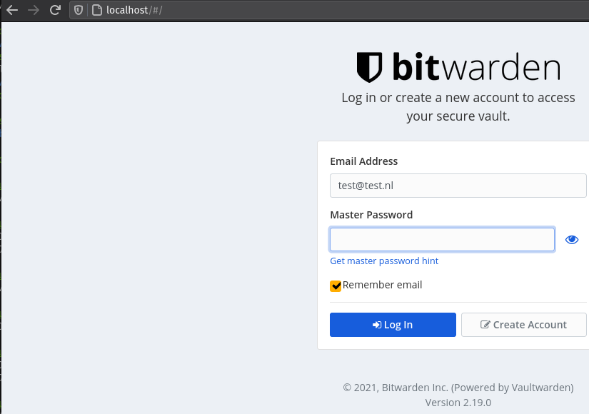

---

Alternative implementation of the Bitwarden server API written in Rust and compatible with upstream Bitwarden clients*, perfect for self-hosted deployment where running the official resource-heavy service might not be ideal.

## Installation

```plain
docker pull vaultwarden/server:latest
docker run -d --name vaultwarden -v /vw-data/:/data/ -p 80:80 vaultwarden/server:latest
```

## Usage

```plain
docker start vaultwarden
docker stop vaultwarden
```

## Examples



## URL List

- [Github.com - Vaultwarden](https://github.com/dani-garcia/vaultwarden)
