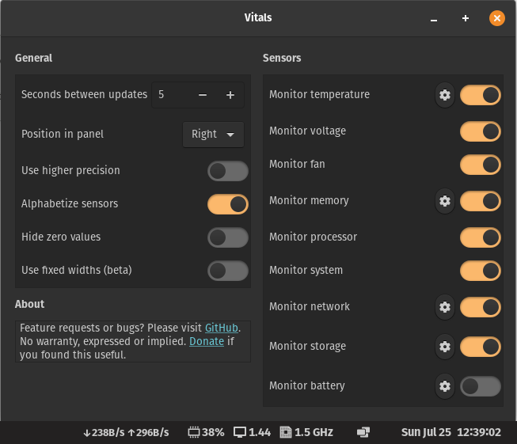
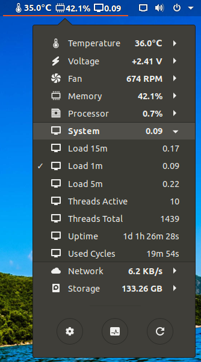

## Vitals

A glimpse into your computer's temperature, voltage, fan speed, memory usage and CPU load.

A glimpse into your computer's temperature, voltage, fan speed, memory usage, processor load, system resources, network speed and storage stats. This is a one stop shop to monitor all of your vital sensors. Uses asynchronous polling to provide a smooth user experience. Feature requests or bugs? Please use GitHub.

### Installation

Installation via [extensions.gnome.org](https://extensions.gnome.org/extension/1460/vitals/)

### Examples

### URL list

* [Extensions.gnome.org](https://extensions.gnome.org/extension/1460/vitals/)
* [Github.com - Vitals](https://github.com/corecoding/Vitals)
