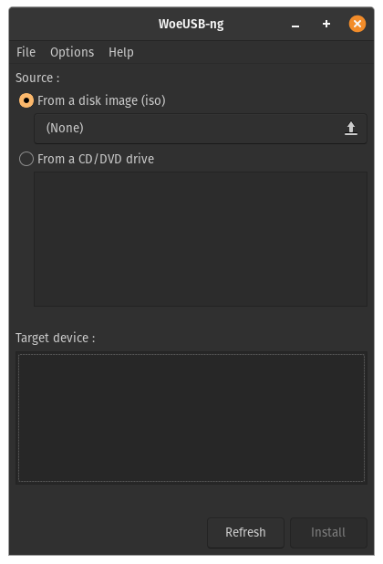
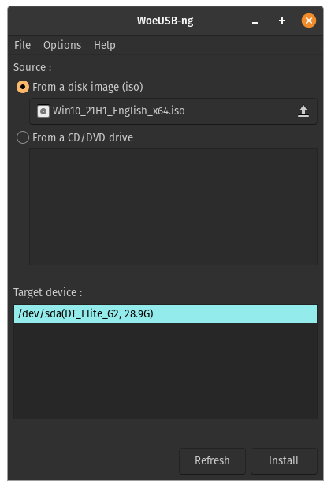
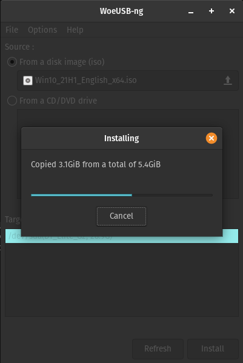

## WoeUSB-ng

A Linux program to create a Windows USB stick installer from a real Windows DVD or image.

### Installation

Requirements

```plain
sudo apt install git p7zip-full python3-pip python3-wxgtk4.0 grub2-common
```

```plain
sudo python3 -m pip install WoeUSB-ng
```

### Examples





### URL list

* [Github.com - WoeUSB-ng](https://github.com/WoeUSB/WoeUSB-ng)
