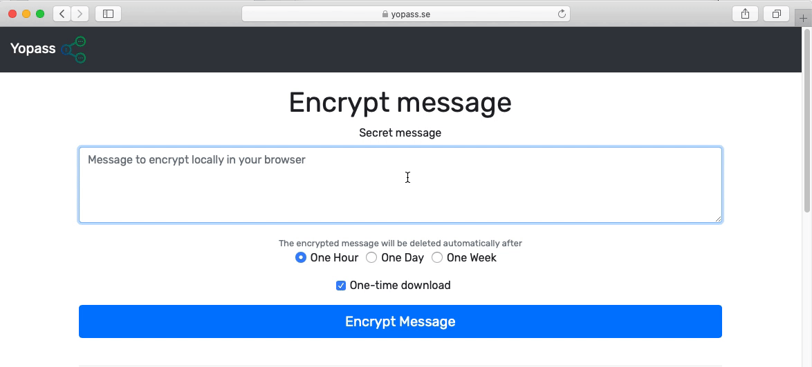

## Yopass - Share Secrets Securely

Yopass is a project for sharing secrets in a quick and secure manner*. The sole purpose of Yopass is to minimize the amount of passwords floating around in ticket management systems, Slack messages and emails. The message is encrypted/decrypted locally in the browser and then sent to yopass without the decryption key which is only visible once during encryption, yopass then returns a one-time URL with specified expiry date.

There is no perfect way of sharing secrets online and there is a trade off in every implementation. Yopass is designed to be as simple and "dumb" as possible without compromising on security. There's no mapping between the generated UUID and the user that submitted the encrypted message. It's always best send all the context except password over another channel.

[Demo available here](https://yopass.se/). It's recommended to host yopass yourself if you care about security.

* End-to-End encryption using [OpenPGP](https://openpgpjs.org/)
* Secrets can only be viewed once
* No accounts or user management required
* Secrets self destruct after X hours
* Custom password option
* Limited file upload functionality

## Installation

Please check [Github.com](https://github.com/jhaals/yopass) repository.

## Flags - CLI

```plain
Yopass - Secure sharing for secrets, passwords and files

Flags:
      --api string          Yopass API server location (default "https://api.yopass.se")
      --decrypt string      Decrypt secret URL
      --expiration string   Duration after which secret will be deleted [1h, 1d, 1w] (default "1h")
      --file string         Read secret from file instead of stdin
      --key string          Manual encryption/decryption key
      --one-time            One-time download (default true)
      --url string          Yopass public URL (default "https://yopass.se")

Settings are read from flags, environment variables, or a config file located at
~/.config/yopass/defaults.<json,toml,yml,hcl,ini,...> in this order. Environment
variables have to be prefixed with YOPASS_ and dashes become underscores.

Examples:
      # Encrypt and share secret from stdin
      printf 'secret message' | yopass

      # Encrypt and share secret file
      yopass --file /path/to/secret.conf

      # Share secret multiple time a whole day
      cat secret-notes.md | yopass --expiration=1d --one-time=false

      # Decrypt secret to stdout
      yopass --decrypt https://yopass.se/#/...
```

## Flags - Server

```plain
yopass-server -h
      --address string     listen address (default 0.0.0.0)
      --database string    database backend ('memcached' or 'redis') (default "memcached")
      --max-length int     max length of encrypted secret (default 10000)
      --memcached string   Memcached address (default "localhost:11211")
      --metrics-port int   metrics server listen port (default -1)
      --port int           listen port (default 1337)
      --redis string       Redis URL (default "redis://localhost:6379/0")
      --tls-cert string    path to TLS certificate
      --tls-key string     path to TLS key
```

## Examples



## URL List

- [Yopass.se](https://yopass.se/)
- [Github.com - yopass](https://github.com/jhaals/yopass)
